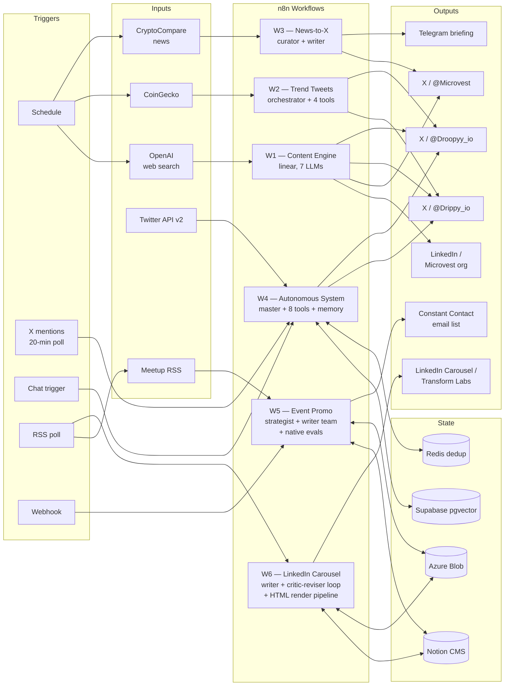

# LinkedIn + Twitter Automations

A portfolio of workflows running real autonomous content systems across LinkedIn, three Twitter/X accounts, and a branded marketing email channel. Two AI personalities (`Drippy_io`, `Droopyy_io`) and one brand voice (`Microvest`) post on schedule, react to market data, and reply to mentions — without me touching anything. A separate event-promo pipeline turns Columbus AI Meetup events into approval-gated branded emails delivered through Constant Contact.

This repo is the source of record. Every workflow JSON in [`workflows/`](workflows/) is the actual file imported into [`microvest.app.n8n.cloud`](https://microvest.app.n8n.cloud); every diagram in [`docs/`](docs/) is generated from those JSONs.

---

## Workflows

Each workflow is a self-contained system with its own trigger surface, prompt design, and reliability posture. Together they cover the full content footprint — news-driven, market-driven, evergreen, conversational, and event-driven email.

### 1. [Microvest Content Engine](docs/workflows/microvest-content-engine.md)

**News-driven LinkedIn + cross-platform fan-out.** Discovers a trending Bitcoin/AI story via web search, writes a brand-voice LinkedIn post with an AI-generated image, and produces three personality-tuned tweets — one each for Microvest, Drippy, and Droopy — from the same source story. Runs ~5×/week. *7 LLM calls per run.*

### 2. [Crypto Trend Tweet Generator](docs/workflows/crypto-trend-tweet-generator.md)

**Market-data-driven Drippy + Droopy tweets.** Pulls live data from three CoinGecko endpoints, classifies the market state into a trigger type (`opportunity_alert`, `community_love`, `fear_uncertainty`, etc.), and routes to an orchestrator agent that calls four specialized sub-workflow tools to draft both personality tweets. Runs 2×/day. *Hierarchical agent design.*

### 3. [News-to-X Distribution](docs/workflows/news-to-twitter-distribution.md)

**Always-on news pipeline + evergreen humor + Telegram briefing.** A multi-channel canvas. The headline path curates CryptoCompare stories under a strict ranked rubric (breaking → institutional → controversy → BTC-adjacent → surprise) with hard-skip rules for sponsored content, then writes a single high-quality `@Microvest` tweet. Same canvas runs three per-persona evergreen-humor flows and a structured mobile-readable Telegram briefing. Runs 3×/day. *Ranked curation w/ explicit skip rules.*

### 4. [Autonomous AI Agent System](docs/workflows/autonomous-ai-agent-system.md)

**Self-aware multi-agent system with vector memory.** A master coordinator agent that calls eight specialized tool agents, picking which to invoke based on the trigger type. Maintains durable personality state (Big-Five traits + emotional levels) across runs, retrieves the 10 most-similar past conversations from Supabase pgvector to ground the prompt, generates dual-personality output with a Human Imperfection Layer, and posts. Also handles inbound mention replies with influence-weighted prioritization. *The most ambitious single artifact in this repo.*

### 5. [Transform Labs Event Promo](docs/workflows/transform-labs-event-promo.md)

**End-to-end event promotion pipeline with native n8n evals.** Discovers Columbus AI Meetup events from RSS, crawls each page with an Azure OpenAI extractor, drafts a branded email through an Anthropic Claude Sonnet 4.5 strategist + writer-team sub-workflow, gates the draft behind a Notion approval workflow, and publishes approved emails to a Constant Contact list at 9:02 AM daily. Includes a versioned test dataset and eleven quantitative quality metrics for the generated copy. *Multi-LLM, full content lifecycle, production-grade evals.*

### 6. [Transform Labs LinkedIn Carousel Generator](docs/workflows/transform-labs-linkedin-carousel.md)

**Weekly LinkedIn PDF carousel pipeline with a critic-reviser quality gate.** Aggregates AI news from five RSS feeds (TechCrunch, Wired, MIT Tech Review, Ars Technica, OhioX), Gemini 3 Pro picks the single best article for a multi-slide breakdown, Claude Sonnet 4.5 + SerpAPI deep-researches it, distills into 6-8 insights, and writes 8-10 slides plus a LinkedIn caption in the founder's voice. The output then loops through a Gemini critic (six weighted scoring categories, ~50 hard-fail rules, math enforced in the prompt) and a Claude reviser until score ≥9 or six iterations. A 600+ line JS code node renders the slides as branded 3D-gradient HTML, ScreenshotOne converts each one to PNG, Azure Blob hosts the assets, and the assembled carousel lands in Notion Content HQ behind a human approval gate with a Slack notification to `#marketing-linkedin-posts`. Runs Mondays at 8:15 AM. *Cross-vendor judge (Gemini grades Claude), bounded-iteration loop, custom render pipeline, approval gate.*

---

## System view



Every other diagram in this repo is generated the same way — by walking the n8n JSON's `nodes` and `connections` keys.

---

## What this demonstrates

The bullets below are the engineering choices that shaped the system. Each one is a skill backed by a specific artifact you can open and read.

- **Agentic architecture (hierarchical orchestration).** Workflows 2, 4, and 5 use orchestrator agents that call other workflows as tools (`toolWorkflow`). The master agent in Workflow 4 has eight tool agents — Engagement, Trend Monitor, Customer Support, Data Analyst, Community Builder, Banter Coordinator, Personality, Performance Analysis — and picks which to invoke based on a trigger-type → agent map. *See [`docs/workflows/autonomous-ai-agent-system.md`](docs/workflows/autonomous-ai-agent-system.md).*

- **Production-grade AI evals.** Workflow 5 uses n8n's native evaluation framework with a versioned test dataset and eleven quantitative quality gates (word count, banned-word presence, punctuation compliance, speaker mention, emoji count, ticket-link presence, and more). Every style rule enforced in the prompt is also enforced in the metrics, so prompt drift is caught instead of shipped. *See [`docs/workflows/transform-labs-event-promo.md`](docs/workflows/transform-labs-event-promo.md#stage-4--evaluation-routing).*

- **Critic-reviser loop with bounded iteration and cross-vendor judging.** Workflow 6 runs a Gemini 3 Pro critic against a Claude Sonnet 4.5 writer, scoring six weighted categories with ~50 enumerated hard-fail rules and an explicit math formula the critic must show its work on. A reviser node applies surgical fixes; the loop exits on `score ≥ 9` OR `iteration_count ≥ 6` so worst-case API spend is bounded. The validator node auto-passes on empty critic responses to defend against infinite loops. *See [`docs/workflows/transform-labs-linkedin-carousel.md`](docs/workflows/transform-labs-linkedin-carousel.md#stage-7--critic-reviser-loop).*

- **Custom HTML render + screenshot pipeline.** Workflow 6's slide generator is a 600+ line JS code node that produces a fully-branded design system per slide — four-stop gradient backgrounds, 3D glass panels via `transform: perspective` rotations, radial glow orbs, per-role layouts (hook / insight / cta / brand_close), Plus Jakarta Sans + DM Sans typography, ghost numbers, progress bars. ScreenshotOne renders each HTML slide to a 1080×1350 PNG, Azure Blob hosts the assets, Notion embeds them inline. *See [`docs/workflows/transform-labs-linkedin-carousel.md`](docs/workflows/transform-labs-linkedin-carousel.md#stage-8--html-slide-generation).*

- **Multi-vendor LLM strategy.** Anthropic Claude Sonnet 4.5 for the W5 email strategist (less generic marketing copy on this prompt class), Azure OpenAI `gpt-5-mini` for W5 extraction and parsers, OpenAI `gpt-5.1` for W4's master coordinator, OpenAI `gpt-5-mini` for analysis-class agents, OpenAI `gpt-image-1` for LinkedIn images, OpenAI `text-embedding-3-small` for vector memory. Picked per task, not per vendor preference.

- **Prompt engineering with structural differentiation.** Workflow 1 takes one news article and produces three voices — Microvest brand voice (analytical, ~200 chars, no first-person), Drippy (upbeat mascot, ~100 chars, high-school reading level), Droopy (cynical NY attitude, ~100 chars, hashtag-formula closer). Banned emoji set, banned punctuation set, and reading-level targets are enforced in-prompt across all three. *See [`docs/workflows/microvest-content-engine.md`](docs/workflows/microvest-content-engine.md).*

- **Vector memory and RAG.** Workflow 4 embeds incoming chat with `text-embedding-3-small`, retrieves the 10 most-similar past conversations via Supabase's `match_conversation_memory` RPC, surfaces the most-frequent successful agent combinations from those past runs, and feeds all of it into the master coordinator's prompt. After posting, it embeds the result and writes it back. *See [`docs/SETUP.md`](docs/SETUP.md) for the schema.*

- **Defense-in-depth output parsing.** Every LangChain agent runs through a `structuredOutputParser` (with `autoFix` where it makes sense). Workflows 2 and 4 layer a regex fallback for malformed JSON, and Workflow 4 adds a canned-response final fallback. The system either posts something coherent or fails loudly. Nothing silent.

- **Character-design as engineering.** Workflow 4's Human Imperfection Layer modulates typing-speed-simulated post delays, emoji selection, ellipsis style (`...` for Droopy, `…` for Drippy), tweet length by time of day, and a 10% post-edit chance — per personality, per current emotional state. The bots feel like consistent characters across hundreds of runs because the consistency is structurally enforced, not vibes.

- **Human-in-the-loop where it matters.** Workflow 5's emails sit in a Notion `Content HQ` database with `Status = Not Published` until a human checks `Approved = true`. The 9:02 AM publisher only sends approved entries. Autonomous content for low-stakes channels, human review for branded outbound email.

- **Multi-platform reliability.** Every Twitter post node runs with `retryOnFail` and `continueErrorOutput`. A LinkedIn outage never blocks tweets; a Drippy outage never blocks Microvest. Per-platform failures route to a no-op error branch instead of stopping the run. Workflow 5 routes errors to a dedicated `#n8n-workflow-error` Slack channel.

---

## Stack

| Layer | What I use here |
|---|---|
| **Orchestration** | n8n (cloud) — schedule / RSS / webhook / chat / eval triggers, AI agent / tool agent / structured output parser nodes, sub-workflow tool invocation, native evaluation framework |
| **Models** | OpenAI `gpt-5.1` (W4 master coordinator), `gpt-5-mini` (W1-3 analysis), `gpt-image-1` (LinkedIn images), `text-embedding-3-small` (vector memory); Azure OpenAI `gpt-5-mini` (W5 extraction, W6 auxiliary); Anthropic Claude Sonnet 4.5 (W5 email strategist; W6 research / distill / write / revise); Google Gemini 3 Pro (W6 topic selector + critic) |
| **State + storage** | Supabase Postgres + pgvector (`conversation_memory`, `ai_knowledge_base`, `match_conversation_memory` RPC); Redis (`processed_tweet:*` dedup); Notion (Events DB, Content HQ approval workflow); Azure Blob Storage (event images, carousel slide PNGs) |
| **External APIs** | LinkedIn Marketing API, Twitter/X API v2 (OAuth2 × 3 accounts + Bearer mention search), CoinGecko (3 endpoints), CryptoCompare News API, Telegram Bot API, Meetup RSS, AI-news RSS (TechCrunch / Wired / MIT Tech Review / Ars Technica / OhioX), OpenAI (chat + image + embeddings), Anthropic, Google Gemini, SerpAPI, ScreenshotOne, Constant Contact (OAuth2), Slack (4 channels) |
| **Patterns** | Hierarchical agent / tool-agent topology, sub-workflow modularization, structured output parsing with autoFix, vector retrieval + memory writeback, multi-source data fusion, defensive output parsing, native eval datasets + quantitative quality gates, critic-reviser loops with bounded iteration, cross-vendor LLM judging, HTML-to-PNG render pipelines, human-in-the-loop approval gates, multi-vendor LLM routing |

---

## Run it

1. n8n instance (cloud or self-hosted, ≥1.50 for the AI agent and evaluation nodes).
2. Import each file in [`workflows/`](workflows/) and attach the credentials listed in [`docs/SETUP.md`](docs/SETUP.md).
3. Copy [`.env.example`](.env.example) to `.env` and fill in.
4. Run the smoke test in [`docs/SETUP.md`](docs/SETUP.md).

---

## Repo layout

```
.
├── README.md                # this file
├── .env.example             # env vars referenced by the workflows
├── workflows/               # raw n8n exports — sanitized, importable
└── docs/
    ├── ARCHITECTURE.md      # cross-workflow system view + design notes
    ├── SETUP.md             # reproduction guide
    └── workflows/           # one deep-dive per workflow
```

---

## Contact

Talon Sturgill — building agentic systems. [GitHub](https://github.com/talonsturgill).
