# Marketing & Content Automations

A portfolio of twenty n8n workflows running real autonomous content systems for two brands: **Microvest** (a crypto / AI media account on LinkedIn + three X personalities + Telegram) and **Transform Labs** (a Columbus-based AI consultancy with a full LinkedIn publishing cadence + Constant Contact email + a Notion-backed events pipeline + a multi-modal Slack app). The workflows handle news-driven posts, market-data-driven tweets, conversational mention replies with vector memory, multi-source RSS aggregation, LinkedIn carousels, LinkedIn long-form posts, LinkedIn thought-leadership posts, X threads, twice-daily AI-news tweets with a native n8n eval framework, weekly LinkedIn blog topic ideation that opens each week with a roundup of working titles, a Slack-triggered case study generator with a hallucination-detector critic, pre-event promo emails, post-event follow-up emails, inbound event ingestion from both a marketing inbox and the Columbus AI Meetup RSS feed, an internal sub-workflow that turns any workflow into a publication-ready marketing case study brief, a Slack interactivity router that dispatches every modal submission in the Slack app behind one URL, a daily LinkedIn analytics sync that closes the publishing loop by pulling reactions + comments back into Notion next to the original drafts, and an hourly comment auto-reply that classifies every new comment on Transform Labs' LinkedIn posts and replies in the founder's voice.

This repo is the source of record. Every workflow JSON in [`workflows/`](workflows/) is the actual file imported into [`microvest.app.n8n.cloud`](https://microvest.app.n8n.cloud); every diagram in [`docs/`](docs/) is generated from those JSONs.

---

## Workflows

Each workflow is a self-contained system with its own trigger surface, prompt design, and reliability posture. Together they cover the full content footprint — news-driven, market-driven, evergreen, conversational, branded email, LinkedIn carousels and long-form, X threads, and event-pipeline ingestion / promo / follow-up.

### 1. [Microvest Content Engine](docs/workflows/microvest-content-engine.md)

**News-driven LinkedIn + cross-platform fan-out.** Discovers a trending Bitcoin/AI story via web search, writes a brand-voice LinkedIn post with an AI-generated image, and produces three personality-tuned tweets — one each for Microvest, Drippy, and Droopy — from the same source story. Runs ~5×/week. *7 LLM calls per run.*

### 2. [Crypto Trend Tweet Generator](docs/workflows/crypto-trend-tweet-generator.md)

**Market-data-driven Drippy + Droopy tweets.** Pulls live data from three CoinGecko endpoints, classifies the market state into a trigger type (`opportunity_alert`, `community_love`, `fear_uncertainty`, etc.), and routes to an orchestrator agent that calls four specialized sub-workflow tools to draft both personality tweets. Runs 2×/day. *Hierarchical agent design.*

### 3. [News-to-X Distribution](docs/workflows/news-to-twitter-distribution.md)

**Always-on news pipeline + evergreen humor + Telegram briefing.** A multi-channel canvas. The headline path curates CryptoCompare stories under a strict ranked rubric (breaking → institutional → controversy → BTC-adjacent → surprise) with hard-skip rules for sponsored content, then writes a single high-quality `@Microvest` tweet. Same canvas runs three per-persona evergreen-humor flows and a structured mobile-readable Telegram briefing. Runs 3×/day. *Ranked curation w/ explicit skip rules.*

### 4. [Autonomous AI Agent System](docs/workflows/autonomous-ai-agent-system.md)

**Self-aware multi-agent system with vector memory.** A master coordinator agent that calls eight specialized tool agents, picking which to invoke based on the trigger type. Maintains durable personality state (Big-Five traits + emotional levels) across runs, retrieves the 10 most-similar past conversations from Supabase pgvector to ground the prompt, generates dual-personality output with a Human Imperfection Layer, and posts. Also handles inbound mention replies with influence-weighted prioritization. *The most ambitious single artifact in this repo.*

### 5. [Event Promo](docs/workflows/transform-labs-event-promo.md)

**End-to-end event promotion pipeline with native n8n evals.** Discovers Columbus AI Meetup events from RSS, crawls each page with an Azure OpenAI extractor, drafts a branded email through an Anthropic Claude Sonnet 4.5 strategist + writer-team sub-workflow, gates the draft behind a Notion approval workflow, and publishes approved emails to a Constant Contact list at 9:02 AM daily. Includes a versioned test dataset and eleven quantitative quality metrics for the generated copy. *Multi-LLM, full content lifecycle, production-grade evals.*

### 6. [LinkedIn Carousel Generator](docs/workflows/transform-labs-linkedin-carousel.md)

**Weekly LinkedIn PDF carousel pipeline with a critic-reviser quality gate.** Aggregates AI news from five RSS feeds (TechCrunch, Wired, MIT Tech Review, Ars Technica, OhioX), Gemini 3 Pro picks the single best article for a multi-slide breakdown, Claude Sonnet 4.5 + SerpAPI deep-researches it, distills into 6-8 insights, and writes 8-10 slides plus a LinkedIn caption in the founder's voice. The output then loops through a Gemini critic (six weighted scoring categories, ~50 hard-fail rules, math enforced in the prompt) and a Claude reviser until score ≥9 or six iterations. A 600+ line JS code node renders the slides as branded 3D-gradient HTML, ScreenshotOne converts each one to PNG, Azure Blob hosts the assets, and the assembled carousel lands in Notion Content HQ behind a human approval gate with a Slack notification to `#marketing-linkedin-posts`. Runs Mondays at 8:15 AM. *Cross-vendor judge (Gemini grades Claude), bounded-iteration loop, custom render pipeline, approval gate.*

### 7. [LinkedIn Thought Leadership Engine](docs/workflows/transform-labs-linkedin-thought-leadership.md)

**Weekly LinkedIn thought-leadership post + quote-card generator with voice-impersonation quality gate.** A web-search-grounded Gemini agent generates one quotable insight in the founder's voice, a second Gemini agent does a strictly-bounded research pass (2-3 searches max), and Claude Sonnet 4.5 writes a 500-1000 character post tuned for LinkedIn's "...more" fold (any `\n\n` in the first 250 characters is a hard fail because it triggers premature truncation). The post then loops through a Claude critic (five weighted categories, voice-impersonation as a hard-fail criterion) and a Claude editor until score ≥8.9 or five iterations. The quotable insight is rendered onto a 1080×1080 PNG quote card via the same ScreenshotOne → Azure Blob pipeline as W6, then both land in Notion Content HQ behind a human approval gate. Two-input pipeline: scheduled (Thursdays 8:45 AM) + manual `/thought` Slack command (planned). *Voice impersonation as a quality gate, format-aware writing, shared render pipeline.*

### 8. [Fractional CTO LinkedIn Engine](docs/workflows/transform-labs-fractional-cto-linkedin.md)

**Weekly long-form LinkedIn post targeting C-suite executives at mid-market companies, with outline-first writing and an aggressive AI-tells critique loop.** Pulls from five corporate-and-enterprise RSS feeds (HBR, MIT Sloan Review, McKinsey Insights, Fortune Tech, CIO.com), a Claude News Selector picks the article with the strongest fractional-CTO positioning angle, a dedicated Outline Agent produces a 20-field strategic blueprint (hook strategy, paragraph-by-paragraph structure, key points, tone calibration, target length, quotable insight) before any drafting happens, then Claude Sonnet 4.5 writes a 1800-2500 character post. The post runs through a Claude critic (5-dimension weighted scoring, anti-inflation prompt anchoring, long anti-AI-tells checklist, ~15 hard-fail rules including the `". But"` sentence-start ban and `we`-not-`I` firm-voice rule) and a Claude editor with a 7-item self-check until score ≥8 or five iterations. A 1080×1080 quote-card PNG is rendered before the loop (so the loop never re-renders), then a JS chunker splits the final post into ≤2000-char Notion paragraph blocks for human review. Runs Fridays at 8:45 AM. *Outline-first architecture, anti-AI-tells engineering, anti-inflation scoring, Notion paragraph chunking.*

### 9. [AI Transformation Carousel Engine](docs/workflows/transform-labs-ai-transformation-carousel.md)

**Weekly theme-first 8-slide LinkedIn carousel with rigid slide-role spine.** A Gemini Theme Discovery agent searches the web (max 5 calls) for one contrarian AI-transformation angle, a second Gemini agent does a strictly-bounded research pass (max 3 calls) to find 5-6 mid-market industry examples *with specific metrics*, then Claude Sonnet 4.5 writes a fixed 8-slide carousel: 1 hook + 5 industry-example body slides (each lead with a metric, e.g. `Healthcare + 40% Faster Diagnoses`) + 1 reinforcing-stat slide + 1 CTA. The output runs through a Claude critic-editor loop with REJECT-by-default scoring + ~25 banned phrases + hedging-word ban (`might/could/would/may`) until score ≥9.1 or five iterations. Slides render via an Azure-hosted HTML template with URL-encoded params per slide type — different from W6's inline 600+ line generator. ScreenshotOne → Azure Blob → Notion approval gate → Slack notification. Runs Wednesdays at 8:45 AM. *Theme-first authoring, rigid slide-role spine, templated render, REJECT-by-default critic.*

### 10. [Inbox Event Ingester](docs/workflows/transform-labs-inbox-event-ingester.md)

**Email-in event ingestion that feeds W5.** Polls the marketing inbox every 2 hours via Microsoft Graph, runs every email through a Claude classifier (`is this a real event vs. an OTP, newsletter, receipt, or spam?`), then through a structured `informationExtractor` (7-field schema with explicit fallbacks for every field), then through a two-layer dedup (Graph message ID across executions + normalized event-name match against the existing Notion DB, with all six Unicode dash variants flattened to ASCII so en-dashes don't bypass dedup), then writes survivors into the Notion Events database that W5 reads from. Notifies `#marketing-events` on Slack and emails a confirmation back to internal senders (`@transformlabs.com`) only. *Two-stage LLM pipeline (cheap classifier → expensive extractor), two-layer dedup, Unicode dash normalization, workflow pairing with W5 via shared Notion state.*

### 11. [Event Follow-Up Email Sender](docs/workflows/transform-labs-event-followup-email-sender.md)

**Daily post-event follow-up email sender — completes the Events trio (W10 ingests, W5 promos before, W11 follows up after).** Pulls approved follow-up email drafts from Notion Content HQ (filter: `Platform=Email - Event Follow Up`, `Approved=true`, `Status=Not Published`, `Date to Publish <= now`), walks the relation chain (Content HQ → Event → Attendees) to fan out one item per attendee, validates each email with a regex filter, creates a fresh per-run timestamped Constant Contact list (so membership stays scoped to one send), upserts each attendee onto the list, builds personalized HTML with a Transform Labs logo header and a 5-icon social signature (`{{name}}` becomes the CC merge tag `[[FIRSTNAME OR "there"]]` for per-recipient substitution at send time), creates the campaign in CC's two-step model (`POST /v3/emails` then `PUT /v3/emails/activities/{id}` to attach the list), and dispatches via `/schedules` with immediate-send sentinel. Marks the Notion entry Published and pings `#marketing-emails`. *Notion-relation-driven attendee fan-out, per-run scoped CC list, three-workflow composition through shared Notion state.*

### 12. [X Thread Generator](docs/workflows/transform-labs-x-thread-generator.md)

**Tri-weekly X (Twitter) thread generator — sibling of W6 with the same RSS aggregation but a different output channel.** Aggregates the same five AI-news RSS feeds W6 uses, Gemini 3 Pro picks the best article for a multi-tweet breakdown, Claude Sonnet 4.5 + SerpAPI builds a *flexible-not-formulaic* outline (role + direction per tweet rather than a rigid script — `"Establish the stakes — why should a CTO care about this?"`), then writes 5-7 tweets under X's structural constraints (tweet 1 ends in `🧵` with no number prefix, tweets 2-6 start with `2/`, `3/`, etc., hashtags only on the final tweet, every tweet under 280 chars including URLs). The output runs through a Gemini 3 Flash critic (cheaper Flash variant for the more mechanical per-tweet pass-or-fail check) and a Claude Sonnet 4.5 reviser until score ≥9 or six iterations. Saves to Content HQ as `X (Thread) - Blog`, renders the thread inline as Notion paragraph blocks for review, and posts a `🧵 *New X Thread Ready for Review*` Slack notification to `#marketing-twitter-posts` with the full thread inline (after sanitizing the topic title's em/en dashes and colons that fight with Slack mrkdwn). Runs M/W/F at 9:15 AM ET. *Flexible outline as creative-output technique, cross-vendor judging with Flash for mechanical checks, format-aware critic, sibling-workflow composition with W6.*

### 13. [Columbus AI Meetup Ingester](docs/workflows/transform-labs-meetup-event-ingester.md)

**Second writer into the Notion Events DB alongside W10 — pulls events from Meetup RSS instead of email.** Polls `https://www.meetup.com/columbus-ai/events/rss/` every 30 minutes, deduplicates by title across executions (the feed re-lists same upcoming events every poll), fetches each event's full HTML page directly with a Mozilla User-Agent, parses the embedded `__NEXT_DATA__` JSON blob (Meetup runs on Next.js, so every prop the React tree needs is in one structured tag), and writes to the Events DB. The defining trick is the **placeholder-aware upsert**: if a human pre-created an entry on the same date with `Placeholder?` checked and name containing `Columbus AI`, the workflow *updates the placeholder* and unchecks the flag instead of creating a duplicate — so W5 promo and W11 follow-up flows can already schedule against the placeholder before the Meetup organizer publishes the real details. Notifies `#marketing-events` with date formatted as `January 20th @ 6:00 PM` (ordinal-suffix expression inline in the Slack template). All onError branches fan into a single `#n8n-workflow-error` alert path. *Placeholder-aware upsert pattern, direct `__NEXT_DATA__` scrape, timezone-preserving time formatting, two-source ingestion into one Notion DB.*

### 14. [Case Study Brief Generator](docs/workflows/transform-labs-case-study-brief-generator.md)

**Internal marketing tool — turns any workflow's structure (plus optional real metrics) into a publication-ready case study brief.** Sub-workflow called by a parent that's already analyzed a target workflow. **Six Claude Sonnet 4.5 specialist agents run in parallel** — Executive Summary / Challenge / Solution / Technical Highlights / ROI & Results / Key Takeaways — each with one focused system prompt and its own structured output schema. A senior-editor orchestrator (Claude Sonnet 4.5 + Think tool) reads all six, enforces first-person voice (`"We built"` not `"Transform Labs built"`), de-duplicates redundant context, generates the title and tags, and adds a `dataConfidenceNotes` field that explicitly distinguishes verified-from-source facts (node count, integrations, complexity) from estimated business metrics. The honesty layer is the distinctive bit — the ROI agent's prompt explicitly bans inventing dollar amounts and forces unverified metrics to be marked `[ESTIMATED: X-Y hours/week — TO VERIFY]`; the orchestrator is told never to remove those markers. Whoever opens the brief downstream can tell at a glance which numbers are real and which need verification before publishing. *Parallel-specialists pattern (different from the writer-critic-reviser loops in W6-W12), three-layer honesty enforcement, sub-workflow as a first-class building block.*

### 15. [Slack Modal Router](docs/workflows/transform-labs-slack-modal-router.md)

**One Slack Interactivity URL serves every modal in your Slack app.** Slack apps allow exactly one Interactivity Request URL — every form submission, button click, and modal close goes there. Most teams hit the wall the second time they want a Slack form. This router pattern dispatches everything by `callback_id`: a webhook receives the Slack payload, parses the `application/x-www-form-urlencoded` body (Slack's `payload=` field is URL-encoded JSON, not a normal JSON body), **acknowledges Slack within the 3-second SLA via a `Respond to Webhook` node placed *before* the routing logic** (miss the SLA and Slack shows the user a timeout error), then a Switch routes by `callback_id` to per-form forwarders that POST to handler workflows on their own webhook paths. New forms ship in 30 seconds — add a Switch case + a forwarder; no handler ever gets touched. Live for `casestudy_form` and `blog_ideas_form`; an `events_form` is queued for letting the team paste manual event URLs into Slack. *Sub-3-second Slack ack pattern, one URL → many modals, two-hop dispatch for clean error surfaces.*

### 16. [LinkedIn Analytics Sync](docs/workflows/transform-labs-linkedin-analytics-sync.md)

**Closes the publishing loop — every morning at 6 AM, every published LinkedIn post gets its current reactions + comments pulled from LinkedIn and written back into Notion next to the original draft.** Reads from the same Content HQ database that W6 (carousels), W7 (thought leadership), and W8 (long-form) write to: humans approve drafts, post to LinkedIn, paste the post URN back into Notion, and W16 syncs the engagement numbers. **Direct LinkedIn REST API integration** (the n8n LinkedIn node doesn't expose `socialMetadata`) with `Bearer` auth + the two required headers: `LinkedIn-Version: 202504` and `X-Restli-Protocol-Version: 2.0.0`. Batched `socialMetadata` BATCH_GET via `?ids=List(urn1,urn2,...)` — 20 URNs per round-trip drops API call count 20× and stays well under rate limits. A 6-hour staleness gate skips already-recently-pulled posts to save API quota. The **multi-format URN normalizer** handles operators pasting URNs in six different shapes (full `urn:li:share:N`, full `urn:li:activity:N`, full URL containing the URN, legacy `activity-N`, bare numeric ID). Slack report to `#marketing-analytics` includes a top-performer callout with reaction emoji breakdown (👍 LIKE, 👏 PRAISE, ❤️ EMPATHY, 💡 INTEREST, 🙏 APPRECIATION) and an **explicit honesty note** that impressions / clicks / engagement-rate require Standard Tier upgrade — empty fields are documented, not unexplained. Empty-run path sends a "nothing to update" alert with reason breakdown so silence is never ambiguous. *Multi-format URN normalization, batched REST BATCH_GET, staleness-gated daily sync, tier-honesty in reporting.*

### 17. [LinkedIn Comment Auto-Reply](docs/workflows/transform-labs-linkedin-comment-auto-reply.md)

**Hourly during business hours, every new comment on Transform Labs' LinkedIn org posts gets read, classified, and replied to in the founder's voice — automatically.** The inbound counterpart to the publishing stack: spam gets ignored, simple `Great post!` reactions get a like, and real questions / lead signals / constructive challenges get a 300-character reply that sounds like a senior consultant wrote it (posted under the org page, plus a like on the original comment). Three-stage classification (post intent → comment category → routing) sends each comment down one of three exit paths so the workflow does the *minimum useful action per comment*. Three-layer self-skip (skip self-comments, skip already-replied threads, skip already-liked) plus a 500-deep `getWorkflowStaticData` ring buffer of seen IDs prevents the embarrassing "auto-reply loop on our own thread" failure mode. Replies survive a Claude Sonnet 4.5 critic that uses an unusually concrete bar — *"Would the founder be comfortable seeing this go out under his name right now?"* — with default-skepticism scoring and ~10 hard-fail rules (`Great question!` opener, emojis without precedent, hashtags, em-dashes, `I think`/`I believe`, buzzwords). Slack `#marketing-linkedin-posts` gets a full audit log of every posted reply with five sub-scores. Capped at 5 comments per run + business-hours-only (Mon-Fri 8am-7pm ET) so it never looks botted. *Closed-loop community management, classification routing, three-layer self-skip, founder-voice critic with default skepticism.*

### 18. [Daily AI Tweet Generator](docs/workflows/transform-labs-daily-ai-tweet-generator.md)

**Twice-daily AI-news tweet drafter — 7:49 AM news-update style, 7:49 PM contrarian-take style — sharing one 10-feed RSS pipeline.** The shared ingestion (10 feeds → parallel fetch → 24h freshness window → title-normalized dedupe → top 30) feeds two writer patterns: the morning path is single-agent (Claude Sonnet 4.5 picks from top 5 and writes a clean news-update tweet, ~$0.05/run); the evening path is curator-then-writer (Gemini 3 Flash scores articles on Newsworthiness 40% / AI Relevance 30% / Contrarian Angle 20% / Audience Fit 10% and supplies a contrarian angle string, then Claude Sonnet 4.5 writes the tweet, ~$0.15/run). Both paths drop into Notion Content HQ behind the standard approval gate with a Slack ping to `#marketing-twitter-posts`. The defining engineering bit is the **first end-to-end native n8n eval framework wiring** in this repo — `evaluationTrigger` reads a `Twitter News Agent Evals` data table, `Format Test Data` fakes a single-article RSS payload, both writer paths run, three deterministic checks score each tweet (length 1-200, hashtags 1-3, no broken `undefined`/`null`), and `setMetrics` writes `overall_reliability` + `status_pass` (80% threshold) back to the eval run. The `checkIfEvaluating` switch is the only test/prod seam; same workflow handles both surfaces. *Shared-ingestion / split-writer pattern, native n8n evaluation framework, cross-vendor Flash-curator + Sonnet-writer split.*

### 19. [Weekly Blog Topic Research](docs/workflows/transform-labs-blog-topic-research.md)

**Mondays-at-7-AM-ET LinkedIn blog topic ideation — sits one step earlier in the publishing pipeline than the writer workflows.** Reads 6 RSS feeds tuned for enterprise dev + workplace AI (Dev.to AI tag, Dev.to Productivity, Hacker News `?points=50` filter, Google Developers Blog, GitHub Engineering, InfoQ AI/ML), filters to a 7-day freshness window, dedupes by 40-char title prefix, takes the top 50 articles, then sends both the title *and* the first 150 chars of each description to Gemini 3 Pro in a single call. The LLM returns 12-15 working titles with structured metadata (target audience from a 6-segment taxonomy, 5-8 SEO keywords, 1200-2000 target word count); a `Parse Topics` JS node fans them out to one item per topic, each lands as a row in the `AI Blog - Prompts` Notion database, and a single Monday-morning Slack post in `#marketing-linkedin-posts` opens the week with the full numbered list and a `Draft one` link back to Notion. *Topic-ideation as a separate workflow from drafting, single-call structured ideation (no critic loop), title+description prompting for grounded angles.*

### 20. [Case Study Generator](docs/workflows/transform-labs-case-study-generator.md)

**Slack-triggered case study generator — `/casestudy` opens a modal, 5-7 minutes later a publication-ready 800-1200 word case study lands in Notion behind a `Needs Review` gate.** Two webhook endpoints (`/casestudy` slash command + modal-submit), one `views.open` API call, two `Respond to Webhook` acks placed before any heavy work — same Slack-interactivity contract as W15. The modal collects a workflow JSON + project name + industry + optional metrics + optional context. A JS `Workflow Analyzer` (deterministic, non-LLM) categorizes every node, computes a complexity score from a fixed formula, classifies the workflow into one or more named patterns, and partitions every fact into a strict three-way `dataConfidence` object — `verified` (from JSON) / `userProvided` (from modal) / `needsPlaceholder` (everything else). The pipeline then runs in two layers: a **brief pass** (Claude Sonnet 4.5 orchestrator + the W14 sub-workflow tool with 6 parallel specialists) that produces structured metadata, then a **long-form pass** (Claude Sonnet 4.5 writer → Gemini 3 Flash hallucination-detector critic → Claude Sonnet 4.5 editor → 7.5/10 quality gate with loop-back). Output writes to Notion as `databasePage` create + chunked `PATCH /v1/blocks/{id}/children` (paragraphs over 2000 chars get split). DM back to the submitter and a public post in `#marketing-linkedin-posts`. *Slack frontend wrapping the W14 brief sub-workflow, `dataConfidence` partition flowing through every prompt, hallucination-detector critic with cross-vendor split.*

---

## System view

```mermaid
flowchart LR
    subgraph triggers["Triggers"]
        S1["Schedule"]
        MENT["X mentions<br/>20-min poll"]
        CHAT["Chat trigger"]
        RSS["RSS poll"]
        WH["Webhook"]
    end

    subgraph sources["Inputs"]
        WEB["OpenAI<br/>web search"]
        CG["CoinGecko"]
        CC["CryptoCompare<br/>news"]
        TW["Twitter API v2"]
        MEET["Meetup RSS"]
        MX["Microsoft Graph<br/>(marketing inbox)"]
        LIA["LinkedIn REST<br/>(socialMetadata)"]
    end

    subgraph engines["n8n Workflows"]
        W1["W1 - Content Engine<br/>linear, 7 LLMs"]
        W2["W2 - Trend Tweets<br/>orchestrator + 4 tools"]
        W3["W3 - News-to-X<br/>curator + writer"]
        W4["W4 - Autonomous System<br/>master + 8 tools + memory"]
        W5["W5 - Event Promo<br/>strategist + writer team<br/>+ native evals"]
        W6["W6 - LinkedIn Carousel<br/>writer + critic-reviser loop<br/>+ HTML render pipeline"]
        W7["W7 - Thought Leadership<br/>insight + writer + critic loop<br/>+ quote-card render"]
        W8["W8 - Fractional CTO<br/>selector + outline + writer<br/>+ critique-edit loop"]
        W9["W9 - AI Theme Carousel<br/>theme + research + 8-slide writer<br/>+ critic-editor loop"]
        W10["W10 - Inbox Event Ingester<br/>Graph poll + classifier + extractor<br/>+ two-layer dedup, feeds W5"]
        W11["W11 - Event Follow-Up<br/>relation walk + per-run CC list<br/>+ two-step campaign send"]
        W12["W12 - X Thread Generator<br/>flexible outline + 5-7 tweet writer<br/>+ Flash critic / Claude reviser loop"]
        W13["W13 - Meetup Event Ingester<br/>RSS poll + __NEXT_DATA__ scrape<br/>+ placeholder-aware upsert"]
        W14["W14 - Case Study Brief Generator<br/>sub-workflow, 6 parallel specialists<br/>+ orchestrator with honesty markers"]
        W15["W15 - Slack Modal Router<br/>one Interactivity URL,<br/>callback_id dispatch + 3s ack"]
        W16["W16 - LinkedIn Analytics Sync<br/>daily 6 AM, batched socialMetadata<br/>+ writes reactions/comments to Notion"]
        W17["W17 - LinkedIn Comment Auto-Reply<br/>hourly biz-hours, classify + route<br/>+ founder-voice critic loop"]
        W18["W18 - Daily AI Tweet Generator<br/>twin 7:49 AM/PM triggers, 10-feed RSS<br/>+ single-agent vs curator-then-writer<br/>+ native n8n eval framework"]
        W19["W19 - Weekly Blog Topic Research<br/>Mondays @ 7 AM ET, 6-feed RSS<br/>+ Gemini 3 Pro topic ideation<br/>+ Notion AI Blog - Prompts queue"]
        W20["W20 - Case Study Generator<br/>/casestudy slash command + modal<br/>+ analyzer + W14 brief tool<br/>+ writer / critic / editor loop"]
    end

    subgraph memory["State"]
        PG[("Supabase pgvector")]
        RD[("Redis dedup")]
        NOT[("Notion CMS")]
        BLOB[("Azure Blob")]
    end

    subgraph outputs["Outputs"]
        LI["LinkedIn /<br/>Microvest org"]
        TM["X / @Microvest"]
        TD["X / @Drippy_io"]
        TY["X / @Droopyy_io"]
        TG["Telegram briefing"]
        EM["Constant Contact<br/>email list"]
        LC["LinkedIn Carousel /<br/>Transform Labs"]
        LT["LinkedIn Post +<br/>Quote Card /<br/>Transform Labs"]
        LF["LinkedIn Long-Form +<br/>Quote Card /<br/>Transform Labs"]
        LA["LinkedIn AI Theme<br/>Carousel /<br/>Transform Labs"]
        XTL["X Thread /<br/>Transform Labs"]
        XTW["X Tweet /<br/>Transform Labs"]
    end

    S1 --> WEB
    S1 --> CG
    S1 --> CC
    S1 --> W7
    RSS --> MEET
    RSS --> W6
    RSS --> W8
    WEB --> W1
    CG --> W2
    CC --> W3
    MENT --> W4
    CHAT --> W4
    TW --> W4
    MEET --> W5
    WH --> W5
    W1 --> LI
    W1 --> TM
    W1 --> TD
    W1 --> TY
    W2 --> TD
    W2 --> TY
    W3 --> TM
    W3 --> TG
    W4 <--> PG
    W4 <--> RD
    W4 --> TD
    W4 --> TY
    W5 <--> NOT
    W5 <--> BLOB
    W5 --> EM
    W6 <--> NOT
    W6 <--> BLOB
    W6 --> LC
    W7 <--> NOT
    W7 <--> BLOB
    W7 --> LT
    W8 <--> NOT
    W8 <--> BLOB
    W8 --> LF
    S1 --> W9
    W9 <--> NOT
    W9 <--> BLOB
    W9 --> LA
    S1 --> MX
    MX --> W10
    W10 --> NOT
    W10 -. populates .-> W5
    S1 --> W11
    W11 <--> NOT
    W11 --> EM
    RSS --> W12
    W12 <--> NOT
    W12 --> XTL
    RSS --> W13
    W13 --> NOT
    W13 -. populates .-> W5
    W13 -. populates .-> W11
    WH --> W15
    W15 -. callback_id dispatch .-> HANDLERS["Per-form<br/>handler workflows"]:::core
    S1 --> W16
    W16 --> LIA
    W16 <--> NOT
    W16 -. closes loop on .-> W6
    W16 -. closes loop on .-> W7
    W16 -. closes loop on .-> W8
    S1 --> W18
    RSS --> W18
    W18 <--> NOT
    W18 --> XTW
    S1 --> W19
    RSS --> W19
    W19 --> NOT
    WH --> W20
    W20 -. ai_tool .-> W14
    W20 --> NOT
```



> W14 is a **sub-workflow** with no scheduled trigger of its own — a parent workflow that has already analyzed a target workflow's structure calls W14 via n8n's `executeWorkflowTrigger`. That's why it appears in the engines group without inflow/outflow edges in the diagram above.

Every other diagram in this repo is generated the same way — by walking the n8n JSON's `nodes` and `connections` keys.

---

## What this demonstrates

The bullets below are the engineering choices that shaped the system. Each one is a skill backed by a specific artifact you can open and read.

- **Agentic architecture (hierarchical orchestration).** Workflows 2, 4, and 5 use orchestrator agents that call other workflows as tools (`toolWorkflow`). The master agent in Workflow 4 has eight tool agents — Engagement, Trend Monitor, Customer Support, Data Analyst, Community Builder, Banter Coordinator, Personality, Performance Analysis — and picks which to invoke based on a trigger-type → agent map. *See [`docs/workflows/autonomous-ai-agent-system.md`](docs/workflows/autonomous-ai-agent-system.md).*

- **Production-grade AI evals.** Workflow 5 uses n8n's native evaluation framework with a versioned test dataset and eleven quantitative quality gates (word count, banned-word presence, punctuation compliance, speaker mention, emoji count, ticket-link presence, and more). Every style rule enforced in the prompt is also enforced in the metrics, so prompt drift is caught instead of shipped. *See [`docs/workflows/transform-labs-event-promo.md`](docs/workflows/transform-labs-event-promo.md#stage-4--evaluation-routing).*

- **Critic-reviser loop with bounded iteration and cross-vendor judging.** Workflow 6 runs a Gemini 3 Pro critic against a Claude Sonnet 4.5 writer, scoring six weighted categories with ~50 enumerated hard-fail rules and an explicit math formula the critic must show its work on. A reviser node applies surgical fixes; the loop exits on `score ≥ 9` OR `iteration_count ≥ 6` so worst-case API spend is bounded. The validator node auto-passes on empty critic responses to defend against infinite loops. *See [`docs/workflows/transform-labs-linkedin-carousel.md`](docs/workflows/transform-labs-linkedin-carousel.md#stage-7--critic-reviser-loop).*

- **Custom HTML render + screenshot pipeline.** Workflow 6's slide generator is a 600+ line JS code node that produces a fully-branded design system per slide — four-stop gradient backgrounds, 3D glass panels via `transform: perspective` rotations, radial glow orbs, per-role layouts (hook / insight / cta / brand_close), Plus Jakarta Sans + DM Sans typography, ghost numbers, progress bars. ScreenshotOne renders each HTML slide to a 1080×1350 PNG, Azure Blob hosts the assets, Notion embeds them inline. Workflow 7 reuses the same screenshot pipeline at 1080×1080 for quote cards. *See [`docs/workflows/transform-labs-linkedin-carousel.md`](docs/workflows/transform-labs-linkedin-carousel.md#stage-8--html-slide-generation).*

- **Voice impersonation as a quality gate.** Workflow 7's critic isn't scoring "is this a good LinkedIn post" — it's scoring "would Ryan Frederick's followers recognize this as his writing." The system prompt grounds the critic in worked examples from his actual Medium posts and treats "sounds like it could come from any company" as a hard fail alongside the punctuation and structural rules. The same workflow encodes platform-physics: any `\n\n` in the first 250 characters is a hard fail because LinkedIn's "...more" fold collapses early when it sees a paragraph break. *See [`docs/workflows/transform-labs-linkedin-thought-leadership.md`](docs/workflows/transform-labs-linkedin-thought-leadership.md#stage-5--critic-reviser-loop).*

- **Outline-first writing + anti-AI-tells engineering.** Workflow 8 separates strategy from prose: a dedicated `Outline Agent` produces a 20-field strategic blueprint (hook strategy, 6-paragraph structure, key points, tone calibration, target length, quotable insight) before the writer ever drafts. Both the writer and critic prompts encode an unusually long checklist of patterns that signal LLM-generated content — back-to-back short sentences, the `[Noun] isn't X. It's Y.` pattern, repeated sentence starters, fragment lists, `It means... It requires...` chains, vague `around` connectors. The critic prompt explicitly anchors the 1-10 scoring scale and instructs the model to default to "the draft is flawed," forbidding 10s — the practical answer to "LLM judges grade everything 8/10." *See [`docs/workflows/transform-labs-fractional-cto-linkedin.md`](docs/workflows/transform-labs-fractional-cto-linkedin.md#stage-3--strategic-outline).*

- **Theme-first authoring with rigid slide-role spine.** Workflow 9 picks a *theme* rather than a single article, then researches 5-6 mid-market industry examples to populate a fixed 8-slide spine (`hook → body × 5 → stat → cta`). Every body slide is required to lead with a specific metric (`Healthcare + 40% Faster Diagnoses`); the structure is the brand voice, which is what makes the publication recognizable week to week. Slides render via an Azure-hosted HTML template with URL-encoded params per slide type — different from W6's 600+ line inline render. Tradeoff: less per-slide visual variety, much simpler per-run code paths. *See [`docs/workflows/transform-labs-ai-transformation-carousel.md`](docs/workflows/transform-labs-ai-transformation-carousel.md#stage-4--write).*

- **Two-stage LLM pipeline + paired-workflow composition through shared Notion state.** Workflow 10 polls the marketing inbox every 2 hours, runs a cheap Claude classifier (`is this a real event vs. an OTP, newsletter, receipt, or spam?`) to firewall out the ~95% of emails that aren't events, then runs an `informationExtractor` only on the survivors. Two layers of dedup — Graph message-ID across executions plus normalized event-name match against the Notion DB (with all six Unicode dash variants flattened to ASCII so en-dashes and em-dashes don't bypass the match). The new events land in the same Notion Events database that **W5** reads from — the two workflows are decoupled (different schedules, different code paths) but composed via shared state. *See [`docs/workflows/transform-labs-inbox-event-ingester.md`](docs/workflows/transform-labs-inbox-event-ingester.md#stage-7--notion-side-dedupe).*

- **Notion-relation-driven attendee fan-out + per-run scoped CC list.** Workflow 11 closes the Events trio (W10 ingests → W5 promos before → W11 follows up after). The Content HQ entry references an Event by relation; the Event references its Attendees by relation; each Attendee record has a name + email. The workflow walks that relation chain rather than asking a human to paste a recipient list — whoever ran event check-in is the source of truth, by construction. Then it creates a *fresh per-run timestamped Constant Contact list* (rather than maintaining a single growing "all attendees" list) so membership semantics stay tied to one specific send. CC's two-step campaign model (`POST /v3/emails` to create + `PUT /v3/emails/activities/{id}` to attach the list) is encoded explicitly. *See [`docs/workflows/transform-labs-event-followup-email-sender.md`](docs/workflows/transform-labs-event-followup-email-sender.md#stage-2--get-the-event-and-merge-its-data).*

- **Flexible-not-formulaic outline + cross-vendor judging at the cheap end.** Workflow 12 (X threads) gives the Writer a *role + direction* per tweet rather than a literal script (`"Establish the stakes — why should a CTO care about this?"`). The system prompt explicitly says *"Some stories need more context upfront. Some need evidence first. Let the topic dictate the structure."* — which is what keeps the weekly thread from reading like the same Mad Lib every time. And the critic uses **Gemini 3 Flash** (not Pro) because X-thread quality is more mechanical than carousel quality (per-tweet character limits + banned-phrase scans + structural rules) — Flash's cheaper cost outweighs the slightly worse semantic judgment. Right model for the right task. *See [`docs/workflows/transform-labs-x-thread-generator.md`](docs/workflows/transform-labs-x-thread-generator.md#stage-3--flexible-outline).*

- **Placeholder-aware upsert + direct `__NEXT_DATA__` scrape.** Workflow 13 is the second writer into the Notion Events DB alongside W10 (RSS for known sources, email forwards for everything else). The clever part is the placeholder pattern: the marketing team can pre-create a Notion entry on a known event date with `Placeholder?` checked, name `Columbus AI Meetup - [Month]`, *before* the Meetup organizer publishes details — so W5 promo and W11 follow-up flows can already schedule against it. When the workflow finally finds the published event on the matching date, it overwrites the placeholder with the real details and unchecks the flag instead of creating a duplicate. The page scrape itself bypasses Meetup's API entirely by reading the embedded `__NEXT_DATA__` JSON blob (Meetup is a Next.js app — every prop the React tree needs is in one structured tag). *See [`docs/workflows/transform-labs-meetup-event-ingester.md`](docs/workflows/transform-labs-meetup-event-ingester.md#stage-5--update-or-create).*

- **Parallel-specialists pattern + three-layer honesty enforcement.** Workflow 14 is a different shape from W6-W12: instead of the *writer → critic → reviser → loop* pattern that iterates toward quality on a single output, it runs **six Claude specialists in parallel** (one per case-study section), then a senior-editor orchestrator stitches them together. Total latency ≈ slowest single agent rather than 6× sequential, and each specialist optimizes for one audience instead of trying to be everything-to-everyone in a mega-prompt. The defining engineering choice is the **honesty layer**: the ROI specialist's prompt explicitly bans inventing dollar amounts and forces unverified metrics to be marked `[ESTIMATED: X-Y hours/week — TO VERIFY]`; the orchestrator is told never to remove those markers; and the output schema includes a `dataConfidenceNotes` field that distinguishes verified-from-source facts (node count, integrations, complexity) from estimated business metrics. Whoever opens the brief downstream can tell at a glance which numbers are real and which need verification before publishing. *See [`docs/workflows/transform-labs-case-study-brief-generator.md`](docs/workflows/transform-labs-case-study-brief-generator.md#honesty-layer).*

- **Slack interactivity at production grade — 3-second ack + one-URL-many-modals dispatch.** Slack apps allow exactly one Interactivity Request URL and enforce a 3-second response SLA — miss the SLA and the user sees `*This app is not responding*` and the modal hangs. Workflow 15 solves both with structure: a `Respond to Webhook` node placed *before* the routing logic sends an empty 200 OK to Slack within milliseconds, then a Switch dispatches by `callback_id` to per-form handler workflows on their own webhook paths. The router also handles the Slack-specific payload format (`application/x-www-form-urlencoded` with a `payload=` field whose value is URL-encoded JSON, not a plain JSON body — common bug source for first-time Slack integrations) and uses two-hop dispatch (router → forwarder HTTP → handler webhook) so each handler has its own execution log + error pipeline + test webhook URL. New Slack forms ship in 30 seconds: add a Switch case + a forwarder; existing handlers never get touched. *See [`docs/workflows/transform-labs-slack-modal-router.md`](docs/workflows/transform-labs-slack-modal-router.md#stage-2--the-3-second-ack-pattern).*

- **Closed-loop analytics on the publishing pipeline.** Workflow 16 is the feedback loop for W6/W7/W8 — every morning at 6 AM it reads from the same Notion `Content HQ` database those workflows write drafts to, fetches reactions + comments from LinkedIn's `socialMetadata` API for every post that has a URN pasted in, and writes the numbers back to the same Notion entry. **Direct REST integration** (the n8n LinkedIn node doesn't expose `socialMetadata`) with the two required headers most teams forget on first try — `LinkedIn-Version: 202504` and `X-Restli-Protocol-Version: 2.0.0` for BATCH_GET. Batched `?ids=List(urn1,urn2,...)` URN requests cut API call count 20× per run; a 6-hour staleness gate skips already-current entries; a multi-format URN normalizer accepts whatever shape the operator pasted (full URN, full URL containing URN, legacy `activity-N`, bare numeric ID); and the Slack report includes an explicit honesty note that impressions / clicks / engagement-rate require LinkedIn Standard Tier upgrade — empty fields are documented, not unexplained. *See [`docs/workflows/transform-labs-linkedin-analytics-sync.md`](docs/workflows/transform-labs-linkedin-analytics-sync.md#stage-3--batched-linkedin-socialmetadata-requests).*

- **Closed-loop community management with classification routing.** Workflow 17 is the inbound counterpart to the publishing stack: hourly during business hours, every new comment on Transform Labs' LinkedIn org posts gets read, classified, and replied to — all under the org page, in the founder's voice, with no human in the loop. The defining engineering choice is **classification routing with three exit paths**: spam → ignore, simple reaction → like only, real comment → full draft + critic + reply + like. The workflow does the *minimum useful action per comment*. A 500-deep `getWorkflowStaticData` ring buffer plus a three-layer self-skip (skip self-comments + already-replied threads + already-liked) prevents the embarrassing "auto-reply loop on our own thread" failure mode. Replies pass through a Claude Sonnet 4.5 critic that uses an unusually concrete bar — *"Would the founder be comfortable seeing this go out under his name right now?"* — with default-skepticism scoring (start at 5, make it earn higher) and ~10 hard-fail rules (`Great question!` opener, emojis without precedent, hashtags, em-dashes, `I think`/`I believe`, buzzwords). Capped at 5 comments per run + business-hours-only so it never looks botted. *See [`docs/workflows/transform-labs-linkedin-comment-auto-reply.md`](docs/workflows/transform-labs-linkedin-comment-auto-reply.md#stage-6--draft--critic--editor-loop).*

- **Topic discovery as a separate workflow from drafting.** Workflow 19 sits one step earlier in the LinkedIn publishing pipeline than W6 / W8 / W9: instead of picking one article and writing one post, it reads 6 RSS feeds tuned for enterprise dev + workplace AI (Dev.to AI tag, Dev.to Productivity, Hacker News `?points=50`, Google Developers Blog, GitHub Engineering, InfoQ AI/ML), keeps the title *and* the first 150 chars of each description (so the LLM sees the actual claim each article makes, not just the headline), and asks Gemini 3 Pro for 12-15 working titles in a single structured-output call — each tagged with one of six target audience segments (CTOs, engineering managers, dev directors, business owners, nonprofit leaders, manufacturing execs), 5-8 SEO keywords, and a 1200-2000 target word count. Output fans out to one Notion row per topic in the `AI Blog - Prompts` database; a Monday-morning Slack roundup in `#marketing-linkedin-posts` opens the week with the full numbered list and a `Draft one` link. Splitting topic-pick from post-write lets a human curate the topic list before any writer workflow commits tokens. No critic loop — the structured parser plus a tight system prompt is enough because ideation outputs metadata not prose. *See [`docs/workflows/transform-labs-blog-topic-research.md`](docs/workflows/transform-labs-blog-topic-research.md).*

- **One ingestion pipeline, two writer patterns + native n8n eval framework end-to-end.** Workflow 18 is the always-on Twitter content pump: 7:49 AM and 7:49 PM, two distinct AI-news tweets get drafted and parked in Notion behind the standard approval gate. The same 10-feed RSS aggregation (parallel fetch → 24h freshness → title-normalized dedupe → top 30) feeds two writer patterns — the morning path is **single-agent** (Claude Sonnet 4.5, direct news-update style, ~$0.05/run) and the evening path is **curator-then-writer** (Gemini 3 Flash scores articles on Newsworthiness 40% / AI Relevance 30% / Contrarian Angle 20% / Audience Fit 10% then Claude Sonnet 4.5 turns the angle into a tweet, ~$0.15/run). Curation is mechanical (rank + extract); writing in voice is creative. Pay for the model where it matters. The other defining bit is the **first end-to-end native n8n evaluation framework wiring** in this repo: an `evaluationTrigger` reads a `Twitter News Agent Evals` data table, a `Format Test Data` node fakes the RSS-pipeline output shape so the agents don't know they're being tested, both writer paths run in parallel, three deterministic checks score each tweet (length 1-200, hashtags 1-3, no broken `undefined`/`null` strings), and `setMetrics` writes `overall_reliability` + `status_pass` (80% threshold) back so reliability tracks across prompt versions. The `checkIfEvaluating` switch is the only test/prod seam — same workflow handles both surfaces, no duplicate "test version" workflow to drift out of sync. *See [`docs/workflows/transform-labs-daily-ai-tweet-generator.md`](docs/workflows/transform-labs-daily-ai-tweet-generator.md#the-native-eval-seam).*

- **Multi-vendor LLM strategy.** Anthropic Claude Sonnet 4.5 for the W5 email strategist (less generic marketing copy on this prompt class), Azure OpenAI `gpt-5-mini` for W5 extraction and parsers, OpenAI `gpt-5.1` for W4's master coordinator, OpenAI `gpt-5-mini` for analysis-class agents, OpenAI `gpt-image-1` for LinkedIn images, OpenAI `text-embedding-3-small` for vector memory. Picked per task, not per vendor preference.

- **Prompt engineering with structural differentiation.** Workflow 1 takes one news article and produces three voices — Microvest brand voice (analytical, ~200 chars, no first-person), Drippy (upbeat mascot, ~100 chars, high-school reading level), Droopy (cynical NY attitude, ~100 chars, hashtag-formula closer). Banned emoji set, banned punctuation set, and reading-level targets are enforced in-prompt across all three. *See [`docs/workflows/microvest-content-engine.md`](docs/workflows/microvest-content-engine.md).*

- **Vector memory and RAG.** Workflow 4 embeds incoming chat with `text-embedding-3-small`, retrieves the 10 most-similar past conversations via Supabase's `match_conversation_memory` RPC, surfaces the most-frequent successful agent combinations from those past runs, and feeds all of it into the master coordinator's prompt. After posting, it embeds the result and writes it back. *See [`docs/SETUP.md`](docs/SETUP.md) for the schema.*

- **Defense-in-depth output parsing.** Every LangChain agent runs through a `structuredOutputParser` (with `autoFix` where it makes sense). Workflows 2 and 4 layer a regex fallback for malformed JSON, and Workflow 4 adds a canned-response final fallback. The system either posts something coherent or fails loudly. Nothing silent.

- **Character-design as engineering.** Workflow 4's Human Imperfection Layer modulates typing-speed-simulated post delays, emoji selection, ellipsis style (`...` for Droopy, `…` for Drippy), tweet length by time of day, and a 10% post-edit chance — per personality, per current emotional state. The bots feel like consistent characters across hundreds of runs because the consistency is structurally enforced, not vibes.

- **Human-in-the-loop where it matters.** Workflow 5's emails sit in a Notion `Content HQ` database with `Status = Not Published` until a human checks `Approved = true`. The 9:02 AM publisher only sends approved entries. Autonomous content for low-stakes channels, human review for branded outbound email.

- **Multi-platform reliability.** Every Twitter post node runs with `retryOnFail` and `continueErrorOutput`. A LinkedIn outage never blocks tweets; a Drippy outage never blocks Microvest. Per-platform failures route to a no-op error branch instead of stopping the run. Workflow 5 routes errors to a dedicated `#n8n-workflow-error` Slack channel.

---

## Stack

| Layer | What I use here |
|---|---|
| **Orchestration** | n8n (cloud) — schedule / RSS / webhook / chat / eval triggers, AI agent / tool agent / structured output parser nodes, sub-workflow tool invocation, native evaluation framework |
| **Models** | OpenAI `gpt-5.1` (W4 master coordinator), `gpt-5-mini` (W1-3 analysis), `gpt-image-1` (LinkedIn images), `text-embedding-3-small` (vector memory); Azure OpenAI `gpt-5-mini` (W5 extraction, W6 auxiliary, W7 hashtags); Anthropic Claude Sonnet 4.5 (W5 email strategist; W6 research / distill / write / revise; W7 write / critic / edit; W8 select / outline / write / critique / edit; W9 write / critic / edit; W10 classify + extract; W12 outline / write / revise; **W14 six specialists + orchestrator**; **W17 draft / critic / editor**; **W18 morning + evening tweet writers**); Google Gemini 3 Pro (W6 topic selector + critic; W7 research; W9 theme + research; W12 topic selector; **W19 weekly LinkedIn topic ideation across a 6-feed dev + workplace AI sweep**); Google Gemini 3.1 Pro (W7 insight generator); Google Gemini 3 Flash (W12 critic — cheaper Flash for the more mechanical X-thread pass-or-fail check; **W17 post-intent + comment classifier — same Flash logic for cheap mechanical tagging**; **W18 evening news curator — Flash ranks + extracts a contrarian angle, Sonnet writes the tweet**) |
| **State + storage** | Supabase Postgres + pgvector (`conversation_memory`, `ai_knowledge_base`, `match_conversation_memory` RPC); Redis (`processed_tweet:*` dedup); Notion (Events DB written by **W10 + W13** with placeholder-aware upsert, read by W5 + W11; Attendees DB read by W11; Content HQ approval workflow with platform-segmented entries); Azure Blob Storage (event images, carousel slide PNGs, thought-leadership + fractional-CTO quote cards) |
| **External APIs** | LinkedIn Marketing API (W1 publishing) + **LinkedIn REST `socialMetadata` BATCH_GET** (W16 analytics, Bearer auth + `LinkedIn-Version: 202504` + `X-Restli-Protocol-Version: 2.0.0`), Twitter/X API v2 (OAuth2 × 3 accounts + Bearer mention search), CoinGecko (3 endpoints), CryptoCompare News API, Telegram Bot API, Microsoft Graph (mail read + mail send on the marketing mailbox), Meetup RSS + direct page scrape via `__NEXT_DATA__`, AI-news RSS (TechCrunch / Wired / MIT Tech Review / Ars Technica / OhioX), corporate-and-enterprise RSS (HBR / MIT Sloan / McKinsey / Fortune / CIO.com), OpenAI (chat + image + embeddings), Anthropic, Google Gemini, SerpAPI, ScreenshotOne, Constant Contact direct API (OAuth2 — `/v3/contact_lists`, `/v3/contacts/sign_up_form`, `/v3/emails`, `/v3/emails/activities/{id}`, `/tests`, `/schedules`), **Slack** (4 channels + slash commands + **Interactivity URL with multi-modal `callback_id` dispatch and 3-second ack pattern via `Respond to Webhook` placed before routing logic**) |
| **Patterns** | Hierarchical agent / tool-agent topology, sub-workflow modularization (W14 as a callable building block), parallel-specialists fan-out + senior-editor orchestrator, **topic-ideation as a separate workflow from drafting** (W19 produces a curated week's worth of working titles + audience + keywords + word count for the LinkedIn writer workflows to pick from), **single-call structured ideation with no critic loop** (W19 — schema + system prompt + autoFix parser is enough because the output is metadata not prose), **title + description prompting over title-only** (W19 keeps the first 150 chars of each article description in the prompt so the LLM grounds topic angles in the actual claim each article makes), **shared-ingestion / split-writer pattern** (W18 — one 10-feed RSS pipeline serves both a morning single-agent path and an evening curator-then-writer path with different cost / quality tradeoffs), **native n8n evaluation framework end-to-end** (W18 — `evaluationTrigger` + `Format Test Data` mock-input + `checkIfEvaluating` test/prod switch + deterministic length / hashtag / no-broken-text scoring + `setMetrics` writeback at the 80% threshold), **`checkIfEvaluating` switch as a clean test/prod seam** (same workflow handles eval and production surfaces, no duplicate "test version" workflow), **closed-loop analytics on the publishing pipeline** (W6/W7/W8 write to Content HQ → human posts → W16 syncs reactions + comments back to the same row), **closed-loop community management** (W17 reads new comments and auto-replies in the founder's voice with classification routing), **classification routing with three exit paths** (spam → ignore, simple reaction → like only, real comment → full draft + critic + reply + like), **`getWorkflowStaticData` ring buffer for cross-execution dedupe** (no external DB dependency), **three-layer self-skip** (skip self-comments + already-replied threads + already-liked), **batched REST BATCH_GET via `?ids=List(...)`** (20-URN batches drop API call count 20×), **multi-format URN normalization**, **staleness-gated daily sync** to save API quota, **Slack interactivity 3-second ack pattern** (Respond to Webhook before routing logic), **one-Slack-URL-many-modals dispatch by `callback_id`**, **Slack `application/x-www-form-urlencoded` payload parsing** (the `payload=` field is URL-encoded JSON, not a plain JSON body), **two-hop webhook dispatch for clean per-handler error surfaces**, outline-first writing, theme-first authoring, rigid slide-role spines, structured output parsing with autoFix, two-stage LLM pipelines (cheap classifier → expensive extractor), two-layer dedup (per-execution + per-domain), Unicode normalization for fuzzy match, placeholder-aware Notion upsert, direct-page scrape via Next.js `__NEXT_DATA__`, timezone-preserving time formatting, Notion-relation-driven fan-out, per-run scoped Constant Contact lists, vector retrieval + memory writeback, multi-source data fusion, defensive output parsing, native eval datasets + quantitative quality gates, critic-reviser loops with bounded iteration, cross-vendor LLM judging, voice-impersonation quality gates, **founder-name-on-the-line critic prompts** (W17's "would the founder be comfortable seeing this go out?" bar), anti-AI-tells detection, anti-inflation scoring instructions, default-skepticism scoring (start at 5, make the output earn higher), REJECT-by-default critics, three-layer honesty enforcement with `[ESTIMATED]` markers, **API tier honesty in reporting** (W16's "impressions require Standard Tier" note), **business-hours gating** (W17 only replies Mon-Fri 8am-7pm ET so it never looks botted), **per-run engagement caps** (W17's 5-comments-per-run limit prevents API floods on viral posts), format-aware writing (LinkedIn fold-physics encoding), HTML-to-PNG render pipelines (inline-generated and template-driven), Notion paragraph chunking, multi-workflow composition through shared Notion state (Events DB + Content HQ), error fan-in to single Slack alert path, **empty-run alerts so silence is never ambiguous**, human-in-the-loop approval gates, multi-vendor LLM routing |

---

## Run it

1. n8n instance (cloud or self-hosted, ≥1.50 for the AI agent and evaluation nodes).
2. Import each file in [`workflows/`](workflows/) and attach the credentials listed in [`docs/SETUP.md`](docs/SETUP.md).
3. Copy [`.env.example`](.env.example) to `.env` and fill in.
4. Run the smoke test in [`docs/SETUP.md`](docs/SETUP.md).

---

## Repo layout

```
.
├── README.md                # this file
├── .env.example             # env vars referenced by the workflows
├── workflows/               # raw n8n exports — sanitized, importable
└── docs/
    ├── ARCHITECTURE.md      # cross-workflow system view + design notes
    ├── SETUP.md             # reproduction guide
    └── workflows/           # one deep-dive per workflow
```

---

## Contact

Talon Sturgill — building agentic systems. [GitHub](https://github.com/talonsturgill).
