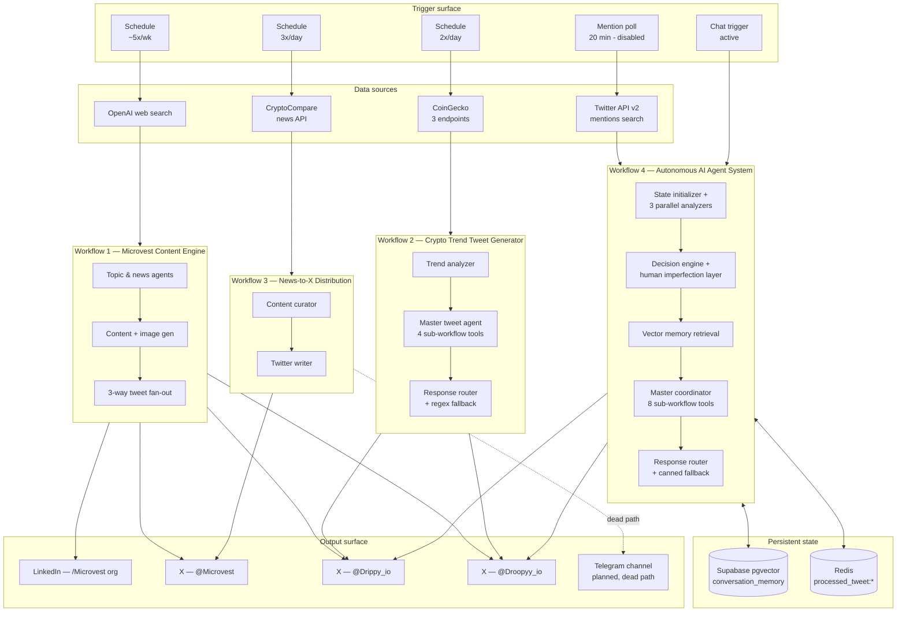

# Architecture

The four workflows in this repo share state, share personalities, and share a content pipeline philosophy, but each one solves a distinct problem. This document is the cross-cutting view: what runs where, what they have in common, and where the seams are.

## System diagram

## Workflow comparison

| | W1 — Content Engine | W2 — Trend Tweets | W3 — News-to-X | W4 — Autonomous System |
|---|---|---|---|---|
| **Cadence** | ~5×/wk | 2×/day | 3×/day | On chat / hourly mention scan (disabled) |
| **Source signal** | Web-search topic discovery | CoinGecko market state + sentiment search | CryptoCompare news feed | User chat or Twitter mentions |
| **LLM calls per run** | 7 | 2 (orchestrator + analyzer) + 4 sub-tools | 2 | 1 master + up to 8 sub-tools + 1 embedding |
| **Topology** | Linear fan-out | Hierarchical agent (1 orchestrator → 4 tool agents) | Linear curator → writer | Hierarchical agent (1 master → 8 tool agents) + memory loop |
| **Persistent state** | None | None | None | Supabase pgvector + Redis |
| **Output platforms** | LinkedIn org + 3 X accounts | 2 X accounts | 1 X account | 2 X accounts |
| **Image generation** | Yes — `gpt-image-1` | No | No | No |
| **Output reliability** | Structured parser per agent + retry-on-fail | Structured parser + regex fallback | Structured parser only | Structured parser + regex + canned-fallback |

## Shared components

### AI personalities

Three voices appear across the workflows, with consistent prompt-level rules:

| Persona | Account | Tone | Char target | Forbidden | Reading level |
|---|---|---|---|---|---|
| Microvest | `@Microvest` | Brand voice — analytical, no first-person | ~200 | 🚀💡🎯✨🔥👇, em-dashes, semicolons | College |
| Drippy | `@Drippy_io` | Upbeat AI mascot — enthusiastic | ~100 | Same emoji blocklist | High school |
| Droopy | `@Droopyy_io` | Cynical NY-attitude AI mascot | ~100 | Same emoji blocklist + sarcasm-friendly | High school |

Workflow 4 extends these with **Big-Five trait vectors** and an **emotional-state map** (joy, anxiety, confidence, curiosity, frustration, excitement, empathy) that modulate output.

### Credentials

n8n credential IDs that recur across workflows. **The IDs are not secrets** — they reference credentials stored in n8n's encrypted credential store; the actual tokens never appear in workflow JSONs.

| Credential | n8n ID | Used by |
|---|---|---|
| OpenAI API | `RnVXrUG2DFCpECNB` | W1, W2, W3, W4 |
| LinkedIn OAuth2 (Microvest org) | `644Jc6QtUEFCFzKT` | W1 |
| Twitter OAuth2 — @Microvest | `WnfkMj7XIuN0PQV7` | W1, W3 |
| Twitter OAuth2 — @Drippy_io | `811yyUDoeRK8Gigj` | W1, W2, W4 |
| Twitter OAuth2 — @Droopyy_io | `TWZoBDF0Wj4InXpj` | W1, W2, W4 |
| Telegram Bot API | `yh1wWgBSEggiX5W8` | W3 (dead path) |
| Supabase | `e7yz7scLuhyxxC0b` | W4 |
| Redis | `FCJkeAU34Pwi8pAc` | W4 |

### Models

- **`gpt-5-mini`** — default for analysis, curation, and tweet writing. Used everywhere except where structured creative writing is required.
- **`gpt-5.1`** — used in Workflow 1 for the LinkedIn Content Generator (longer-form copy with strict structural constraints) and Workflow 4 for the Master Coordinator.
- **`gpt-image-1`** — Workflow 1 only, for the LinkedIn post image (high-quality preset).
- **`text-embedding-3-small`** — Workflow 4 only, for vector memory.

## Design decisions

### Why n8n

The system is glue code between LLMs, social APIs, and a data store, refreshed on schedule. n8n gives me visual debugging of every node's input and output, native OAuth credential storage, native AI agent / tool / memory nodes, and trivial "share-as-export" portability — exactly what this repo demonstrates. Hand-rolling the same thing in code means rebuilding 80% of the n8n primitives before I can write the first prompt.

### Why hierarchical agents in W2 and W4

A single LLM with eight tools and forty constraints melts. The orchestrator-with-tool-agents pattern lets each tool agent run with its own focused system prompt and its own structured output schema. The orchestrator's job is reduced to "pick which tools to call and merge their results" — a much more tractable task for the model than "do everything at once".

### Why Workflow 1 is *not* hierarchical

Workflow 1's pipeline is naturally linear (topics → article → post → image → hashtags → 3 tweets). There's no decision branching that would benefit from tool agents. Adding hierarchy would be ceremony over substance.

### Why Workflow 4 simulates personality state

The published bot accounts need to feel like consistent characters across hundreds of tweets and replies. Stuffing the entire history into a system prompt every call is expensive and degrades. Instead, a compact `GLOBAL_AI_STATE` (Big-Five + emotional levels + recent memory windows) flows through the workflow as a single object, and the prompt for each agent reads only the slices it needs. State is durable across runs via the Supabase memory write at the end of each run.

### Why Supabase pgvector and not Pinecone

The Pinecone references in Workflow 4's metadata are aspirational — actual vector storage is in Supabase. Reasons: (1) one fewer service to manage, (2) `pg_vector` is fast enough at this scale (low five-figures of memories), (3) Supabase RPCs let me write the similarity query as `match_conversation_memory(query_embedding, match_count: 10)` with native joins to other tables.

## Reliability posture

Every Twitter post node runs with `retryOnFail` and `continueErrorOutput`, isolating per-platform outages from the rest of the run. Every LLM agent runs through a `structuredOutputParser`. The Twitter post path in Workflows 2 and 4 layers a regex fallback on top of the structured parse, and Workflow 4 adds a canned-response final fallback — output reaches the post node, or it is dropped explicitly. Nothing is silent.

## Repository as documentation

The deep-dive docs in [`docs/workflows/`](workflows/) are written so that someone who has never touched n8n can read them and reconstruct the intent of each node. The diagrams there are generated by walking each JSON's `nodes` array and `connections` map — same algorithm as the system diagram at the top of this file. If a node name or edge in a diagram doesn't match the JSON, that's a bug; report it.
