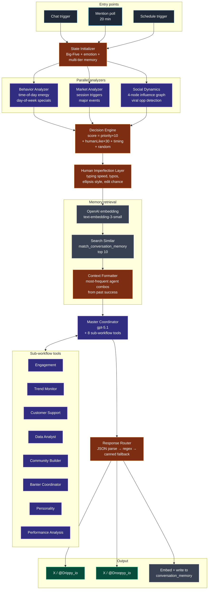

# Workflow 4 — Autonomous AI Agent System

> **File:** `workflows/autonomous-ai-agent-system.json`
> **Triggers:** Chat (interactive), 20-min mention scan, scheduled tweet runs, vector memory backfill
> **Per-run cost:** ~$0.20 (master coordinator + sub-tools + 1 embedding)

## Purpose

The centerpiece of the system. An autonomous multi-agent runtime that operates `@Drippy_io` and `@Droopyy_io` as consistent characters — generating tweets, replying to mentions, maintaining vector memory of past interactions, and coordinating dual-personality banter exchanges. Where Workflows 1-3 are scheduled publishers, this is a runtime: it has state, it remembers, it reacts, and it speaks in two voices that stay in character across hundreds of interactions.

## Pipeline



## Architecture in layers

This workflow is the most ambitious artifact in the repo. It's organized as nine logical layers; each does one job and hands off a richer object to the next.

### Layer 1 — State initialization

The `State Initializer` builds a `GLOBAL_AI_STATE` object that flows through every downstream node. For each personality:

- **Big-Five trait vector**
  - Drippy: openness 0.9, conscientiousness 0.7, extraversion 0.95, agreeableness 0.85, neuroticism 0.3
  - Droopy: openness 0.7, conscientiousness 0.8, extraversion 0.4, agreeableness 0.5, neuroticism 0.6
- **Emotional levels** (joy, anxiety, confidence, curiosity, frustration, excitement, empathy)
- **Multi-tier memory** (`shortTerm`, `workingMemory`, `longTerm`, `episodic`, `semantic`)
- **Goals** (`shortTerm`, `mediumTerm`, `longTerm`), quirks, habits, relationship map, internal monologue, learning rate
- **Pinecone reference** to `microvest-ai-memory` index, `personality-memories` namespace (mirror of the active Supabase memory)

Why a state object instead of stuffing everything into the system prompt: the prompt for each downstream agent reads only the slices it needs. The personality agent reads traits + voice; the engagement agent reads goals + recent successful interactions; the response router reads emotional levels for delay calibration. One source of truth, many narrow consumers.

### Layer 2 — Three parallel analyzers

Each analyzer runs concurrently against the state object and produces a list of scored triggers.

- **Behavior Analyzer** — time-of-day energy peaks per personality (Drippy peaks 7-9 AM, Droopy peaks 8-10 PM), mood-driven posting from the top emotions, day-of-week specials (Monday motivation, Friday celebration, Sunday reflection), 25%-probability special-hour triggers (`sunrise_thoughts`, `midnight_oil`).
- **Market Analyzer** — market-session triggers (Asian / European / US open), special events (weekly close, options expiry, futures rollover). Defers actual price data fetching to the Data Analyst sub-agent.
- **Social Dynamics Analyzer** — a four-node social graph with influence scores, time-bucketed topic pools (`morning`, `afternoon`, `evening`, `trending`, `meme`, `microvest`), conversation-wave momentum scoring, viral-opportunity detection with thresholds, community-milestone proximity, influencer-engagement triggers, spontaneous social triggers (`community_question`, `success_story_share`, `myth_busting`, `community_shoutout`).

### Layer 3 — Decision engine

Scores every trigger from the three analyzers using an explicit formula:

```
score = priority × 10
      + humanLikeScore × 30
      + timingBonus
      + random(0..20)
```

Picks the highest-scoring trigger per personality. 30% chance to chain into a banter sequence (one personality posts, the other responds). Maps each chosen trigger type to a specific subset of the 8 sub-agent tools via a `triggerTypeAgentMap`. Falls back to a curated trigger library if no analyzer-derived trigger qualifies.

### Layer 4 — Human Imperfection Layer

For each personality and current emotional state, computes:

| Modulator | Effect |
|---|---|
| Typing speed | 50ms/char (Drippy), 80ms/char (Droopy), modulated by excitement and anxiety |
| `doubleSpaceChance` | Probability of leaving a stray double space |
| `typoChance` | Adds plausible adjacent-key typos at low rates |
| `ellipsisStyle` | `...` for Droopy, `…` for Drippy |
| Response delay | 5-35 seconds before posting |
| Edit chance | 10% probability of post-and-edit |
| Platform behaviors | `useThreads` ~20% for Drippy; sarcastic vs supportive quote-tweet style |
| Tweet length by time of day | concise → moderate → verbose → rambling |

The point isn't that any of these individually fool a reader. The point is that the *distribution* of outputs over hundreds of posts looks human-distributed, not LLM-flat.

### Layer 5 — Vector context retrieval

```
input → OpenAI embedding (text-embedding-3-small) → Supabase RPC match_conversation_memory(query_embedding, match_count: 10)
```

The Pre-Master Coordinator Formatter then:
1. Aggregates the 10 returned past-conversation rows.
2. Computes the most-frequent agent combinations from past successful runs (`agent_combination` array on each row).
3. Decides whether dual-personality output is needed (based on the trigger type).
4. Builds a context-rich prompt that surfaces both the similar past content *and* the agents that worked last time on similar inputs.

This is RAG with two layers — content similarity *and* tool-selection similarity. The master coordinator gets a hint about which sub-tools have worked before for inputs like this.

### Layer 6 — Master Coordinator

The orchestrator. `gpt-5.1`, with eight sub-workflow tools registered via `toolWorkflow`:

| Tool | Workflow ID | Purpose |
|---|---|---|
| Engagement Agent | `3XoN2pVb4mEo8lti` | Conversational hooks / reply-bait |
| Trend Monitor | `${vars.TREND_MONITOR_WORKFLOW_ID}` | Twitter trends / viral opportunities |
| Customer Support | `tlITbd8NBbqdrOMN` | Support / educational replies |
| Data Analyst | `6wylD6WPYQMlixY0` | Market data interpretation |
| Community Builder | `tREwgrMuNVlFWluz` | Community-focused content |
| Banter Coordinator | `Jh643zr0eYIHmgxE` | Drippy↔Droopy exchange choreography |
| Personality Agent | `vn9SJwGsFZQaD2ve` | Voice consistency check |
| Performance Analysis | `cROdkvVdLp4szCgh` | Post-mortem on past tweets |

The system prompt requires the coordinator to invoke every agent listed in the trigger's `requiredAgents` field. Output schema is strict JSON with both personalities populated; failure to reach a required tool returns a `COORDINATION_FAILURE` exit signal that surfaces in the n8n execution log.

### Layer 7 — Output routing and posting

Response Router runs three parses in order: primary JSON-block extraction, regex fallback for `drippy:` / `droopy:` patterns, and a canned-emergency-tweet fallback if both fail. Output is split by personality, routed through `IF` nodes to the correct Twitter post node (Drippy → `@Drippy_io`, Droopy → `@Droopyy_io`), and a `Success Response → Error Handler` pair captures status.

In parallel: an embedding of the new conversation is written to Supabase `conversation_memory`, with the `agent_combination` array populated from the trigger's required agents. This is what the next run's vector retrieval will surface.

### Layer 8 — Mention-monitoring + reply pipeline

The ambient layer. Every 20 minutes:

1. Three parallel fetches: Drippy mentions, Droopy mentions, BTC/ETH market data.
2. `Process & Prioritize Tweets` (~150 lines of JS) — author-influence scoring, sentiment detection, topic classification (`technical`, `meme`, `news`, `educational`, `concern`, `hype`, `fear`, `microvest`), banter-need determination, priority scoring out of 100.
3. Redis dedup via `processed_tweet:<id>` keys with TTL.
4. `IF banter needed` → **Advanced Banter Generator** (~500 lines: 7 banter style templates × 2 personalities × 3 variations = ~42 base templates with dynamic placeholder fills using 25+ replacement keys, market-sentiment analysis, follow-up-tweet suggestions, optimal-delay calculation).
5. Else → **Simple Response Generator** (canned reply per topic class × personality × author influence).
6. `Process one at a time → Wait → Split Responses → Switch by personality → Post → Merge → Store in Supabase memory → Embed → Done`.

This pipeline is what makes the accounts feel reactive instead of broadcast-only.

### Layer 9 — Vector memory backfill

Two parallel paths fill `message_embedding` (`conversation_memory`) and `content_embedding` (`ai_knowledge_base`) for any rows where the embedding column is null. Batched 10 rows at a time. Runs on its own schedule, decoupled from the live posting loop, so backfilling old rows never starves the user-facing path.

## Infrastructure introduced

| Service | Use |
|---|---|
| **Supabase** (`flfyhzsxugytcjsjcxub.supabase.co`) | `conversation_memory` table, `ai_knowledge_base` table, `match_conversation_memory` RPC for pgvector similarity search |
| **Redis** | Tweet-processed dedup (`processed_tweet:<id>`) with TTL |
| **Pinecone** | `microvest-ai-memory` / `personality-memories` namespace — referenced in state metadata as a mirror of the active Supabase memory |
| **Twitter API v2 (raw HTTP)** | Direct calls to `api.twitter.com/2/tweets/search/recent` for mention monitoring |
| **OpenAI embeddings** | `text-embedding-3-small` (1536 dims) for vector memory |

## Reliability posture

- **Defense in depth on output parsing.** Three parse layers in the Response Router (structured → regex → canned). The system never posts garbage and never silently drops.
- **Per-platform isolation.** Drippy and Droopy post nodes both run with `retryOnFail` and `continueErrorOutput`. A Drippy outage doesn't block Droopy.
- **Coordination failure surfaced.** The master coordinator's strict JSON output requirement and `COORDINATION_FAILURE` exit signal mean missing tools fail loudly in the execution log, not silently in production output.
- **Idempotent mention replies.** Redis dedup ensures the same mention is never replied to twice, even across overlapping 20-min poll windows.

## Skills demonstrated

- **Hierarchical multi-agent system design** — orchestrator + 8 specialized tool agents, with explicit trigger → tool-set mapping.
- **State engineering for LLMs** — Big-Five traits, emotional vector, multi-tier memory, all flowing through nodes as a single object that downstream prompts read narrow slices of.
- **Vector retrieval + RAG with two-layer similarity** — content similarity *and* tool-selection similarity (which agents worked last time for similar inputs).
- **Defensive output parsing** — primary structured parse, regex fallback, canned-response final fallback.
- **"Don't sound like an AI" engineering** — the Human Imperfection Layer is novel and addresses a real production concern.
- **Choreographed multi-character interactions** — banter coordination at the workflow level, not just the prompt level.
- **Inbound conversation handling** — influence-weighted prioritization, topic classification, dedup, and a templating system with 42+ banter variations and 25+ placeholder fills.
- **Async memory backfill** — separation of live posting path from background embedding computation, avoiding starvation.
