# Workflow 2 — Crypto Trend Tweet Generator

> **File:** [`workflows/crypto-trend-tweet-generator.json`](../../workflows/crypto-trend-tweet-generator.json)
> **Cadence:** 2×/day at 07:04 and 21:03
> **Per-run cost:** ~$0.06

## Purpose

Twice-daily reactive tweet generator for `@Drippy_io` and `@Droopyy_io` that fuses real-time market data with social-sentiment search to produce data-grounded tweets. Different from Workflow 1: this one is market-driven, not news-driven, and runs entirely on the Twitter side.

## Pipeline

```mermaid
flowchart LR
    SCH[Schedule<br/>2x/day]:::trigger
    CG1[CoinGecko<br/>/search/trending]:::data
    CG2[CoinGecko<br/>top by volume]:::data
    CG3[CoinGecko<br/>top 24h gainers]:::data
    FMT[Format Market Data<br/>JS Code]:::glue
    TA[Trend Analyzer<br/>gpt-5-mini + websearch]:::ai
    PR[Prepare Tweet Request<br/>JS Code]:::glue
    TG[Tweet Generator<br/>gpt-5-mini<br/>orchestrator]:::ai
    RR[Response Router<br/>JS Code + regex fallback]:::glue
    SW{Switch by personality}:::decision
    DRP[X / @Drippy_io]:::out
    DRY[X / @Droopyy_io]:::out

    subgraph tools[Sub-workflow tools]
        TM[Trend Monitor]:::ai
        CA[Crypto Analyst]:::ai
        EA[Engagement Agent]:::ai
        PA[Personality Agent]:::ai
    end

    SCH --> CG1 & CG2 & CG3
    CG1 & CG2 & CG3 --> FMT --> TA --> PR --> TG
    TG <--> tools
    TG --> RR --> SW
    SW -->|drippy| DRP
    SW -->|droopy| DRY

    classDef trigger fill:#1f2937,color:#fff,stroke:#0ea5e9
    classDef data fill:#7c2d12,color:#fff,stroke:#fb923c
    classDef glue fill:#374151,color:#fff,stroke:#9ca3af
    classDef ai fill:#312e81,color:#fff,stroke:#a78bfa
    classDef decision fill:#78350f,color:#fff,stroke:#fbbf24
    classDef out fill:#064e3b,color:#fff,stroke:#34d399
```



## Architecture: hierarchical agent

This is the workflow that earns the "agentic" label. The `Tweet Generator` agent is an orchestrator — its job is not to write tweets directly, but to call the four sub-workflow tools, gather their outputs, and merge them into a structured response. Each tool is itself a separate n8n workflow registered with `toolWorkflow`.

| Tool | Workflow ID | Responsibility |
|---|---|---|
| Trend Monitor | `EC6PE9Y0HgG41fJ1` | Twitter-side trending topics + viral opportunities |
| Crypto Analyst | `6wylD6WPYQMlixY0` | Market data interpretation; "what's the story behind these numbers" |
| Engagement Agent | `3XoN2pVb4mEo8lti` | Hook style suggestions, question framing, reply-bait |
| Personality Agent | `vn9SJwGsFZQaD2ve` | Voice consistency check for both Drippy and Droopy |

The orchestrator's system prompt requires it to call **at least two tools per run** before returning. This forces multi-source grounding — the orchestrator can't just freestyle a tweet from the market data alone.

## Node-by-node

| # | Node | Type | Role |
|---|---|---|---|
| 1 | Daily Schedule | `n8n-nodes-base.scheduleTrigger` | 07:04 + 21:03 daily |
| 2-4 | CoinGecko fetches (×3) | `n8n-nodes-base.httpRequest` | Trending, top-by-volume, top-by-24h-gain |
| 5 | Format Market Data | `n8n-nodes-base.code` | Combine streams; emit `marketSummary` + suggested social-sentiment search queries |
| 6 | Trend Analyzer | `@n8n/n8n-nodes-langchain.agent` (gpt-5-mini + webSearch tool, min 2 calls) | Top-3 tweetable stories with Drippy/Droopy angle for each |
| 7 | Prepare Tweet Request | `n8n-nodes-base.code` | Randomize personality order; classify trigger type (`opportunity_alert` / `community_love` / etc.) from market state; build orchestrator chat input |
| 8 | Tweet Generator | `@n8n/n8n-nodes-langchain.agent` (gpt-5-mini) | Orchestrator. 4 sub-workflow tools attached. Output: JSON `{ drippy: { tweet, reasoning }, droopy: { tweet, reasoning } }` |
| 9 | Response Router | `n8n-nodes-base.code` | Primary JSON-block parse; falls back to regex extraction of `drippy:` / `droopy:` patterns; emits two items |
| 10 | Switch | `n8n-nodes-base.switch` | Route by `personality` field |
| 11-12 | Twitter Post (×2) | `n8n-nodes-base.twitter` | Post each tweet to its account |

## Engineering choices worth pointing at

### Hierarchical, not monolithic

A single LLM call asked to "look at market data + check trends + write two character-consistent tweets + match a sentiment trigger" produces drift on every dimension. Splitting into specialized sub-agents (each with its own system prompt and structured output schema) and letting an orchestrator pick which to call recovers reliability. This is the same pattern as Workflow 4, just smaller.

### Defensive parsing

The `Response Router` has a primary parse path that extracts the JSON block from the orchestrator's response, and a regex fallback that catches the `drippy:` / `droopy:` pattern even if the JSON is malformed. This is the kind of code you write after watching one model regression silently break a posting pipeline.

### Adaptive prompting

`Prepare Tweet Request` classifies the trigger type **before** building the orchestrator's prompt:

```
opportunity_alert    — when 24h gainers contain a coin up > 15%
community_love       — when trending list overlaps last week's
fear_uncertainty     — when top movers are red and volume spikes
…
```

The orchestrator's prompt is then assembled with a trigger-specific opening directive ("a tweet that warns without panicking" vs "a tweet that celebrates with the community"). The model isn't asked to figure out tone from the data — the workflow tells it.

### Personality randomization

`Prepare Tweet Request` randomizes which personality the orchestrator generates first. This avoids systematic order bias in the LLM's output (the first tweet tends to be more polished; the second tends to inherit phrasing from the first).

### Free-tier engineering

CoinGecko free tier is unauthenticated and capped at 1 req/sec. The three parallel fetches each hit different endpoints, so there's no rate-limit collision. SerpAPI (if used by the websearch tool) is on the 100-call/month free tier — `Trend Analyzer`'s minimum-2-calls rule means up to 4 calls/day, well under the cap. The whole workflow runs on $0 of infrastructure spend per day; only OpenAI is billable.

## Sub-workflow contracts

The four sub-workflow tools are not in this repo (they're separate workflow files). Each one is invoked by the orchestrator with a single string argument and is expected to return a single object. Documented at the interface level:

| Tool | Input | Output (expected shape) |
|---|---|---|
| Trend Monitor | `query: string` | `{ trends: [{ topic, momentum, relevance }] }` |
| Crypto Analyst | `marketSummary: string` | `{ insight: string, riskAngle?: string, opportunityAngle?: string }` |
| Engagement Agent | `topic + context: string` | `{ hooks: string[], questions: string[] }` |
| Personality Agent | `draftTweet + persona: string` | `{ revisedTweet: string, voiceScore: number }` |

If you want to import this workflow standalone without the sub-workflows, the orchestrator will fail at runtime when it tries to call a missing tool. Either import the four sub-workflow JSONs first, or stub the orchestrator's `tools` array down to whatever you have available.

## Reliability posture

Every LLM agent runs through a `structuredOutputParser` with `retryOnFail`. The Response Router gives the orchestrator's output two routes home — primary JSON parse, then a regex fallback that catches `drippy:` / `droopy:` patterns even if the JSON envelope drifts. The Twitter post nodes use `retryOnFail` + `continueErrorOutput`, so one account's outage never blocks the other.

## Skills demonstrated

- Hierarchical multi-agent design (orchestrator + tool agents).
- Tool-use enforcement via system-prompt-level "minimum N tool calls" rule.
- Adaptive prompting based on real-time data classification.
- Defensive output parsing with primary-parse / regex fallback.
- Free-tier API engineering (CoinGecko, SerpAPI) with no rate-limit incidents.
- Sub-workflow modularization in n8n via `toolWorkflow`.
