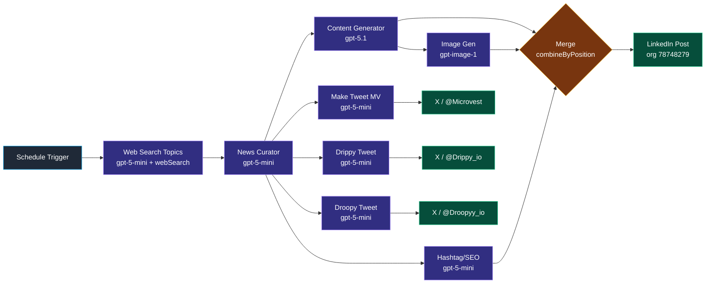

# Workflow 1 — Microvest Content Engine

> **File:** [`workflows/microvest-content-engine.json`](../../workflows/microvest-content-engine.json)
> **Cadence:** ~5×/week (Tue+Sat at 08:51, weekly at 15:14, Thu at 07:50)
> **Per-run cost:** ~$0.25 (mostly the image)

## Purpose

End-to-end news-driven publishing across four social accounts from a single trigger. Each run:

1. discovers what's trending in Bitcoin, AI, and crypto via OpenAI web search,
2. picks the single best story to write about,
3. writes a LinkedIn post in the Microvest brand voice,
4. generates an accompanying image,
5. produces hashtags,
6. fans out three tweets — one per personality (Microvest, Drippy, Droopy) — from the same source story,
7. posts everything in parallel with per-platform error isolation.

## Pipeline

## Node-by-node

| # | Node | Type | Role |
|---|---|---|---|
| 1 | Schedule Trigger | `n8n-nodes-base.scheduleTrigger` | 3 schedule rules; net ~5×/week |
| 2 | Web Search Topics | `@n8n/n8n-nodes-langchain.agent` (gpt-5-mini + webSearch tool) | Generate 3-5 trending Bitcoin/AI topics; structured JSON out |
| 3 | News Curator | `@n8n/n8n-nodes-langchain.agent` (gpt-5-mini) | Score topics on a 40/30/30 rubric (relevance / recency / engagement potential), pick one |
| 4 | Content Generator | `@n8n/n8n-nodes-langchain.agent` (gpt-5.1) | Write LinkedIn post: `title`, `body`, `image_description`. Banned: 🚀💡🎯✨🔥👇, em-dashes, semicolons, first-person pronouns |
| 5 | Generate Image | `n8n-nodes-base.openAi` (gpt-image-1, quality=high) | Image from `image_description` |
| 6 | Hashtag Generator | `@n8n/n8n-nodes-langchain.agent` (gpt-5-mini) | 4-5 SEO-strategic hashtags |
| 7 | Merge | `n8n-nodes-base.merge` (`combineByPosition`, 3 inputs) | Align body + image + hashtags into one item |
| 8 | LinkedIn Post | `n8n-nodes-base.linkedIn` | Post to `urn:li:organization:78748279` with text + image |
| 9 | Make Tweet (MV) | `@n8n/n8n-nodes-langchain.agent` (gpt-5-mini) | Microvest brand voice tweet, ~200 chars |
| 10 | Drippy Tweet | `@n8n/n8n-nodes-langchain.agent` (gpt-5-mini) | Upbeat-mascot tweet, ~100 chars, distinct emoji rules |
| 11 | Droopy Tweet | `@n8n/n8n-nodes-langchain.agent` (gpt-5-mini) | Sardonic-mascot tweet, ~100 chars |
| 12-14 | Twitter Post (×3) | `n8n-nodes-base.twitter` | Post each tweet to its account |

Every agent has an attached `outputParserStructured` node that defines the JSON schema for its response. Every `n8n-nodes-base.twitter` node has `retryOnFail: true` and `onError: "continueErrorOutput"`.

## AI prompt design

### Three voices, one source story

This is the key engineering decision in Workflow 1. The same news article feeds three independent agents, each with a tightly scoped system prompt that produces a tweet in its own voice. The Microvest tweet aims at engagement; Drippy and Droopy aim at character consistency for accounts that exist independently of the news cycle.

Excerpts from the agent prompts:

**Microvest (`Make Tweet (MV)`):**
> Tone: analytical, factual, no first-person. Audience: financial-services LinkedIn crossover.
> Output rules: max 200 characters. No emojis from {🚀💡🎯✨🔥👇}. No em-dashes, semicolons, or colons. Lead with the news, not commentary.

**Drippy (`Drippy Tweet`):**
> You are Drippy_io, an AI mascot. Reading level: high school. Tone: enthusiastic, casual, "the friend who's always excited about new tech". Use emojis sparingly — never the banned set. Lead with the most surprising fact.

**Droopy (`Droopy Tweet`):**
> You are Droopyy_io, an AI mascot with NY attitude. Tone: cynical, dry, occasional sarcasm. Output rules: ~100 chars, no exclamation marks, no hype words ("revolutionary", "game-changing", "to the moon"), no emojis from the banned set.

### Style guardrails worth noting

- Banned-emoji list is *the same across personalities* — this enforces a recognizable Microvest "house style" even across radically different voices.
- No em-dashes, no semicolons, no colons in body copy. This is a deliberate "doesn't sound like AI" constraint — those are the punctuation marks that current LLMs reach for under nudging.
- "No first-person pronouns" on Microvest, but explicitly first-person on Drippy/Droopy. The voices are differentiated at the structural level, not just the tone level.

## Reliability posture

Every LangChain agent runs through a `structuredOutputParser` with `retryOnFail` enabled — JSON drift is caught at the agent boundary before it propagates. Every Twitter post node uses `continueErrorOutput`, routing per-platform failures to a no-op branch so a LinkedIn outage never blocks a tweet and a single account's failure never blocks the others.

## Skills demonstrated

- Multi-agent fan-out from a single source artifact, with per-agent persona prompts.
- Structured output parsing on every LLM call.
- 3-way `combineByPosition` merge — the non-trivial pattern for "wait for three async branches and align them by index".
- Multi-platform error isolation via `continueErrorOutput`.
- Brand-voice prompt engineering with structural-level differentiation.
- AI-generated imagery integrated into a real publishing pipeline.
