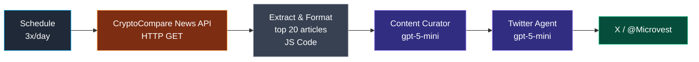

# Workflow 3 — News-to-X Distribution

> **File:** `workflows/news-to-twitter-distribution.json`
> **Cadence:** 3×/day at 07:58, 12:03, 18:02 (news-to-X) + per-persona evergreen schedules + Telegram briefing
> **Per-run cost:** ~$0.01 per X post run; ~$0.02 per Telegram briefing

## Purpose

A multi-channel publishing canvas. The headline path is the news-to-X pipeline for `@Microvest` — three times a day, fetch CryptoCompare's news feed, pick the highest-engagement story by an explicit ranked rubric, and write one tweet about it. The same canvas hosts three per-persona evergreen-humor flows (one each for Microvest, Drippy, Droopy) and a structured Telegram briefing flow that pushes a longer-form mobile-readable digest to a private channel.

## News-to-X pipeline



### Node-by-node

| # | Node | Type | Role |
|---|---|---|---|
| 1 | Schedule Trigger | `n8n-nodes-base.scheduleTrigger` | 3 fixed times daily |
| 2 | Fetch Crypto News | `n8n-nodes-base.httpRequest` | `GET https://min-api.cryptocompare.com/data/v2/news/?lang=EN` (no auth) |
| 3 | Extract & Format Crypto News | `n8n-nodes-base.code` | Take top 20, normalize fields, extract `title` + `body` + `url` + `source` |
| 4 | Content Curator | `@n8n/n8n-nodes-langchain.agent` (gpt-5-mini) | Apply ranked rubric, return one selected article + reasoning |
| 5 | Twitter Agent | `@n8n/n8n-nodes-langchain.agent` (gpt-5-mini) | Write the tweet under hard 200-char limit |
| 6 | Post Tweet | `n8n-nodes-base.twitter` | Post to `@Microvest` |

### Curator prompt — ranked criteria

The Content Curator's system prompt is explicit about how to rank stories:

```
1. Breaking news (regulatory, hacks, major exchange moves)
2. Institutional movement (BlackRock, Fidelity, MicroStrategy, sovereign funds)
3. Controversy (forks, lawsuits, public conflicts between major figures)
4. BTC-adjacent (ETH, L2s, AI-coin narratives)
5. Surprise factor (unexpected partnerships, reversals)

Hard skip:
  - Anything from sponsored/PR sources (e.g., domain has "press release" or "sponsored")
  - Casino, gambling, or token-shilling content
  - Stories more than 24 hours old when fresher coverage exists
```

The output schema requires the curator to return `selectedArticle`, `rank` (1-5 from the criteria above), and `reasoning` — the `reasoning` field is the audit trail that lets me sanity-check curation decisions in n8n's execution log.

### Twitter agent — hook formula

The Twitter Agent's prompt encodes a hook-alternation rule:

> Open with `⚠️Just In:` on odd-numbered runs and `🚨Breaking:` on even-numbered runs. Total length ≤ 200 characters including the hook. Banned: em-dashes, semicolons, banned-emoji set {🚀💡🎯✨🔥👇}, hype words.

This is the same banned-emoji set as Workflow 1 — house style is consistent across the system.

## Per-persona evergreen humor

Three independent flows in the same canvas, each with its own schedule and its own LLM agent. These produce non-news evergreen content — observations, quips, occasional motivational posts. Distinct from the news pipeline: nothing here reacts to the day's news, which is precisely the point. The accounts feel alive in between news cycles.

| Flow | Persona | Char target | Reading level | Hook style |
|---|---|---|---|---|
| `MV1` | Microvest brand voice | ~200 | College | Analytical opener — no rhetorical hook |
| `Drippy1` | Upbeat mascot | ~100 | High school | Emotional / curiosity opener |
| `Droopy1` | Cynical NY mascot | ~100 | High school | Hashtag-formula closer |

Each runs through the same banned-emoji and banned-punctuation guardrails as the news pipeline, so style stays consistent across feeds.

## Telegram briefing

A separate flow on the same canvas pushes a longer-form structured briefing to a private Telegram channel (chat `-1002696122399`). Different audience, different format — Telegram subscribers get the full picture, not the 200-character X version.

The `Telegram Agent` node runs gpt-5-mini with `reasoning_effort: high` and produces:

> - **Lead Story** (1-2 paragraphs, the most important thing today)
> - **Quick Hits** (3 bullets, ≤140 chars each)
> - **Market Pulse** (1 paragraph on overall sentiment)
> - **What to Watch** (1-2 catalysts in the next 24h)
>
> Total length: ≤1500 characters for mobile readability.

The structured format makes the briefing scan-friendly on a phone — a recurring constraint in publishing automation that's worth designing for explicitly.

## Reliability posture

Every LLM agent runs through a `structuredOutputParser` with `retryOnFail`. Twitter post nodes use `retryOnFail` + `continueErrorOutput` so per-platform failures route to a no-op branch instead of stopping the run.

## Skills demonstrated

- Explicit ranked-criteria curation prompts with hard-skip rules.
- Alternating-hook formula for visual variety in account feeds.
- Strict character / style constraints baked into prompts.
- Multi-flow workflow file — news pipeline, evergreen humor flows, and Telegram briefing on a single canvas with shared style guardrails.
- Format-aware prompt design (200-char tweet vs 1500-char mobile briefing).
