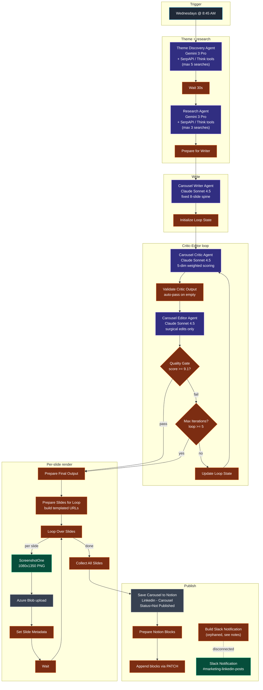

# Workflow 9 — Transform Labs AI Transformation Carousel Engine

> **File:** [`workflows/transform-labs-ai-transformation-carousel.json`](../../workflows/transform-labs-ai-transformation-carousel.json) *(JSON to be added)*
> **Trigger:** Wednesdays at 8:45 AM weekly
> **Per-run cost:** ~$0.30–$0.70 (depends on critic-editor iterations)

## Purpose

Weekly LinkedIn carousel generator that picks **a theme** rather than a single article. A Gemini-powered Theme Discovery agent searches the web for an interesting AI-transformation angle (a contrarian insight, a surprising ROI statistic, a counter-narrative), a second Gemini agent does a strictly-bounded research pass to gather 5-6 mid-market industry examples *with specific metrics*, then Claude Sonnet 4.5 writes a fixed 8-slide carousel: 1 hook + 5 industry-example body slides + 1 reinforcing-stat slide + 1 CTA slide. The carousel runs through a Claude critic-editor loop until it scores ≥9.1 or hits 5 iterations. Each slide is rendered via the Azure-hosted `tl_carousel_slide.html` template (URL-encoded params per slide type), screenshot to PNG by ScreenshotOne, uploaded to Azure Blob, then assembled into a Notion entry behind a human approval gate with a Slack notification to `#marketing-linkedin-posts`.

The defining engineering choice is **theme-first authoring with rigid slide-role structure**. Unlike W6 which deep-dives a single news article into 8-10 freeform slides, W9 enforces an exact 8-slide spine (`hook → body × 5 → stat → cta`) and requires every body slide to lead with a specific metric (`Healthcare + 40% Faster Diagnoses`). The structure is the brand voice — every weekly carousel looks and reads the same shape.

## Architecture



## Pipeline detail

### Stage 1 — Theme discovery

`Theme Discovery Agent` (Google **Gemini 3 Pro Preview** + **SerpAPI tool** + Think tool) runs up to 5 web searches looking for **one** AI-transformation theme worth a carousel. The system prompt teaches Ryan Frederick's pattern-recognition framing — contrarian-but-earned, grounded-in-specific-data, about-tensions-and-dynamics, mid-market-relevant — and gives worked examples of theme types that work (`AI ROI is happening faster than predicted`, `The companies winning at AI aren't the ones spending the most`) vs. don't (`AI is changing business`, `Digital transformation matters`).

Output: structured JSON with `selectedTheme` (≤10 words), `hookStatistic` (`{number, context, source, year}`), `themeReasoning`, `conventionalWisdomChallenged`, `industryAngles` (5-6 industries to cover), `searchSummary`.

### Stage 2 — 30-second wait

A `Wait1` node sits between Theme Discovery and Research. Likely added to space out SerpAPI / Gemini calls and avoid bursty rate-limit issues — the two agents back-to-back can run 5+3 searches in a span of seconds.

### Stage 3 — Industry-example research

`Research Agent` (Gemini 3 Pro Preview + SerpAPI + Think) takes the selected theme + the list of industries and runs **2-3 searches MAXIMUM** to find:
- Specific company or industry case studies *with metrics* (`Manufacturing defect rates dropped 90% after AI visual inspection`)
- Supporting statistics from credible sources (McKinsey, Gartner, Deloitte, HBR)
- Recent examples (2024-2026 preferred)

Per-industry the agent tries to surface a specific metric, a deployment timeframe, a company-size reference, and a credible source. The system prompt is hard-bounded: `Do NOT keep searching for perfect information` and `maxIterations: 7` on the agent caps tool calls regardless. Same cost-control philosophy as W7's research agent.

Output: `industryExamples` (5-6 entries with `{industry, headline, transformation, metric, timeframe, source, midMarketRelevance}`), `reinforcingStat`, `dataQuality`, `gaps`.

`Prepare for Writer` (Set node) flattens `theme` and `research` into a single object for the writer.

### Stage 4 — Write

`Carousel Writer Agent1` (Anthropic **Claude Sonnet 4.5**) writes a fixed-shape 8-slide carousel:

| Slide | Type | Required fields | Char limits |
|---|---|---|---|
| 1 | `hook` | eyebrow (≤20), headline (≤60), subheadline (≤120) | bold-statement opening |
| 2-6 | `body` | title (≤50, **must contain a metric**), description (≤150), bullets (2-3 × ≤60) | one industry per slide |
| 7 | `stat` | statNumber (≤6), statLabel (≤60), statContext (≤150), statSource (≤40) | reinforcing data |
| 8 | `cta` | ctaHeadline (≤50), ctaSubtext (≤100), ctaButton (≤20) | thought-provoking, not salesy |

Plus a 500-800 character LinkedIn `postCaption` that opens with a bold statement, references the carousel value, ends with a specific question, and uses `we` for Transform Labs.

The Writer system prompt is the longest in the workflow. It encodes:
- Sentence rules (under 15 words, high school reading level, active voice, no subordinating conjunctions)
- Anti-fragment-list rules (worked examples of bad: `Chatbots know things. Facts. Patterns.` vs good: `Chatbots needed to know facts and patterns. Agents need to DO things.`)
- Banned punctuation (em dashes, en dashes, semicolons, mid-sentence colons)
- ~25 banned phrases (`In today's`, `Here's the thing`, `Game-changer`, `Leverage`, `Synergy`, `Innovative`, `Excited to share`, sentences starting with `So,` or `Now,`, all hedging — `might / could / would / may`)
- Anti-AI-tells (no `I hope this helps`, no `As an AI...`)
- A 7-item self-check before output

### Stage 5 — Critic-Editor loop

Same architectural pattern as W6/W7/W8. `Initialize Loop State1` packages the writer's draft + theme + research with `loopCount: 1`, then:

**`Carousel Critic Agent1` (Claude Sonnet 4.5)** scores the carousel against five weighted dimensions:

| Dimension | Weight |
|---|---|
| Hook Impact | 20% |
| Data Quality | 25% |
| Voice Authenticity | 20% |
| Conversational Flow | 20% |
| CTA Effectiveness | 15% |

Hard fails (automatic cap at 5.0):
- Banned punctuation (em/en dashes, semicolons, colons anywhere)
- ~20 banned phrases (the full Writer's banned list, enforced again)
- Hook opens with a question instead of a bold statement
- Body slide title missing a specific metric
- CTA sounds like a sales pitch
- Generic advice anyone could give
- Third-person voice (`Transform Labs built` instead of `We built`)
- Temporal fails (referencing the current year as future, outdated stats, claims about client work the prompt says were not actually done by Transform Labs)

The critic prompt explicitly anchors the scoring scale: `9-10: Genuinely surprising. 7-8: Solid but predictable. 5-6: Generic. Could be any brand. Below 5: REJECT.` — and instructs the critic to *default to REJECT* and demand content earn approval. Same anti-inflation discipline as W8.

**`Validate Critic Output1`** (JS) defends against empty/malformed critic responses by auto-passing the carousel (`overallScore: 8.5, readyToPublish: true, _autoPassedDueToError: true`) and propagates the loop counter forward. On iteration 1 it reads the counter from `Initialize Loop State1`; on subsequent iterations from `Update Loop State`.

**`Carousel Editor Agent1` (Claude Sonnet 4.5)** applies surgical edits: fix banned punctuation (search-and-destroy with one-for-one replacements), rewrite forbidden phrases completely, enforce all character limits, preserve voice and structure. Includes a 7-item self-check before output (no em dashes, no semicolons, no mid-sentence colons, no forbidden phrases, all fields within char limits, every body slide title has a metric, first-person voice preserved).

**`Quality Gate`** exits when `overallScore >= 9.1`. **`Max Iterations Check`** exits when `_loopCount >= 5`. Worst case: 5 critic + 5 editor calls.

> **Note:** the workflow's sticky note says `Pass: Score >= 8.5` but the IF node compares against `9.1`. The sticky is documentation drift — the live behavior is `>= 9.1`.

### Stage 6 — Per-slide render

`Prepare Final Output2` consolidates the editor's revised carousel + critic scoring + iteration count into one object, derives `passedQuality = score >= 8.0`.

`Prepare Slides for Loop1` (JS) builds, per slide, a query-string-encoded URL pointing at the Azure-hosted `tl_carousel_slide.html` template — different params for each `slideType`:

```
?type=hook&num=1&total=8&eyebrow=AI+TRANSFORMATION&headline=...
?type=body&num=2&total=8&title=Healthcare+%2B+40%25+Faster+Diagnoses&description=...&bullets=...|...|...
?type=stat&num=7&total=8&stat=73%25&statlabel=...&statcontext=...&statsource=...
?type=cta&num=8&total=8&ctaheadline=...&ctasubtext=...&ctabutton=...
```

The hosted template handles all the visual rendering — different from W6 which generates the entire HTML in a 600+ line JS code node. W9's approach is template-driven, making per-run code paths simpler at the cost of less per-slide visual variation.

`Loop Over Slides` (split-in-batches) iterates each slide:
1. **`Screenshot Slide1`** — POSTs to ScreenshotOne (1080×1350, PNG, `delay: 2s` for font loading), retries up to 3× with 2s backoff
2. **`Upload Slide to Azure1`** — stores as `carousel-{carouselId}-slide-{n}.png` in `blogheaderimages` container
3. **`Set Slide Metadata`** — flattens the loop's per-item context plus quality data into the next iteration
4. **`Wait`** — small delay (rate-limit hygiene)

`Collect All Slides1` consolidates the per-slide URLs in slide-number order, marks `passedQuality` based on the critic's overall score.

### Stage 7 — Notion + Slack

`Save Carousel to Notion1` creates the Notion entry under platform `Linkedin - Carousel` with `Status = Not Published`, `Date to Publish = now + 24h`, the carousel title, and the slide URLs joined into the `Linkedin Image` field.

`Prepare Notion Blocks` (JS) builds a structured block array — `Heading 2: LinkedIn Caption`, the full caption + hashtags as a paragraph, divider, `Heading 2: Carousel Slides`, then each slide URL as an external image block.

`Append Content to Notion1` (HTTP PATCH) writes the blocks into the new page body.

> **Known issue:** the workflow defines a `Build Slack Notification1` → `Slack Notification1` pair with a fully-formed Block Kit message (score / iterations / slide assessment / caption preview / action buttons). But nothing connects *into* `Build Slack Notification1` — the connection from `Append Content to Notion1` is an empty array. The Slack notification path is currently orphaned. Wiring `Append Content to Notion1 → Build Slack Notification1` would activate it.

## Models used

| Model | Purpose | Why |
|---|---|---|
| **Google Gemini 3 Pro** | Theme Discovery + Research | Web-search-grounded ideation across current tech executive discourse and per-industry case-study lookups |
| **Anthropic Claude Sonnet 4.5** | Writer / Critic / Editor | Long structured prompts (8-slide schema), voice fidelity, surgical revision discipline |

The Gemini-as-ideator / Claude-as-writer-and-judge split is a softer cross-vendor pattern than W6's Gemini-vs-Claude judging — Gemini gathers raw material, Claude does the writing and quality control end-to-end.

## Skills demonstrated

- **Theme-first authoring vs article-first.** W6 picks a single article and deep-dives. W9 generates a contrarian *theme*, then researches 5-6 industry examples to support it. The two patterns produce visually similar carousels but creatively different output: W9 ranges across industries on a single thesis, W6 goes deep on one story.
- **Rigid slide-role spine.** Exactly 8 slides, exactly one role per position, exactly one metric per body title. The structure *is* the brand voice — every weekly carousel reads the same shape, which is what makes the publication recognizable. *See [the slide-role table](#stage-4--write).*
- **Templated render via hosted HTML, not inline generation.** Slides are rendered by ScreenshotOne pulling URL-param-encoded data into a hosted Azure HTML template (`tl_carousel_slide.html?type=hook&headline=...`). Different from W6's 600+ line inline render. Tradeoff: less per-slide visual variety, much simpler per-run code paths, easier to update the template without changing the workflow.
- **Anti-inflation scoring with REJECT-by-default critic.** The critic prompt explicitly anchors the 1-10 scale (`9-10: Surprising. 7-8: Predictable. 5-6: REJECT.`) and instructs the model to *default to REJECT* and demand content earn approval. Same discipline as W8's anti-inflation framing.
- **Voice-rule enforcement at three layers.** Same anti-buzzword + anti-banned-punctuation + anti-hedging list appears in the Writer prompt, the Critic hard-fail list, and the Editor self-check. The same rule appears three times because that's what it takes to make it stick — same lesson as W6.
- **Bounded research with explicit search caps.** Theme Discovery: max 5 searches. Research: max 2-3 searches. Plus `maxIterations: 7` on the agent itself. Prevents the most common runaway-cost failure mode for tool-using LLMs.
- **30-second deliberate wait between agents.** A `Wait1` node sits between Theme Discovery and Research to space out SerpAPI calls. Small detail, real production hygiene.
- **Approval gate on outbound publishing.** Notion `Status = Not Published` until a human reviews. Same philosophy as W5 / W6 / W7 / W8.
