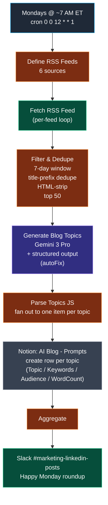

# Workflow 19 — Weekly Blog Topic Research

> **What it does for you:** every Monday morning, the marketing team opens Slack to a roundup of 12-15 fresh LinkedIn blog topic ideas — each one a working title, a target audience, an SEO keyword set, and a target word count — already filed in the Notion `AI Blog - Prompts` database, ready for someone to pick one and start drafting. The week's writing pipeline begins automatically.

> **File:** `workflows/transform-labs-blog-topic-research.json` *(JSON to be added)*
> **Trigger:** Schedule — Mondays at 12:00 UTC (~ 7-8 AM ET depending on DST)
> **Per-run cost:** ~$0.05–$0.10 (one Gemini 3 Pro call against ~50 article summaries)

## Purpose

Most of the LinkedIn-publishing workflows in this repo (W6 carousels, W7 thought leadership, W8 fractional CTO, W9 AI theme carousels, W12 X threads) start by picking a single article from an RSS feed and writing one post about it. **W19 inverts that.** It reads the same kind of feeds, but its job is to produce *topic ideas* — working titles + audience + keywords + length targets — not finished drafts. A human (or one of those downstream workflows) picks an entry from the resulting Notion list and runs it through a writer.

That separation matters because **picking what to write about is a different judgment call from writing it**. Article-of-the-week selection inside a writer workflow is biased toward *what's a good single article to summarize*. Topic-of-the-week ideation across a feed sweep is biased toward *what's a trend worth a strategic take* — and the two often disagree. Splitting them out lets a human review and curate the topic list before the writer workflows commit any tokens to a draft.

The defining engineering choice is **single LLM call against article descriptions, not just titles.** Most other RSS workflows in this repo dedupe to ~30 titles and feed those titles into the prompt. W19 keeps the top 50 articles and feeds the LLM both the title and the first 150 chars of each description. Topic synthesis needs that extra context — you can't tell whether `"OpenAI launches GPT-5"` is worth a topic angle without the surrounding text.

## Architecture



## The 6-feed source set

Tuned narrower than W18's general AI-news set — this one is for **enterprise software development + AI-in-the-workplace** specifically, since the downstream LinkedIn audience is CTOs, engineering managers, and digital-transformation buyers.

| Source | Why |
|---|---|
| Dev.to AI tag | Practitioner-written posts on AI in dev workflows |
| Dev.to Productivity tag | Workplace-productivity-for-developers angle |
| Hacker News (`?points=50` filter) | High-signal AI / automation / dev-tools posts only |
| Google Developers Blog | First-party tool announcements |
| GitHub Engineering Blog | First-party engineering practices from the largest dev platform |
| InfoQ AI/ML | Enterprise AI/ML — mid-market relevant |

The `?points=50` filter on the Hacker News feed is the same noise-reduction trick W18 uses: community-validated articles only.

## Why descriptions, not just titles

The `Filter & Dedupe Articles` node keeps the first 150 chars of each article's description (HTML-stripped, whitespace-normalized) and feeds them to the LLM alongside the title:

```
1. How AI-powered code review tools are reducing developer burnout
   Engineering teams adopting AI-assisted code review report 30% fewer hours spent on routine PR feedback...

2. Google's new AI agent platform launches in beta
   The release ships with multi-step reasoning, tool calling, and a managed runtime for enterprise customers...
```

A title-only prompt gives you `"How AI-powered code review tools are reducing developer burnout"` and asks the LLM to invent context. A title+description prompt gives the LLM the actual claim being made — **30% fewer hours** — which it can fold into the topic angle. This is the difference between *"AI in code review"* (vague) and *"How AI Code Review Cuts CTO Sprint Overhead by 30%"* (specific, audience-targeted, quotable).

Cost goes up linearly with the description budget; with 50 articles × ~250 chars (title + 150-char description + numbering), the prompt is around 12K input tokens. One Gemini 3 Pro call. No critic loop, no second pass.

## Why Gemini 3 Pro for ideation

Topic ideation is creative — the model has to spot trends across 50 disparate articles, group them, and turn each grouping into a working title that lands with one of six target audiences (CTOs evaluating AI adoption / engineering managers scaling teams / dev directors improving velocity / business owners weighing transformation / nonprofit leaders modernizing on a budget / manufacturing execs exploring automation). Gemini 3 Pro's long-context strength matters when the prompt carries 50 article summaries plus an audience taxonomy plus a quality rubric. No critic loop is needed because the structured output schema constrains the shape — `{ topic, keywords, targetAudience, targetWordCount }` per item — and the `autoFix` flag on the parser handles drift instead of re-running a critic.

## Skills demonstrated

- **Topic discovery as a separate workflow from drafting.** W6 / W8 / W9 / W12 all start by picking one article and writing one post. W19 sits one step earlier in the pipeline: it reads the same feeds and produces *a curated week's worth of topic ideas* with structured metadata (audience, keywords, word count). Splitting topic-pick from post-write lets a human review the ideas before any writer workflow commits tokens to a draft.
- **Single-call structured ideation, no critic loop.** Other LinkedIn workflows in this repo run writer-then-critic-then-reviser loops to enforce style. W19 doesn't — the structured output parser (`autoFix`) gives the schema, and the system prompt gives the audience taxonomy + quality rubric, and that's enough because the output is metadata not prose. Critic loops are for voice fidelity; ideation doesn't have a voice to fidelity-check.
- **Title-plus-description over title-only.** Most RSS-fed LLM workflows in this repo strip to titles. W19 keeps the first 150 chars of each description (after HTML-stripping and whitespace normalization), feeding both fields into the prompt. The cost is ~3× the input tokens; the benefit is topic angles grounded in the actual claim each article makes, not on an LLM guess about what the headline implies.
- **6-feed source set tuned for enterprise dev + workplace AI.** Different from W18's general AI-news mix — W19's feeds are biased toward practitioner content (Dev.to tags), high-signal community filtering (HN `?points=50`), and first-party engineering announcements (Google Devs, GitHub Engineering, InfoQ). The audience is CTOs and engineering managers, not consumers, so the feed mix avoids consumer-AI publications entirely.
- **7-day freshness window.** Wider than W18's 24-hour window because topic ideation is weekly cadence — a Monday-morning roundup naturally pulls from the prior business week. Articles older than 7 days get dropped (they'd already have been ideated on last week).
- **Title-prefix dedupe.** Articles within the window are deduped by the first 40 chars of the title (lowercased) before sorting, so the same story republished in two outlets — `"OpenAI Launches GPT-5"` and `"OpenAI Launches GPT-5: What It Means for Enterprise"` — collapses to one entry instead of generating two near-duplicate topics.
- **Notion approval queue + Slack Monday-morning roundup.** Each topic becomes a row in the `AI Blog - Prompts` Notion database with `Topic / Keywords / TargetAudience / Targetwordcount / Date Created`, and a single Slack post in `#marketing-linkedin-posts` opens the week with a numbered list of all 12-15 topics + a `Draft one` link back to Notion. Same approval-gate posture as the publishing workflows — autonomous draft, human pick, then the writer workflows take over.
