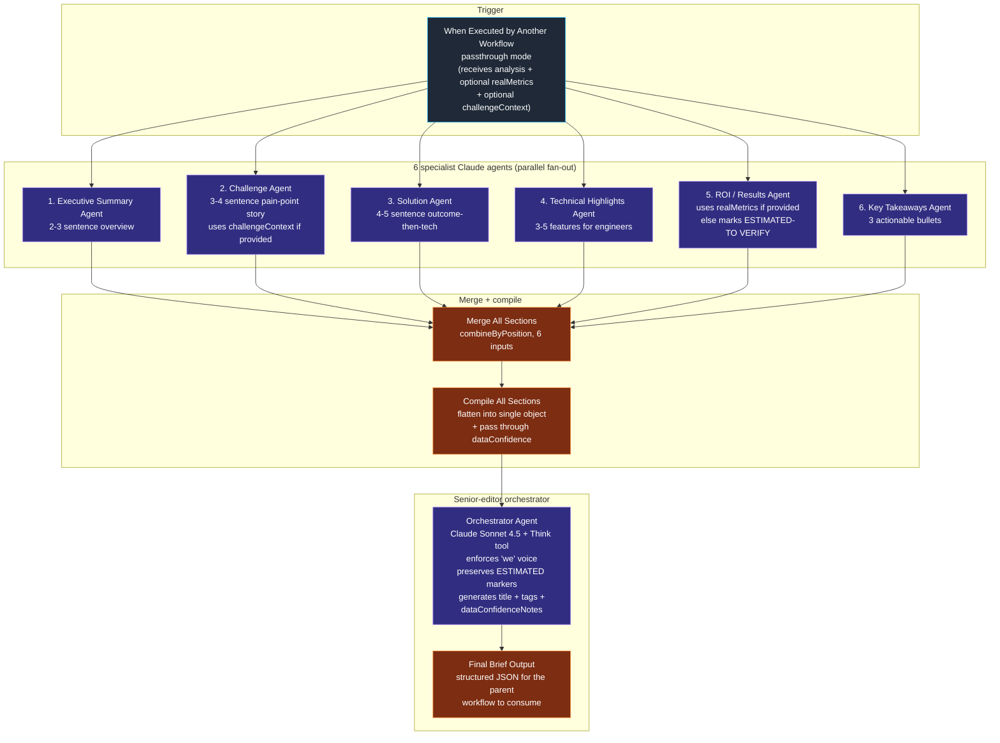

# Workflow 14 — Transform Labs Case Study Brief Generator

> **What it does for you:** turns any n8n workflow's structure (plus optional real-world metrics) into a publication-ready marketing case study brief — first-person voice, with a senior-editor pass that catches invented metrics and enforces honesty markers.

> **File:** `workflows/transform-labs-case-study-brief-generator.json` *(JSON to be added)*
> **Trigger:** `executeWorkflowTrigger` — called as a sub-workflow by a parent that has already analyzed a target workflow's structure
> **Per-run cost:** ~$0.20–$0.40 (six Claude Sonnet 4.5 specialists in parallel + one orchestrator)

## Purpose

Internal marketing tool. The Transform Labs team uses this to turn the workflows they've actually built (their own n8n library, plus client builds) into draft case study briefs they can hand to a writer or paste straight into a blog/sales deck.

**The problem this solves:** writing case studies by hand for a library of 14+ workflows is grindy and inconsistent. Every brief ends up in a different shape, written by whoever was around that week, with vague metrics that nobody verifies. This sub-workflow standardizes the shape (executive summary → challenge → solution → technical highlights → results & ROI → key takeaways → tags) and bakes honesty rules into the prompts so estimates get marked instead of hand-waved.

**The defining engineering choice** is the **6-way parallel fan-out + senior-editor orchestrator**. Most of the other Transform Labs writing workflows (W6 / W7 / W8 / W9 / W12) follow a linear *writer → critic → reviser → loop* pattern. W14 doesn't loop — it parallelizes. Six specialist Claude agents each own one section of the case study, each gets the same input but their own focused system prompt, and they all run simultaneously. Then a single orchestrator agent reads all six outputs, enforces voice consistency, preserves honesty markers, removes redundancy, and adds the metadata layer (title, tags, data-confidence notes). The two patterns serve different goals: the loop pattern *iterates toward quality* on a single output; the parallel-specialists pattern *covers breadth* by letting each section be written by its own focused expert.

## Architecture

## Pipeline detail

### Stage 1 — Sub-workflow intake

`When Executed by Another Workflow` (`executeWorkflowTrigger`, `inputSource: passthrough`) is the entry point. The parent workflow calls this sub-workflow with an `analysis` object that already contains:

- **Workflow structure** (verified facts): `workflowName`, `totalNodes`, `aiNodes`, `complexityScore`, `triggers`, `integrations`, `dataProcessing`, `outputs`, `branchCount`, `hasErrorHandling`, `uniqueServices`, `automationTypes`, `workflowPatterns`
- **`realMetrics`** (optional, may be null per field): `timeSaved`, `costSavings`, `errorReduction`, `otherMetrics` — these are user-verified business metrics
- **`challengeContext`** (optional): `problemDescription`, `previousAttempts`, `stakesOfNotSolving` — supplied by the human running the parent workflow if they want the Challenge section to reference real pain points
- **`dataConfidence`**: a classification object listing which fields are verified vs. need placeholders
- **`targetIndustry`**: e.g. `"Technology Consulting"`

The same input fans out to all 6 specialist agents simultaneously.

### Stage 2 — Six specialist Claude agents in parallel

Each agent is a `chainLlm` node with Claude Sonnet 4.5 + a structured output parser. Each gets the full analysis but writes only **one** section. Running them in parallel rather than sequentially means total latency ≈ slowest single agent (typically ~10s) rather than 6 × 10s.

| # | Agent | Output | Length | Special rules |
|---|---|---|---|---|
| 1 | Executive Summary | `executiveSummary` (string) | 2-3 sentences | First-person; no clichés like *"In today's fast-paced world"* |
| 2 | Challenge | `challenge.{painPoint, manualProcess, oldCost, fullText}` | 3-4 sentences | Uses `challengeContext` if provided; otherwise infers from analysis without inventing specifics |
| 3 | Solution | `solution.{overview, keyTechnologies[], innovation, fullText}` | 4-5 sentences | Outcome first, technology second; technical details from analysis are *verified*, free to use |
| 4 | Technical Highlights | `technicalHighlights[].{feature, description}` | 3-5 items | Engineer-impressing but business-readable; explicitly references `triggers / aiNodes / integrations / dataProcessing / outputs / complexityScore / branchCount / hasErrorHandling` arrays from analysis |
| 5 | ROI / Results | `results.{timeSaved, errorReduction, costSavings, scalability, fullText, hasVerifiedMetrics}` | 4-5 sentences | **The honesty layer:** if a metric is in `realMetrics` it gets used as a fact; if it's missing, the agent must mark it `[ESTIMATED: X-Y hours/week — TO VERIFY]` or use vague phrasing; **never invent dollar amounts** |
| 6 | Key Takeaways | `keyTakeaways[]` | exactly 3 bullets | Action-verb-led, quotable, no specific metrics unless from `realMetrics` |

Every agent's system prompt enforces the same voice rule: *"You ARE Transform Labs — use first-person voice. Never say 'Transform Labs built' — say 'We built'."*

### Stage 3 — Merge + compile

`Merge All Sections1` (n8n Merge node, `combineByPosition` mode, 6 inputs) zips the six parallel branches back into a single item. `Compile All Sections1` (Set node) flattens each agent's output into one object with named fields (`executiveSummary`, `challenge`, `solution`, `technicalHighlights`, `results`, `keyTakeaways`) plus passes through `workflowAnalysis` and `dataConfidence` from the original trigger payload.

### Stage 4 — Senior-editor orchestrator

`Orchestrator` (LangChain `agent` node, Claude Sonnet 4.5 + Think tool + structured output parser) receives the compiled six-section draft and runs an editorial pass:

1. **Review for consistency** — do all six sections tell the same story?
2. **Enforce first-person voice** — sweep any leftover "Transform Labs built" → "We built"
3. **Preserve `[ESTIMATED]` markers** — explicitly told *not* to remove or fill in placeholders
4. **De-duplicate** — sections often re-state context that other sections already covered; remove the overlaps
5. **Add transitions** — make the brief read as flowing prose rather than six stitched-together drafts
6. **Verify honesty** — ensure no specific metric got smuggled in from a hallucination rather than `realMetrics`
7. **Generate metadata** — `suggestedTitle`, 5-7 relevant `tags`, target `industry`, a `qualityScore` 1-10
8. **Add `dataConfidenceNotes`** — a one-paragraph summary of what's verified (workflow structure + any provided `realMetrics`) vs. what's estimated and needs human verification

Output: a single structured object with the final brief — title, refined sections, tags, industry, quality score, and the data-confidence transparency note.

### Stage 5 — Final output

`Final Brief Output1` (Set node) wraps the orchestrator's response with metadata for the parent workflow: the brief itself, the original `workflowAnalysis`, the `dataConfidence` classification, a `batchId`, and a `generatedAt` ISO timestamp.

## Why this architecture instead of a single big prompt

A single Claude agent could in theory write the whole case study from one mega-prompt. Three reasons it doesn't here:

1. **Section quality goes up when each prompt has only one job.** The Technical Highlights agent never has to choose between "be specific to engineers" and "stay accessible to executives" — that's the Solution agent's tradeoff. Each specialist optimizes for one audience.

2. **Honesty rules need to fire on the section that handles metrics, not the whole brief.** The ROI agent's prompt has dedicated, lengthy honesty enforcement (real metrics → use as fact; missing metrics → mark `[ESTIMATED]`; never invent). Folding that into a giant system prompt dilutes it — the rules get half-applied across all sections instead of fully applied where they matter.

3. **Parallel latency is roughly 1× slowest agent, not 6×.** Six independent calls run simultaneously over the same input. A single sequential mega-call would take longer.

The cost: an orchestrator pass at the end to enforce consistency *across* sections (voice, redundancy, metric-marker preservation). Worth it.

## Honesty layer

The most distinctive design choice is the **invent-no-metrics enforcement** that runs at three layers:

1. **At the ROI agent's system prompt:** explicit *"NEVER invent specific dollar amounts"* + the `[ESTIMATED: X — TO VERIFY]` marker pattern + per-field branching on `realMetrics?` being null vs. populated
2. **At the orchestrator's system prompt:** *"Preserve `[ESTIMATED]` markers — do NOT remove or fill in estimate placeholders"*
3. **At the output schema:** the `results` object includes `hasVerifiedMetrics: bool` so downstream consumers can route accordingly (e.g. show a "verify these numbers" warning in the editor's UI when `hasVerifiedMetrics: false`)

Plus the orchestrator's output includes a `dataConfidenceNotes` paragraph that explicitly distinguishes verified-from-workflow facts (node count, integrations, complexity) from estimated-business-metrics. So whoever opens the brief downstream can tell at a glance which numbers to trust.

## Quirks worth knowing

- **Two orchestrator nodes in the JSON.** The original `Orchestrator Agent1` (a `chainLlm` node) is left in but its `main` output array is empty — disconnected. The active orchestrator is `Orchestrator` (a LangChain `agent` node with the Think tool). Looks like a refactor where the agent variant replaced the chain variant but the old node wasn't deleted. Cosmetic — the live path is unambiguous via the connections.
- **No retry / fallback.** Unlike the writer-critic-reviser loops in W6/W7/W8/W9/W12, this workflow has no quality gate or iteration cap. If a specialist produces a weak section, it makes it through. The reasoning: the orchestrator catches voice issues and the human reviewer catches the rest before publishing. Could add a critic pass over the orchestrator's output as a future hardening.
- **First-person enforcement at three layers.** Each specialist's system prompt + the orchestrator's system prompt + the orchestrator's explicit voice-sweep step. Same lesson as W6/W8: the same rule appears multiple times because that's what it takes to make it stick.

## Skills demonstrated

- **6-way parallel specialist fan-out + orchestrator.** Different from the linear writer-critic-reviser loops in W6/W7/W8/W9/W12. Each section is written by a specialist with one focused job; then a senior-editor agent enforces consistency across all six. Total latency is roughly the slowest single agent rather than 6× sequential.
- **Honesty enforcement at three layers.** ROI agent prompt (per-field `realMetrics ?? "[ESTIMATED — TO VERIFY]"` branching + explicit "never invent dollar amounts") + orchestrator prompt (preserve markers) + output schema (`hasVerifiedMetrics: bool` + `dataConfidenceNotes` string). Whoever opens the brief downstream can tell at a glance which numbers are real and which need verification.
- **Sub-workflow as a first-class building block.** This workflow has no schedule trigger and no human-facing UI. It's a tool that other workflows call via `executeWorkflowTrigger` with a typed input contract. Decoupled from any particular ingestion or publishing path — the parent workflow handles "what workflow am I writing about?" and "where does the brief go after?" The sub-workflow only knows "given an analysis, write a brief."
- **Voice enforcement at three layers.** First-person ("we built") enforced in each of the six specialist prompts, in the orchestrator's system prompt, and as an explicit sweep step in the orchestrator's task list. Same lesson as W6 / W8 — the same rule multiple times because that's what it takes.
- **Data-confidence as a first-class output field.** Most prompt pipelines either trust the model or trust the user; this one explicitly tags every claim as verified-from-source vs. estimated-and-marked, and surfaces that classification in the final output as `dataConfidenceNotes`. Makes downstream review and editing tractable.
