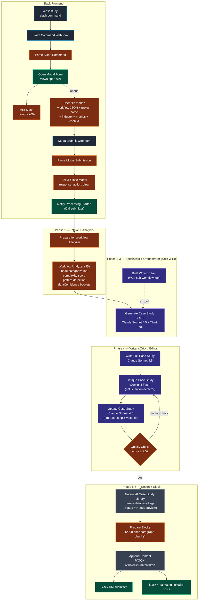

# Workflow 20 — Case Study Generator

> **What it does for you:** anyone in the marketing Slack types `/casestudy`, fills out a short modal (paste a workflow JSON + optional metrics + optional context), and 5-7 minutes later a fully-drafted 800-1200 word case study lands in the Notion `AI Case Study Library` with `Status = Needs Review` and a Slack DM back to the submitter. The marketer never opens an LLM playground; the engineering work is one form-fill away.

> **File:** `workflows/transform-labs-case-study-generator.json` *(JSON to be added)*
> **Triggers:** Two Slack webhooks — `/casestudy` slash command + modal-submit
> **Per-run cost:** ~$0.40-$0.80 (one orchestrator + 6 specialists via the W14 sub-workflow tool, then writer + critic + editor + quality gate; mostly Anthropic Claude Sonnet 4.5 with Gemini 3 Flash on the critic)

## Purpose

This is the **user-facing surface** for the case-study pipeline. It pairs with two other workflows in the repo:

- **W14 (Case Study Brief Generator)** — the sub-workflow that runs the 6 parallel specialists (Executive Summary / Challenge / Solution / Technical Highlights / ROI & Results / Key Takeaways) plus a senior-editor orchestrator. W20 calls W14 as a `toolWorkflow`.
- **W15 (Slack Modal Router)** — the one-URL-many-modals dispatcher that owns the `casestudy_form` callback. The slash-command + modal pair in W20 are the consumer side of that router pattern.

W14 produces a *structured brief* (title + section blurbs + tags + qualityScore + dataConfidenceNotes). W20 then takes that brief and runs a **full writer → critic → editor loop with a hallucination detector** to turn it into prose, gated on a 7.5/10 quality threshold, and finally writes the result to Notion as `databasePage` + chunked content blocks.

The defining engineering choice is **the data-confidence object**. The workflow analyzer (a JS code node, not an LLM) parses the pasted workflow JSON and partitions every fact into one of three buckets — `verified` (node count, services, complexity score, patterns detected), `userProvided` (only the metrics the operator typed into the modal), and `needsPlaceholder` (anything else). The brief writer, the case-study writer, the critic, and the editor are all given the same bucket structure in their prompts. The critic's job is then mechanical: any specific dollar amount, percentage, or hour-saving claim that *isn't* in the `userProvided` bucket is a hallucination, full stop. This is what keeps the autonomous-draft pipeline from inventing ROI numbers no one can defend in a sales conversation.

## Architecture



## The Slack frontend

Two webhook endpoints and one modal definition. The pattern is rigid because Slack's interactivity API is rigid:

1. **`/casestudy` slash command → `Slash Command Webhook`.** Slack POSTs an `application/x-www-form-urlencoded` body with `trigger_id`, `user_id`, `channel_id`, `team_id`, `command`, and a `response_url`. `Parse Slash Command` decodes the body into JSON.
2. **`Open Modal Form` immediately POSTs to `https://slack.com/api/views.open`** with the captured `trigger_id` and a full block-kit modal definition (workflow JSON textarea, project name, industry select with 9 options, three optional metric inputs, two optional context textareas). Slack's `trigger_id` is single-use and short-lived (~3 seconds), so this call has to happen before any heavy work.
3. **`Acknowledge Slash Command` returns an empty 200** to close out the slash-command HTTP cycle. Same 3-second SLA pattern as W15 — ack first, do work second.
4. The modal's `callback_id` is `casestudy_form`, the same callback the W15 router watches for.
5. **`Modal Submit Webhook`** receives the form submission. The body is again `application/x-www-form-urlencoded` but the value of the `payload` field is itself URL-encoded JSON — the parser unwraps it before reading `view.state.values`. Each block + action ID combo gets pulled out into a `formData` object (e.g. `getValue('industry_block', 'industry')` returns the selected option's `value`).
6. **`Acknowledge & Close Modal` returns `{response_action: "clear"}`** so Slack dismisses the modal immediately. Without this the user stares at a spinner.
7. **`Notify Processing Started`** posts a DM to the submitter — *"Processing your workflow through our AI agent teams... This typically takes 5-7 minutes."* — so the marketer has explicit confirmation and a time expectation before the long-running work starts.

The payload-parsing JS understands both shapes (`type === 'view_submission'` and the legacy direct-body shape) so the same handler works whether the router two-hops the payload or Slack hits the webhook directly.

## Why two writer layers (brief, then long-form)

The agent pipeline is staged in two distinct passes that look similar at a glance but solve different problems:

**Brief pass (orchestrator + 6 specialists, via the W14 sub-workflow tool).** `Generate Case Study BRIEF` is a Claude Sonnet 4.5 orchestrator with a `Brief Writing Team` sub-workflow attached as an `ai_tool`. The orchestrator's job is to call that tool with the workflow analysis object and merge its return value into a structured brief — `{ suggestedTitle, executiveSummary, challenge, solution, technicalHighlights[], results, keyTakeaways[], tags[], industry, qualityScore, dataConfidenceNotes }`. Inside the W14 sub-workflow, six Claude specialists run in parallel (Executive Summary / Challenge / Solution / Technical Highlights / ROI & Results / Key Takeaways) and a senior-editor orchestrator stitches their outputs into one coherent brief. The output of this pass is **structured metadata, not prose** — short blurbs and lists you can render anywhere.

**Long-form pass (writer → critic → editor → quality gate).** `Write Full Case Study` is a Claude Sonnet 4.5 agent that takes the structured brief plus the workflow analysis plus the data-confidence buckets and produces a 800-1200 word **prose case study** with 8 named sections (Title / Executive Summary / The Challenge / The Discovery / The Solution / Results & Impact / Internal Perspective / Key Takeaways + About boilerplate). `Critique Case Study` is a **Gemini 3 Flash** agent — Flash because the critic's main job is mechanical (cross-check claimed metrics against the `userProvided` bucket, voice check, structural review). `Update Case Study` is a Claude Sonnet 4.5 editor that takes the critique and rewrites with a hard contract — *"Return ONLY valid JSON. No preamble. Must start with `{` and end with `}`"* — plus an explicit em-dash ban in its system prompt. `Quality Check` is an `IF` node on `overallScore ≥ 7.5`; below threshold loops back to the critic for another pass.

The split is intentional. **Brief generation is a structuring task**; long-form writing is a **voice and verification task**. Different prompts, different output schemas, different models on the critic, and the brief is durable — if the long-form pass produces garbage, the brief in `$('Generate Case Study BRIEF3')` is still available as input for the editor's revision call. Same lesson as W6/W7/W8/W12 (writer + critic + editor + bounded loop), but with the specialists pattern (W14) feeding the brief instead of a single-agent ideation step.

## The `dataConfidence` partition

`Workflow Analyzer Agent4` is a JS code node, not an LLM. Given the pasted workflow JSON and the form metrics, it builds an `analysis` object that includes a strict three-way partition of every fact the downstream prompts will see:

```js
analysis.dataConfidence = {
  verified: {        // Inferred deterministically from the JSON
    nodeCount, aiNodeCount, integrations, patterns,
    complexity, hasErrorHandling
  },
  userProvided: {    // Only what the operator typed into the modal
    timeSaved, costSavings, errorReduction, otherMetrics,
    challengeContext, quote
  },
  needsPlaceholder: [ // Everything else — names of fields that have no source
    'time_saved', 'cost_savings', 'error_reduction', ...
  ]
};
```

Every downstream prompt is given this structure verbatim. The brief orchestrator's prompt classifies inputs into the three buckets explicitly. The writer's prompt prints all three buckets into its context window and instructs *"USER-PROVIDED METRICS (use if not null) ... NEEDS PLACEHOLDER: {{ ...needsPlaceholder }}"*. The critic's system prompt is **"YOU ARE A HALLUCINATION DETECTOR"** with explicit rules: any specific dollar amount, percentage, or hour-saving claim that isn't in `userProvided` is `CRITICAL` severity. The editor's prompt orders priorities — *"FIX HALLUCINATIONS FIRST. Remove or mark as [ESTIMATED] any metrics not in `data_confidence.userProvided`"* — before any voice or em-dash work.

Unverified claims survive in the document as `[ESTIMATED: X-Y hours/week — TO VERIFY]` markers. The editor's rules forbid filling those in; whoever opens the case study downstream sees them at a glance and knows what still needs verification before the doc goes out the door.
