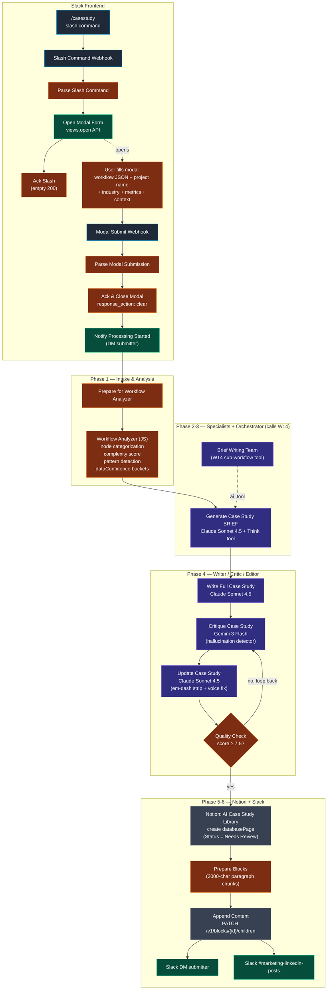

# Workflow 20 — Case Study Generator

> **What it does for you:** anyone in the marketing Slack types `/casestudy`, fills out a short modal (paste a workflow JSON + optional metrics + optional context), and 5-7 minutes later a fully-drafted 800-1200 word case study lands in the Notion `AI Case Study Library` with `Status = Needs Review` and a Slack DM back to the submitter. The marketer never opens an LLM playground; the engineering work is one form-fill away.

> **File:** `workflows/transform-labs-case-study-generator.json` *(JSON to be added)*
> **Triggers:** Two Slack webhooks — `/casestudy` slash command + modal-submit
> **Per-run cost:** ~$0.40-$0.80 (one orchestrator + 6 specialists via the W14 sub-workflow tool, then writer + critic + editor + quality gate; mostly Anthropic Claude Sonnet 4.5 with Gemini 3 Flash on the critic)

## Purpose

This is the **user-facing surface** for the case-study pipeline. It pairs with two other workflows in the repo:

- **W14 (Case Study Brief Generator)** — the sub-workflow that runs the 6 parallel specialists (Executive Summary / Challenge / Solution / Technical Highlights / ROI & Results / Key Takeaways) plus a senior-editor orchestrator. W20 calls W14 as a `toolWorkflow`.
- **W15 (Slack Modal Router)** — the one-URL-many-modals dispatcher that owns the `casestudy_form` callback. The slash-command + modal pair in W20 are the consumer side of that router pattern.

W14 produces a *structured brief* (title + section blurbs + tags + qualityScore + dataConfidenceNotes). W20 then takes that brief and runs a **full writer → critic → editor loop with a hallucination detector** to turn it into prose, gated on a 7.5/10 quality threshold, and finally writes the result to Notion as `databasePage` + chunked content blocks.

The defining engineering choice is **the data-confidence object**. The workflow analyzer (a JS code node, not an LLM) parses the pasted workflow JSON and partitions every fact into one of three buckets — `verified` (node count, services, complexity score, patterns detected), `userProvided` (only the metrics the operator typed into the modal), and `needsPlaceholder` (anything else). The brief writer, the case-study writer, the critic, and the editor are all given the same bucket structure in their prompts. The critic's job is then mechanical: any specific dollar amount, percentage, or hour-saving claim that *isn't* in the `userProvided` bucket is a hallucination, full stop. This is what keeps the autonomous-draft pipeline from inventing ROI numbers no one can defend in a sales conversation.

## Architecture

