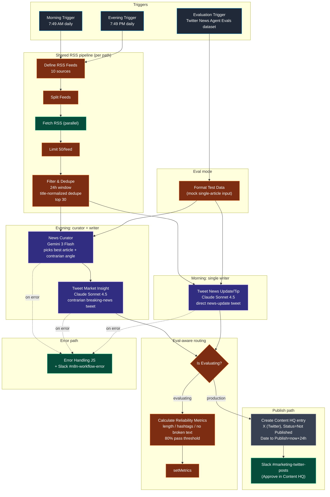

# Workflow 18 — Daily AI Tweet Generator

> **What it does for you:** twice every day — 7:49 AM and 7:49 PM — Transform Labs' Twitter account gets a fresh AI-news tweet drafted from 10 RSS feeds, scored for length + hashtag + format quality, and parked in Notion for one-click human approval. Morning is a news-update style; evening is a contrarian market-insight style. Same pipeline shape, two distinct voices, one Twitter cadence the marketing team never has to think about.

> **File:** `workflows/transform-labs-daily-ai-tweet-generator.json` *(JSON to be added)*
> **Triggers:** Schedule — 7:49 AM (morning path) and 7:49 PM (evening path), plus an Evaluation Trigger for offline reliability testing
> **Per-run cost:** ~$0.05–$0.15 (one Anthropic call on the morning path; one Gemini Flash + one Anthropic on the evening path)

## Purpose

This is the **always-on Twitter content pump** for Transform Labs' AI-focused account. The user-visible promise is simple: two tweets per day, drafted from current AI news, sitting in Notion for approval. The engineering promise is that the same RSS-aggregation plumbing serves two distinct writer personalities — the morning agent writes a clean news-update tweet directly from the headlines, the evening agent runs a curator-then-writer pair to find a *contrarian angle* and craft a market-insight tweet that says what others won't.

The defining engineering choice is **two writer patterns from one ingestion pipeline**. Both paths share an identical RSS fan-out (10 feeds → fetch in parallel → 24-hour freshness filter → title-normalized dedupe → top 30). The morning path then goes single-agent — direct headline-to-tweet — because the morning style is simpler and one Anthropic call is enough. The evening path adds a Gemini Flash *curator* in front of the Anthropic *writer*: the curator picks the single best article and supplies a contrarian angle, then the writer turns the angle into a tweet. Two patterns, one shared ingestion, different cost/quality tradeoffs per time of day.

The other distinctive bit is the **native n8n evaluation framework** — first workflow in this repo to wire up n8n's built-in `evaluationTrigger` + `checkIfEvaluating` + `setMetrics` chain. A `Twitter News Agent Evals` data table holds test articles; running the workflow in evaluation mode replaces the live RSS path with `Format Test Data` (mock single-article input), runs both agents in parallel, scores each tweet on three deterministic checks (length 1–200, hashtags 1–3, no broken `undefined`/`null` strings), and writes the metrics back via `setMetrics` so reliability can be tracked across versions of the prompts.

## Architecture

## The 10-feed RSS source set

| Source | Why |
|---|---|
| Dev.to AI + ML tags | Practitioner-written posts; surfaces hands-on takes |
| Hacker News AI (`points=50` filter) | Community-validated signal — 50+ point threshold filters noise |
| GitHub Engineering | First-party engineering blog from a major AI shipper |
| InfoQ AI/ML | Enterprise AI / ML-ops focus — mid-market relevant |
| OpenAI Blog | First-party model + product announcements |
| Google AI Blog | Google research + Gemini announcements |
| MIT Tech Review AI | Long-form tech-policy framing |
| The Verge AI | Consumer-facing AI coverage |
| Ars Technica | Technical detail + skepticism |

10 feeds is more than any other workflow in the repo. The `?points=50` filter on the Hacker News feed is the trick that makes that source usable — without it the HN feed is too noisy.

## Why two writer patterns

**Morning (single agent — `Tweet News Update/Tip`):** the morning style is *informational*. Pick a relevant article from the top 5, summarize the news, add 1-2 hashtags, ship. One Anthropic call. The system prompt is short and reads like a brand voice guide — neutral, clear, AP-style, max 200 chars, no em-dashes / colons / semicolons.

**Evening (curator + writer):** the evening style is *contrarian*. Picking which article deserves a contrarian take is itself a judgment task — and a different one from writing the tweet. So the evening path runs Gemini 3 Flash as a *curator* first: it scores each article on (1) Newsworthiness 40%, (2) AI Relevance 30%, (3) Contrarian Angle 20%, (4) Audience Fit 10%, picks one, and supplies a contrarian angle string. Then Claude Sonnet 4.5 — the *writer* — turns that angle into a tweet. Same brand-voice rules; same character cap; but now the writer has a specific contrarian framing to execute against rather than starting from headlines.

Why Flash for the curator and Sonnet for the writer? Curation is mechanical (rank + extract). Writing in voice is creative. Pay for the model where it matters.

## The native-eval seam

This is the first workflow in the repo to wire up n8n's built-in evaluation framework end-to-end. The pieces:

1. **`When fetching a dataset row1` (`evaluationTrigger`):** points at the `Twitter News Agent Evals` data table. Each row has `test_id`, `article_title`, `article_description`. The trigger fires once per row when an evaluation run is launched.
2. **`Format Test Data1` (JS):** transforms the test row into the same RSS-pipeline output shape (`articleCount`, `articleSummary`, `articles[]`) so downstream agents don't need to know they're being tested. Mock-input compatibility done right.
3. **`Evaluation3` (`checkIfEvaluating`):** sits on the agent output edges and routes — eval mode → reliability scoring path; production mode → Notion publish path. Same workflow handles both surfaces; no duplicate "test version" workflow.
4. **`Calculate Reliability Metrics1` (JS):** scores each tweet against three deterministic checks — length 1-200 chars, hashtag count 1-3, no broken `undefined`/`null` strings. Computes per-agent pass rates, an `overall_reliability` percentage, and a `status_pass` flag at the 80% threshold.
5. **`Evaluation2` (`setMetrics`):** writes `overall_reliability`, `workflow_completed`, `tweets_valid`, `status_pass` back to the eval run so it shows up in n8n's evaluation UI for tracking across prompt versions.

The whole eval rig lives alongside the production flow without affecting it — the `checkIfEvaluating` switch is the only seam.

## Skills demonstrated

- **One ingestion pipeline, two writer patterns.** Same 10-feed RSS plumbing serves both daily tweets, but the morning path is single-agent (cheap, direct news-update style) and the evening path is curator-then-writer (more expensive, contrarian-take style). Right model for the right task at the right time of day.
- **Native n8n evaluation framework end-to-end.** First workflow in this repo to wire up `evaluationTrigger` + `checkIfEvaluating` + `setMetrics` together with a real test dataset. Reliability scoring (length 1-200 / hashtags 1-3 / no broken text / 80% pass threshold) is deterministic and trackable across prompt versions.
- **`checkIfEvaluating` switch as a clean test/prod seam.** The same workflow runs production (Notion publish + Slack notify) and evaluation (reliability metrics + setMetrics) — no duplicate "test version" workflow to drift out of sync. The evaluation path replaces the RSS pipeline with a single `Format Test Data` mock-input node so the agents see an identical shape regardless of source.
- **Cross-vendor model split for cost control.** Gemini 3 Flash for the evening curator (mechanical: rank + extract a contrarian angle); Claude Sonnet 4.5 for both writers (creative: voice fidelity in 200 chars). Same lesson as W12, applied per-stage.
- **10-source RSS aggregation with HN points filter.** The `?points=50` filter on the Hacker News feed turns a firehose into a usable signal — community-validated articles only. Trick worth borrowing for any HN-fed pipeline.
- **24h-windowed title-normalized dedupe.** Articles older than 24h get dropped (yesterday's news isn't news), and within the window titles are normalized (lowercase + strip non-alphanumeric) before deduping so `"OpenAI Launches GPT-5!"` and `"OpenAI launches GPT-5"` collapse to one entry.
- **Approval gate on outbound publishing.** Same Notion `Status = Not Published` + `Approved = false` pattern as W5 / W6 / W7 / W8 / W9 / W11 / W12 / W13. Autonomous draft, human review before tweet.
