# Workflow 11 — Transform Labs Event Follow-Up Email Sender

> **File:** `workflows/transform-labs-event-followup-email-sender.json` *(JSON to be added)*
> **Trigger:** Daily at 8:15 AM (currently disconnected — see notes), manual run otherwise
> **Per-run cost:** ~$0.00 in LLM (no LLM in this pipeline) + Constant Contact send-volume costs

## Purpose

Daily post-event email sender. Pulls approved follow-up email drafts from the Notion Content HQ database (where someone has written and approved a recap email after an event happened), traverses the Notion relations to pull every attendee for that event, validates email addresses, creates a temporary Constant Contact list scoped to that single event, upserts each attendee onto the list, builds a personalized HTML email with a Transform Labs logo header + signature with social icons, creates a Constant Contact campaign, attaches the temp list, and sends.

This is the **third workflow in the Events trio**:
- **W10** ingests events from email into the Notion Events DB
- **W5** sends *pre-event* promotional emails to general lists
- **W11** sends *post-event* follow-up emails to the actual attendees of a specific event

The defining engineering choice is the **Notion-relation-driven attendee fan-out**. The Content HQ entry references an Event by relation; the Event references its Attendees by relation; each Attendee record carries a name + email. The workflow walks those relations rather than asking a human to manually paste an attendee list — which means whoever ran the event check-in process is the source of truth, not whoever's writing the recap email.

## Architecture

```mermaid
flowchart TB
    subgraph trig["Trigger"]
        T["Daily @ 8:15 AM<br/>(currently disconnected)"]:::trigger
    end

    subgraph fetch["Get approved content + event"]
        GAC["Get Approved Follow-up Content<br/>Notion Content HQ filter:<br/>Platform=Email - Event Follow Up,<br/>Approved=true,<br/>Status=Not Published,<br/>Date to Publish &lt;= now"]:::data
        PCE["Parse Content & Get Event ID"]:::core
        HEL{"Has Event Link?"}:::core
        GED["Get Event Details<br/>(Notion get page)"]:::data
        MED["Merge Event Data<br/>name, date, photo gallery,<br/>hashtag, upcoming topic,<br/>attendee IDs"]:::core
        HA{"Has Attendees?"}:::core
    end

    subgraph attendees["Per-attendee lookup"]
        SAI["Split Attendee IDs"]:::core
        GAD["Get Attendee Details<br/>(Notion get page per ID)"]:::data
        EAI["Extract Attendee Info<br/>name, email, regex validation"]:::core
        VE["Valid Email? filter"]:::core
        AAE["Aggregate Attendees by Event"]:::core
    end

    subgraph cc["Constant Contact list + send"]
        CTL["Create Temp Contact List<br/>(per-run, timestamped)"]:::out
        PCD["Prepare Contact Data"]:::core
        SCU["Split for Contact Upsert"]:::core
        UCC["Upsert Contact to CC<br/>POST /sign_up_form<br/>(batch size 10)"]:::out
        AUR["Aggregate Upsert Results"]:::core
        BET["Build Email with CC Tags<br/>name placeholder maps to<br/>CC FIRSTNAME merge tag<br/>+ logo header + body + signature"]:::core
        EHJ["Escape HTML for JSON"]:::core
        CEC["Create Email Campaign"]:::out
        ECI["Extract Campaign IDs"]:::core
        ALC["Add List to Campaign<br/>PUT /emails/activities/{id}"]:::out
        TST["TEST -- Send to Talon<br/>POST /tests"]:::out
        PROD["PROD -- Schedule Immediate<br/>POST /schedules<br/>{scheduled_date: 0}"]:::out
    end

    subgraph done["Mark + notify"]
        MAP["Mark as Published<br/>(Notion status update)"]:::data
        SLK["Slack #marketing-emails"]:::out
        ERR["Slack #n8n-workflow-error<br/>(any upstream failure)"]:::out
    end

    T -. disconnected .-> GAC
    GAC --> PCE --> HEL
    HEL -- yes --> GED --> MED --> HA
    HEL -- no --> ERR
    HA -- yes --> SAI --> GAD --> EAI --> VE --> AAE
    HA -- no --> ERR
    GED -. on error .-> ERR
    GAD -. on error .-> ERR
    AAE --> CTL --> PCD --> SCU --> UCC --> AUR --> BET --> EHJ --> CEC --> ECI --> ALC
    ALC --> TST
    ALC --> PROD
    TST --> MAP
    PROD --> MAP
    MAP --> SLK

    classDef trigger fill:#1f2937,color:#fff,stroke:#0ea5e9
    classDef core fill:#7c2d12,color:#fff,stroke:#fb923c
    classDef data fill:#374151,color:#fff,stroke:#9ca3af
    classDef out fill:#064e3b,color:#fff,stroke:#34d399
```

## Pipeline detail

### Stage 1 — Pull approved follow-up content

`Get Approved Follow-up Content` (Notion `databasePage.getAll`) queries the Content HQ database with a four-filter conjunction:

| Property | Filter |
|---|---|
| `Platform` (select) | equals `Email - Event Follow Up` |
| `Approved` (checkbox) | equals true |
| `Status` (select) | equals `Not Published` |
| `Date to Publish` (date) | on or before `$now` |

Only entries that have been human-reviewed, approved, scheduled for today or earlier, and not yet sent come through.

`Parse Content & Get Event ID` (JS) splits the Notion title field into `subject` (first line, optionally prefixed `Subject:`) and `bodyTemplate` (the rest), and pulls the linked `Event` page ID from the Content HQ entry's relation property. Entries without a linked Event are skipped — there's nothing to fan out to.

`Has Event Link?` (IF) routes — yes branch continues; no branch fires the error Slack notification.

### Stage 2 — Get the Event and merge its data

`Get Event Details1` (Notion `databasePage.get`) fetches the linked Event page. `Merge Event Data` (JS) consolidates the event-level fields the email template needs:

- `eventName`, `eventDate` (start ISO)
- `photoGalleryLink` (URL, optional)
- `hashtag` (multi-select, take first)
- `upcomingTopic` + `upcomingDate` (for the "see you next time at X" line)
- `attendeeIds` (relation array → list of Attendee page IDs)

`Has Attendees?` (IF) routes on `attendeeCount > 0`. Empty attendee lists fire the error Slack notification — there's no point creating a campaign with zero recipients.

### Stage 3 — Per-attendee lookup

`Split Attendee IDs` (JS) fans out one item per attendee ID. `Get Attendee Details` (Notion `databasePage.get`, `onError: continueErrorOutput`) fetches each Attendee page. `Extract Attendee Info` (JS) reads `name` and `email`, splits the name into `firstName`, validates the email against a regex, and tags `isValidEmail`.

`Valid Email?1` (Filter node) drops items with invalid or missing emails — typos in the attendee table don't crash the campaign send.

`Aggregate Attendees by Event` (JS) groups the surviving attendees back into one item per event, attaching the consolidated email metadata.

### Stage 4 — Per-run Constant Contact list

Constant Contact's API requires recipients via a **list**, not direct addresses. To keep send scope crisp, the workflow creates a fresh list per run rather than maintaining a single growing "all attendees" list:

`Create Temp Contact List` POSTs `/v3/contact_lists` with name `Event Follow-up - {eventName-truncated} - {timestamp}`. `Prepare Contact Data` captures the returned `list_id`.

`Split for Contact Upsert` fans out per attendee. `Upsert Contact to CC` POSTs `/v3/contacts/sign_up_form` with `email_address`, `first_name`, and `list_memberships: [listId]`. The sign_up_form endpoint upserts (creates new contacts or adds existing ones to the new list) — exactly the semantics needed for cross-event reuse. `batchSize: 10` keeps Constant Contact's rate limits happy; `retryOnFail` with 5s backoff handles transient 429s.

`Aggregate Upsert Results` collapses back to one item before email construction.

### Stage 5 — Build the HTML email

`Build Email with CC Tags` (JS) takes the body template and:

1. Replaces `{{name}}` and `{{first_name}}` with the Constant Contact merge tag `[[FIRSTNAME OR "there"]]` — CC does the per-recipient name substitution at send time, with `there` as the fallback when first-name is unknown
2. Replaces event-specific placeholders (`{{event_name}}`, `{{event_date}}`, `{{photo_gallery}}`, `{{hashtag}}`, `{{upcoming_event}}`) with the actual values from the Event record
3. Wraps each paragraph in styled `
` tags
4. Prepends a logo header (Transform Labs logo from a CC-hosted CDN URL, 120px wide, blue underline)
5. Appends a signature block with 5 social icons (LinkedIn / X / TikTok / Instagram / YouTube) using flaticon-hosted PNGs
6. Composes the final subject line, applying the same event-level placeholder substitutions

`Escape HTML for JSON` (JS) escapes backslashes + double quotes, strips newlines/CRs/tabs — required because the next node embeds this HTML into a JSON request body string and unescaped chars would break the JSON parse.

### Stage 6 — Create campaign, attach list, send

`Create Email Campaign1` POSTs `/v3/emails` with the campaign name, the inline `email_campaign_activities` array containing `from_email`, `from_name`, `reply_to_email`, `subject`, `html_content` (with a `[[trackingImage]]` tag), and the legally-required `physical_address_in_footer` block (Transform Labs' Dublin, OH address hardcoded).

`Extract Campaign IDs2` parses the response — pulls `campaign_id` and walks `campaign_activities` to find the `primary_email` activity's ID.

`Add List to Campaign` PUTs `/v3/emails/activities/{campaignActivityId}` with `contact_list_ids: [listId]` — Constant Contact's two-step model means the campaign exists separately from its recipient list, and the list gets attached after creation.

Then **two parallel branches** (both wired):
- **`TEST - Send to Talon`** POSTs `/tests` with `email_addresses: ["talon.sturgill@transformlabs.com"]` — sends a single test copy to Talon's inbox
- **`PROD - Schedule Immediate Send`** POSTs `/schedules` with `scheduled_date: "0"` — Constant Contact's "send immediately" sentinel, which pushes to the full list

Both branches feed `Mark as Published` so the Notion status flip happens once regardless of which path completed.

> **Note:** the workflow's sticky note says *"⚠️ CURRENTLY IN TEST MODE - sends to test endpoint. Change to /schedules for production."* But the JSON wires *both* the TEST and PROD branches as live siblings off `Add List to Campaign`. So today, every approved entry actually sends *both* a test to Talon *and* a real send to the full list. Either disconnect the PROD branch (true test mode) or remove the sticky (we're already in production). Pick one.

### Stage 7 — Mark + notify

`Mark as Published1` (Notion `databasePage.update`) flips the Content HQ entry's `Status` from `Not Published` to `Published` so the same entry won't get re-sent on tomorrow's 8:15 AM run.

`Slack Notification` posts to `#marketing-emails` with the event name, recipient count, campaign name, and list name.

A separate `Slack Notification1` posts to `#n8n-workflow-error` if any of the upstream branches errored (missing event link, missing attendees, Notion get-page failures).

## Known issues

- **The Daily 8:15 AM trigger is disconnected.** In the JSON, `"Daily 815am Check": { "main": [[]] }` — no downstream connection. The workflow currently doesn't fire on its own; it has to be run manually. To activate the schedule, wire the trigger to `Get Approved Follow-up Content`.
- **TEST and PROD send paths are both wired live.** See note in Stage 6. Disconnect the PROD branch if you actually want test-mode-only.
- **Hardcoded test recipient.** The TEST branch hardcodes `talon.sturgill@transformlabs.com`. Should be parameterized via env var or n8n credential.

## External services + APIs

| Service | Use |
|---|---|
| **Notion** | Content HQ (read approved drafts, write Published status), Events DB (read event details + attendee relations), Attendees DB (read names + emails) |
| **Constant Contact API** | `/v3/contact_lists` (create temp list per run), `/v3/contacts/sign_up_form` (upsert per attendee), `/v3/emails` (create campaign), `/v3/emails/activities/{id}` (attach list), `/tests` (test send), `/schedules` (production send) |
| **Slack** | `#marketing-emails` (success notification), `#n8n-workflow-error` (failure notification) |

## Skills demonstrated

- **Notion-relation-driven fan-out.** The Content HQ entry → Event → Attendees relation chain is the source of truth for *who* gets the email. The workflow walks the relation graph instead of asking the human to paste a recipient list. Whoever owned the check-in process owns the audience, by construction.
- **Per-run scoped Constant Contact list.** Rather than maintain one giant "all event attendees" list (where membership semantics get muddled across events), the workflow creates a fresh timestamped list per run, upserts only this event's attendees, and uses that list as the campaign recipient. Membership state stays tied to a single send.
- **Two-step CC campaign model.** Constant Contact requires creating the campaign first (with content + footer), then attaching the recipient list separately via PATCH. The workflow encodes that two-step dance with `Extract Campaign IDs` parsing the campaign-activity ID out of the create response and feeding it into the attach call.
- **Manual JSON-safe HTML escaping.** Building HTML in JS and embedding it into a JSON request body is a common rough edge. `Escape HTML for JSON` handles the backslash-then-quote ordering correctly (escape backslashes first, then quotes), strips line breaks that would break JSON validity. No `JSON.stringify` shortcut because the surrounding template uses literal interpolation.
- **Three-workflow composition through shared Notion state.** W10 → Events DB → W5 (pre-event promo) and W11 (post-event follow-up). All three workflows are independent (different schedules, different code paths, different downstream services) but composed through the shared Notion Events database and Content HQ. Each can be modified without touching the others.
- **Per-attendee email validation before the API call.** A regex filter drops invalid emails before they ever reach Constant Contact, so a single bad attendee record doesn't poison the entire campaign send.
- **Conditional error fan-in.** Three different upstream branches (no event link / no attendees / Notion fetch errors) all converge on a single Slack `#n8n-workflow-error` notification node. One alert path, three different root causes, easy to wire in n8n's IF + onError-continue model.
