# Workflow 5 — Transform Labs Event Promo

> **File:** [`workflows/transform-labs-event-promo.json`](../../workflows/transform-labs-event-promo.json) *(JSON to be added)*
> **Triggers:** RSS poll (30 min), Slack `/promo` webhook, daily 9:02 AM publish, eval dataset, manual
> **Per-run cost:** ~$0.03 per event extracted + ~$0.05 per email generated

## Purpose

End-to-end event promotion pipeline for Transform Labs. Discovers new Columbus AI Meetup events from RSS, crawls each event page with an AI extractor, drafts a branded promotional email through a Claude-powered strategist, gates the result behind a Notion approval workflow, and publishes the approved emails to a Constant Contact list on a daily schedule. Includes a native n8n evaluation framework with eleven quality metrics and a test dataset.

This is the most operationally complete workflow in the repo: it spans content discovery, generation, asset handling (image download + Azure Blob hosting), human approval, and delivery — with explicit quality gates at each step.

## Architecture

```mermaid
flowchart LR
    subgraph entry[Entry points]
        RSS[RSS Feed<br/>Columbus AI Meetup<br/>30 min poll]:::trigger
        WH[Webhook<br/>/promo Slack cmd]:::trigger
        EVAL[Eval dataset trigger]:::trigger
        MAN[Manual trigger]:::trigger
        SCH[Schedule<br/>9:02 AM daily]:::trigger
    end

    subgraph extract[Event extraction]
        DD[De-Duplicate<br/>by title]:::core
        EX[Extract Event Intel<br/>Azure gpt-5-mini<br/>+ HTTP crawl tool<br/>+ structured parser]:::ai
    end

    subgraph generate[Email generation]
        ES[Email Strategist<br/>Anthropic Claude<br/>Sonnet 4.5]:::ai
        WT[Writer Team<br/>sub-workflow tool]:::ai
        TH[Think tool]:::ai
        OP[Structured Output<br/>Parser w/ autoFix]:::core
    end

    subgraph evals[Evaluation path]
        EVCHK[Evaluation1<br/>checkIfEvaluating]:::core
        METRICS[Calculate Reliability<br/>Metrics — 11 gates]:::core
        EVOUT[Evaluation<br/>setMetrics]:::core
    end

    subgraph assets[Asset handling]
        LOOKUP[Notion: Lookup<br/>Event in Events DB]:::data
        IF1{Has Event<br/>Image?}:::core
        DL[Download Event Image]:::core
        BLOB[Azure Blob Storage<br/>blogheaderimages]:::data
        ASSEMBLE[Assemble Data<br/>with/without image]:::core
        MERGE[Merge Image Paths]:::core
    end

    subgraph cms[CMS + approval]
        IF2{Event Found<br/>in DB?}:::core
        HQ[Notion: Create<br/>Content HQ entry<br/>Status=Not Published]:::data
        IF3{Webhook<br/>triggered?}:::core
        SLACK1[Slack: Notify<br/>Submitter DM]:::out
        SLACK2[Slack: Notify<br/>#marketing-emails]:::out
    end

    subgraph publish[Daily publishing]
        PULL[Notion: Get Approved<br/>Approved=true,<br/>Date<=now]:::data
        BUILD[Build Email HTML<br/>Transform Labs<br/>branded template]:::core
        ESC[Escape HTML for JSON]:::core
        CC1[Constant Contact<br/>Create Campaign]:::out
        CC2[Add List to Campaign]:::out
        CC3[Schedule Immediate Send]:::out
        MARK[Notion: Mark Published]:::data
        NOTIFY[Slack: ops notification]:::out
    end

    subgraph err[Error path]
        EH[Error Handler]:::core
        ERRMSG[Slack: #n8n-workflow-error]:::out
    end

    RSS --> DD --> EX
    WH --> EX
    EVAL --> EX
    EX --> ES --> EVCHK
    WT -.tool.-> ES
    TH -.tool.-> ES
    OP -.parser.-> ES
    EVCHK -- eval --> METRICS --> EVOUT
    EVCHK -- prod --> LOOKUP --> IF1
    IF1 -- yes --> DL --> BLOB --> ASSEMBLE
    IF1 -- no --> ASSEMBLE
    ASSEMBLE --> MERGE --> IF2
    IF2 --> HQ --> IF3
    IF3 -- webhook --> SLACK1 & SLACK2
    IF3 -- scheduled --> SLACK2

    SCH --> PULL --> BUILD --> ESC --> CC1 --> CC2 --> CC3 --> MARK --> NOTIFY

    EX -.error.-> EH
    ES -.error.-> EH
    EH --> ERRMSG

    classDef trigger fill:#1f2937,color:#fff,stroke:#0ea5e9
    classDef core fill:#7c2d12,color:#fff,stroke:#fb923c
    classDef ai fill:#312e81,color:#fff,stroke:#a78bfa
    classDef data fill:#374151,color:#fff,stroke:#9ca3af
    classDef out fill:#064e3b,color:#fff,stroke:#34d399
```

## Pipeline detail

### Stage 1 — Event discovery (RSS)

`RSS Feed - Columbus AI Meetup` polls the Meetup group's public RSS feed every 30 minutes. `De-Duplicate1` (n8n `removeItemsSeenInPreviousExecutions`) keys on event `title` so the same event never enters the pipeline twice across polls. Webhook and eval entry paths bypass the dedup since they target a single specific event.

### Stage 2 — Intel extraction

`Extract Event Intel1` is a LangChain agent (Azure OpenAI `gpt-5-mini`) with three attached components:
- **HTTP Request1** as a tool — lets the agent fetch and crawl the actual event page.
- **Parser1** (structured output parser w/ `autoFix: true`) — schemas out `date`, `speaker`, `topic`, `summary`, `ticketLink`, `eventImageUrl`.
- **Think tool** — gives the agent a scratchpad for reasoning.

The system prompt is unusually disciplined about speaker extraction. The Meetup format consistently shows "Hosted by Chris S." as the organizer, but the actual speaker is a different person buried in the description. The prompt has explicit ✅/❌ examples and a hard rule: if the speaker isn't explicitly identified as presenter, return `"Unknown"` rather than guess. This is the kind of in-prompt guardrail that comes from watching the model fail in production.

### Stage 3 — Email generation (the strategist + writer pattern)

`Email Strategist` is an Anthropic Claude Sonnet 4.5 agent with three attached components:
- **Writer Team1** — a *sub-workflow* attached as a `toolWorkflow` (workflow ID `lgGINJEucGshix4H`, "Marketing Automations — Email Writing Team Sub-Flow"). The strategist creates an outline, then calls the writer team to generate the actual email body.
- **Think tool**.
- **Structured Output Parser** w/ `autoFix: true` — schemas out `email_newsletter` and `quality_summary`.

The prompt is a full content brief: subject line guidance, hook structure, key points extraction, structure notes, tone guidance, formatting rules, and an aggressive ~70-entry banned-words list (no "leverage", "however", "delve", "tapestry", "cutting-edge", etc.) plus banned punctuation (no semicolons, no em-dashes). Every banned token is enforced again in the eval metrics downstream — same rule, two enforcement layers.

This is the only workflow in the repo that uses Anthropic instead of OpenAI for the heavy lift. The choice reflects task fit: Claude Sonnet 4.5 produces noticeably less generic marketing copy on this prompt class.

### Stage 4 — Evaluation routing

`Evaluation1` (`checkIfEvaluating` mode) splits the path. In eval mode, the email goes through `Calculate Reliability Metrics` and `Evaluation` (setMetrics). In production mode, the email continues to the asset and CMS stages.

This is n8n's native evaluation framework: a versioned test dataset (`Twitter - Event Promo - Test Dataset`), a custom metrics calculator, and metric publishing back to the eval run. Eleven metrics, all binary 0/1 scored:

| Metric | Check |
|---|---|
| `hasOutput` | Email body present and non-empty |
| `wordCountCompliant` | 150 ≤ word count ≤ 300 |
| `hasSpeakerMention` | "Chris Slee" or "Ryan Frederick" appears in body |
| `hasTicketLink` | At least one URL in the body |
| `noBannedWords` | Zero hits from ~70-entry banned list |
| `punctuationCompliant` | No semicolons, no em-dashes (`—` or `--`) |
| `emojiCompliant` | 0 or 1 emojis (regex over Unicode emoji ranges) |
| `dateFormatCompliant` | No raw ISO dates (`YYYY-MM-DD`) leaked into copy |
| `noHashtags` | Zero `#tag` occurrences |
| `speakingEventMention` | Body contains "speaking" / "presenting" / "talk" / "session" / "event" |
| `overallScore` | Pass percentage across the above |

The overall score lets you compare prompt revisions or model swaps against the test dataset and see whether reliability went up or down.

### Stage 5 — Asset handling

After the strategist, `Lookup Event in Events DB` queries the Notion Events database for the event by ticket URL. `Has Event Image?` IF branches on whether the extractor surfaced an `eventImageUrl`:

- **Image path:** `Download Event Image` (HTTP, binary response) → `Create blob` (Azure Blob Storage `blogheaderimages` container) → `Assemble Data (with Image)`. Constructs the hosted CDN URL by appending the original filename to the blob container's public base URL.
- **No-image path:** `Assemble Data (no Image)` with empty image URL.

`Merge Image Paths` rejoins the two branches.

### Stage 6 — CMS entry + approval gate

`Event Found in DB?` IF then routes to one of two Notion creators:
- `Create Content HQ (with Relation)` — links the new Content HQ entry to the Events DB row via Notion relation.
- `Create Content HQ (no Relation)` — fallback when the event isn't in the Events DB yet.

Either way, the entry is created with `Status = Not Published`, `Date to Publish = now + 24h`, full event metadata, and the email body in the title field. The entry sits in Content HQ until a human checks `Approved = true`. **Nothing publishes without that checkbox.**

### Stage 7 — Notification

`If` branches on whether the run originated from the webhook (`/promo` Slack command):
- **Webhook origin:** notify the original submitter via Slack DM (raw user ID extracted from the webhook payload) AND notify the `#marketing-emails` channel.
- **Other origins:** notify `#marketing-emails` only.

### Stage 8 — Daily publishing (separate flow on the same canvas)

A `Schedule Trigger` at 9:02 AM kicks off the publishing path independent of the generation path:

1. `Get Approved Content2` queries Notion for entries where `Status = Not Published` AND `Date to Publish ≤ now` AND `Approved = true` AND `Platform = Email`.
2. `Parse Subject & Body` splits the first line as subject and the rest as body, converts paragraph breaks to HTML.
3. `Build Email with CC Tags` constructs the full HTML email — Transform Labs logo header, blue separator bar, optional event image, body paragraphs styled inline, signature block, social icon row (LinkedIn / X / TikTok / Instagram / YouTube), Constant Contact merge tags (`[[FIRSTNAME OR "there"]]`).
4. `Escape HTML for JSON` carefully escapes the HTML for embedding in the Constant Contact JSON request body.
5. `Create Email Campaign1` POSTs to Constant Contact's `/v3/emails` endpoint with the full campaign payload (from name, reply-to, html_content, physical address for CAN-SPAM compliance).
6. `Extract Campaign IDs2` parses out `campaign_id` and the primary `campaign_activity_id`.
7. `Add List to Campaign` PUTs the contact list assignment.
8. `PROD - Schedule Immediate Send` POSTs `{"scheduled_date": "0"}` to trigger the send.
9. `Mark as Published1` updates the Notion entry to `Status = Published` with the publish timestamp.
10. `Slack Notification` posts a confirmation to `#marketing-emails`.

### Stage 9 — Error path

Errors from `Extract Event Intel1`, `Email Strategist`, and `Notify Marketing` route through `Error Handling` (a JS Code node that builds a Slack-formatted error message) into `Error Message` (Slack post to `#n8n-workflow-error`). Every node touching an external API has `retryOnFail: true` and `onError: continueErrorOutput`.

## Stack additions introduced by W5

| Service | Use |
|---|---|
| **Azure OpenAI** | `gpt-5-mini` for the event-intel extractor agent and structured parsers |
| **Anthropic Claude Sonnet 4.5** | `Email Strategist` agent — multi-vendor LLM strategy |
| **Azure Blob Storage** | `blogheaderimages` container hosts event images for email embedding |
| **Notion** | Two databases — Events (source of truth for events) and Content HQ (content management with approval workflow) |
| **Constant Contact (OAuth2)** | Email service provider — campaign creation, list assignment, scheduled send |
| **Slack** | Three channels — `#marketing-emails` (ops), `#n8n-workflow-error` (alerts), user DMs (submitter feedback) |
| **n8n native evaluation framework** | Test dataset + custom metrics + setMetrics node |

## Skills demonstrated

- **Native n8n evaluation framework** — versioned test datasets, eleven quantitative quality gates, metrics published back to the eval run for comparison across prompt revisions.
- **Multi-vendor LLM strategy** — Anthropic Claude for content generation, Azure OpenAI for extraction and structured parsing, picked per task fit.
- **Two-layer enforcement** — every style rule (banned words, punctuation, length, emoji count) is enforced both in the prompt and in the eval metrics. Prompt-level enforcement keeps generations clean; metrics-level enforcement detects regressions when prompts drift.
- **Strategist + writer pattern** — the orchestrator agent creates an outline and delegates the actual draft to a sub-workflow tool, separating "what to say" from "how to say it".
- **End-to-end content pipeline** — RSS discovery → AI extraction → AI generation → image processing → CMS approval gate → email service provider → audit trail back to CMS.
- **Multi-trigger architecture** — five distinct entry points (RSS automation, Slack `/promo` command, eval dataset, manual, scheduled publish) on one workflow canvas.
- **HTML email engineering** — branded template with conditional image rendering, Constant Contact merge tags, CAN-SPAM-compliant footer, social icon row, inline styles for client compatibility.
- **In-prompt anti-failure-mode guardrails** — the speaker-extraction prompt has explicit ✅/❌ examples for known failure cases observed in production.
