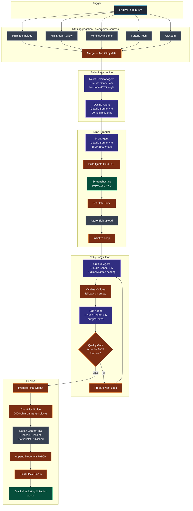

# Workflow 8 — Transform Labs Fractional CTO LinkedIn Engine

> **File:** `workflows/transform-labs-fractional-cto-linkedin.json` *(JSON to be added)*
> **Trigger:** Fridays at 8:45 AM weekly
> **Per-run cost:** ~$0.40–$0.80 (depends on iterations through critique loop)

## Purpose

Weekly LinkedIn long-form post generator targeting C-suite executives at mid-market companies ($10M–$500M revenue) who could use Transform Labs' fractional CTO/CIO services. Pulls from five corporate-and-enterprise RSS feeds (Harvard Business Review, MIT Sloan Review, McKinsey Insights, Fortune Tech, CIO.com via TechTarget), picks the article with the strongest fractional-CTO positioning angle, builds a strategic outline before any drafting, writes a 1800–2500 character LinkedIn post, generates a quote-card image with the pull quote, and runs the post through a critique-edit loop until it scores ≥8 or hits 5 iterations.

The defining engineering choice here is **outline-first writing**. Unlike W7 which goes from research straight to draft, this workflow runs a dedicated `Outline Agent` that produces a 20-field strategic blueprint — hook strategy, paragraph-by-paragraph structure, key points, tone calibration (authority / warmth / urgency 1-10), target length, and the quotable-insight string. The Draft Agent then writes from the outline, dramatically reducing variance in tone and structure across runs.

## Architecture

## Pipeline detail

### Stage 1 — Corporate RSS aggregation

Five parallel `rssFeedRead` nodes pull from publications that mid-market executives actually read:

| Source | Why |
|---|---|
| Harvard Business Review | C-suite framing of strategic shifts |
| MIT Sloan Review | Research-backed management thinking |
| McKinsey Insights | Strategy consulting voice |
| Fortune Tech | Business-side tech coverage |
| CIO.com (via TechTarget) | IT leadership perspective |

`Merge All Feeds4` fans the five inputs into one. `Prepare Articles4` (JS) sorts by `pubDate` (newest first), takes the top 25, and reshapes each into `{ index, title, description, url, source, publishedAt }` for the agent. Source attribution is enriched by URL pattern matching when the feed doesn't include `creator`/`author`.

> **Note:** the workflow includes a sticky note on the article-prep step reading *"15 articles is too much. dedupe, clean, english, shorten descriptions, make it easier on the agent"* — a TODO from the operator. The current code passes 25 articles; tightening to ~10-15 with dedupe + English-language filter is on the backlog.

### Stage 2 — News selection

`News Selector Agent4` (Anthropic **Claude Sonnet 4.5**) reads the 25 articles and picks **one** with the strongest fractional-CTO positioning angle. The selection rubric is weighted:

- **Executive Relevance (40%)** — would a CEO/CFO/COO find this strategically relevant?
- **Fractional CTO Angle Potential (30%)** — can this be translated into "here's what a seasoned CTO would advise"?
- **Mid-Market Relevance (20%)** — does this affect $10M-$500M companies?
- **Credibility & Depth (10%)** — substantive enough for a 1800-2500 char post?

Output: structured JSON with `selectedArticle`, `selectionReasoning`, `fractionalCTOAngle`, `targetAudience`, `keyInsight`, `quotableInsight`, `urgencyLevel`.

### Stage 3 — Strategic outline

`Outline Agent4` (Claude Sonnet 4.5) is the architectural centerpiece. Before any drafting happens, this agent produces a 20-field strategic blueprint:

- **`hookStrategy`** — type (Bold Assertion / Pattern Recognition / Question That Resonates), the actual hook text capped at 210 characters (LinkedIn's pre-fold limit), character count, why it works
- **`postStructure`** — paragraph-by-paragraph: hook, context, thePattern, insight, implication, thoughtToPonder
- **`keyPoints`** — 5-8 distinct points (no redundancy, no multi-item lists)
- **`toneCalibration`** — authority/warmth/urgency 1-10
- **`targetLength`** — typically `1800-2500 characters`
- **`quotableInsight`** — the pull quote that goes on the image card, capped at 150 chars

The system prompt is the longest in the repo. It encodes:
- Voice rules ("we" not "I" because Transform Labs is a firm, not an individual)
- Punctuation bans (no colons, no semicolons, no em/en dashes, no comma splices)
- Anti-list-setup instructions ("don't write 'three things' — weave into prose")
- Anti-AI-tells (no back-to-back short sentences, no repeated sentence starters, no `[Noun] isn't X. It's Y.` pattern, no formulaic setups like `Here's the thing`, no vague `around` connectors)
- Hook-and-quote character counting requirements
- A 20-item final-check the agent must run before output

This outline-first approach reduces draft variance — the writer has a clear structure to fill in instead of a blank page.

### Stage 4 — Draft

`Draft Agent4` (Claude Sonnet 4.5) takes the outline and writes the actual 1800-2500 character LinkedIn post. The system prompt is largely a *re-enforcement layer* for the outline's rules — same banned punctuation, same banned phrases (`I'm excited to share`, `game-changing`, `revolutionary`, `Let's connect`, `Agree?`, `Thoughts?`), same AI-tells list — plus formatting specifics:

- 3,000 character LinkedIn ceiling, target 1,800-2,500
- First 210 characters render before LinkedIn's "see more" fold
- 1-2 hashtags maximum, only at the end
- `". But"` to start a sentence is banned (use comma + lowercase)
- Worked good-example post showing tone, paragraph rhythm, and pull-quote integration

Output: `{ draft, characterCount, first210Chars, hookType, selfAssessment }`.

### Stage 5 — Quote card render

After the draft (not after the loop), four nodes generate the pull-quote image:

1. **`Build Quote Card URL`** — URL-encodes the outline's `quotableInsight` onto the hosted template `tl_quote_card.html` in Azure Blob, builds the screenshot URL
2. **`Screenshot Quote Card`** — POSTs to ScreenshotOne (1080×1080, PNG, file response)
3. **`Set Blob Name`** — generates `linkedin-quote-{timestamp}.png`
4. **`Upload to Azure Blob`** — stores the PNG in the `blogheaderimages` container

Then `Initialize Loop` consolidates the draft + quote-card URL + selection context into one object with `loopCount: 0` and ships it to the critique loop.

> Generating the quote card *before* the critique loop (rather than after, like W7) means the loop never re-renders the card on each iteration. The quotable insight is fixed by the outline; only the post copy gets edited.

### Stage 6 — Critique-Edit loop

The quality engine. Same pattern as W6/W7 but with a five-dimension weighted score and an aggressively long AI-tells checklist.

**`Critique Agent4` (Claude Sonnet 4.5)** scores:

| Dimension | Weight |
|---|---|
| Hook / First 210 Chars | 30% |
| Executive Resonance | 25% |
| Human Voice | 20% |
| Quote Card Integration | 15% |
| Technical Compliance | 10% |

The system prompt explicitly anchors the scale: `Score 1-4: Unacceptable. Score 5-6: Mediocre. Score 7: Decent but not ready. Score 8: Good. Score 9: Excellent (rare). Score 10: You've never given a 10.` And it instructs the critic to **default to "the draft is flawed" and prove otherwise**, with explicit anti-inflation language.

Hard fails (automatic rejection regardless of score):
- Banned punctuation (colons, semicolons, em/en dashes)
- Banned phrases (`I'm excited to share`, `game-changing`, `Let's connect`, `Agree?`, `Here's the thing`, `Here's the pattern`)
- `". But"` to start a sentence
- Over 3,000 chars
- Hashtags in body, more than 2 hashtags
- `I` instead of `we` for Transform Labs

AI-tells deductions (each instance flagged):
- Choppiness (back-to-back short sentences, `[Noun] isn't X. It's Y.` pattern)
- Repetition (same sentence starter 2+ times, `It means... It requires...` chains)
- Weak writing (`with AI in place`, `when it comes to`, vague `around`)
- Formulaic setups (`Here's the pattern`, `The truth is`, `Let me be clear`)
- Buzzwords (`leverage`, `landscape`, `paradigm`, `navigate`, `unpack`)

**`Validate Critique4`** (JS) defends against malformed critic output by substituting a fallback critique payload (score 6.2, `specificIssues: ["Critique validation failed - manual review needed"]`) so the loop can keep flowing.

**`Edit Agent4` (Claude Sonnet 4.5)** applies surgical edits with a 7-item self-check before output (no colons, no semicolons, no dashes, first 210 chars end on complete word, hashtags compliant, no banned phrases, under char limit). The system prompt insists on "fix one problem at a time without creating another."

**`Quality Gate4`** (IF node, OR combinator) exits when `weightedScore >= 8` OR `loopCount >= 5`. **`Prepare Next Loop4`** (JS) increments the counter and reshapes the edit output into the critique input contract for another pass.

### Stage 7 — Notion publish + Slack notify

`Prepare Final Output5` (JS) consolidates the final post + quote card URL + scoring + iteration count into a single object with a derived `passedQuality` boolean and `status` string.

`Chunk Content for Notion1` (JS) splits the post into ≤2000-character chunks (Notion's paragraph block limit), preferring `\n\n` and `. ` boundaries near 500-char minimum to avoid mid-sentence splits. Builds a `notionChildren` array of paragraph blocks plus a divider, the quote card image URL, and the pull quote.

`Save to Content HQ` creates the Notion entry under `Linkedin - Insight` platform with `Status = Not Published`, `Date to Publish = now + 24h`, the pull quote as the title, the quote card URL in the `Linkedin Image` field, and the critic's reviewer notes in `Details`.

`Append Content to Notion1` (HTTP PATCH to `/v1/blocks/{page_id}/children`) writes the chunked paragraph blocks into the page body since the create-page node's properties don't accept arbitrary block arrays.

`Build Slack Blocks2` (JS) constructs a rich Block Kit message — score / iterations / character count badges, quote card link, post preview as blockquote, the pull quote in a context block, the critique checklist (✅/❌ per item with notes), reviewer notes, and action buttons (`Review in Content HQ`, `View Quote Card`).

`Slack Notification7` posts to `#marketing-linkedin-posts`. Same approval gate as W5/W6/W7 — autonomous draft, human review before publish.

## Models used

| Model | Purpose | Why |
|---|---|---|
| **Anthropic Claude Sonnet 4.5** | News Selector, Outline, Draft, Critique, Edit | Long structured prompts, 20-field outlines, voice fidelity, surgical revisions — the whole content pipeline |

> The workflow's overview sticky note says *"Azure GPT-5 mini: News Selector, Outline, Critique"* — that's documentation drift. The live model bindings on every agent in the JSON are `claude-sonnet-4-5`. Either swap the bindings to Azure for cost or update the sticky to reflect reality, but the two should agree.

## Skills demonstrated

- **Outline-first writing.** A dedicated `Outline Agent` produces a 20-field strategic blueprint (hook strategy + 6-paragraph structure + key points + tone calibration + target length + quotable insight) before the writer ever drafts. This dramatically reduces variance in tone and structure across runs — the model has a structure to execute against rather than a blank page. *See [the outline prompt's 20-item final-check](#stage-3--strategic-outline).*
- **Anti-AI-tells engineering.** Both the writer and critic prompts encode an unusually long checklist of patterns that signal LLM-generated content: back-to-back short sentences, the `[Noun] isn't X. It's Y.` pattern, repeated sentence starters, fragment lists, `It means... It requires...` chains, `Here's the thing`/`Let me be clear` setups, vague `around` connectors. The critic deducts points per instance; the editor must re-check before output.
- **LinkedIn fold-physics.** First 210 characters get rendered before the "see more" collapse. The outline must produce a hook within that budget, the writer must end the 210-char window on a complete word, and the editor's self-check verifies it. This platform-specific physics rule is surfaced in three places.
- **Firm-voice enforcement.** Transform Labs is a firm, not an individual — `we` not `I` — and the rule is enforced at three layers (outline prompt, draft prompt, critic hard-fail). The system prompt includes worked examples showing the wrong and right phrasings.
- **Anti-inflation scoring instructions.** The critic prompt explicitly anchors the 1-10 scale, instructs the model to default to "the draft is flawed," and forbids 10s. This is the practical answer to "LLM judges grade everything 8/10."
- **Quote card generated outside the loop.** The pull-quote image is rendered once after the first draft, before the critique loop starts. The loop only edits the post copy, never the card. Avoids re-rendering on every iteration when the quote doesn't change.
- **Notion paragraph chunking.** Notion's paragraph block API rejects content over 2000 characters, but LinkedIn posts can run to 3000. A pre-publish JS chunker splits at `\n\n` boundaries (or `. ` near a minimum boundary) and emits an array of paragraph blocks for a follow-up PATCH on the new page.
- **Approval gate on outbound publishing.** Same philosophy as W5/W6/W7 — autonomous draft, human reviews in Notion before LinkedIn publish. Fractional CTO positioning is a high-trust voice; nothing ships without a human signoff.
