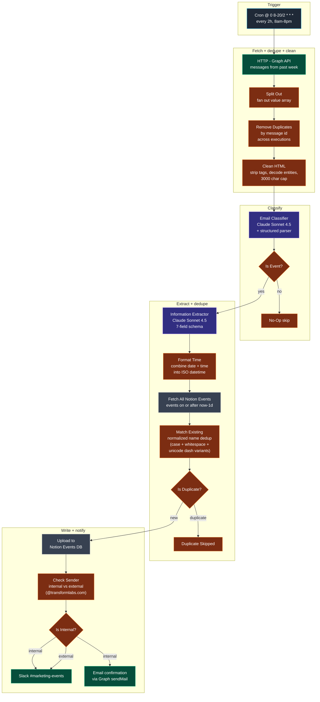

# Workflow 10 — Transform Labs Inbox Event Ingester

> **File:** `workflows/transform-labs-inbox-event-ingester.json` *(JSON to be added)*
> **Trigger:** Cron — every 2 hours from 8 AM to 8 PM (`0 8-20/2 * * *`)
> **Per-run cost:** ~$0.05–$0.20 (scales with mailbox volume; one classify call + one extract call per non-skipped email)

## Purpose

Polls the `marketing.communications@transformlabs.com` mailbox via Microsoft Graph every 2 hours, classifies each email through a Claude-powered "is this a real event?" gate, extracts structured event data from the survivors, deduplicates against the Notion Events database, writes new events into Notion, and notifies `#marketing-events` on Slack — plus a confirmation email back to internal senders. **This workflow feeds W5** — the Event Promo pipeline reads the same Notion Events DB that this one writes to.

The defining engineering choice is the **classifier-then-extractor split with a two-layer dedup**. A naive pipeline would just throw every email at the structured extractor and waste tokens on OTPs, marketing newsletters, and Stripe receipts. Instead the cheap classifier acts as a Claude-powered firewall — only the emails it tags as real events go through the extractor + Notion lookup + write path.

## Architecture



## Pipeline detail

### Stage 1 — Microsoft Graph fetch

`HTTP Request` calls `GET https://graph.microsoft.com/v1.0/users/marketing.communications@transformlabs.com/messages` with an OData filter `$filter=receivedDateTime ge {{ $now.minus({weeks: 1}).toISO() }}`. Authenticated via OAuth2 (the `Marketing Comms` n8n credential, scoped to `Mail.Read` + `Mail.Send` on that one mailbox). `retryOnFail` is on — Graph 503s and throttling are common.

`Split Out` fans out the `value` array so each message becomes its own item.

### Stage 2 — Cross-execution dedupe

`Remove Duplicates2` uses n8n's `removeItemsSeenInPreviousExecutions` mode keyed on the Graph `message.id`. n8n stores the seen-IDs across runs, so a message that was already processed two hours ago won't get reclassified now. The week-long Graph filter is intentionally generous (Graph occasionally surfaces messages late) — this dedupe layer is what keeps us from re-processing them.

### Stage 3 — HTML clean

`Clean HTML1` (JS, `runOnceForEachItem`) takes the raw `body.content` HTML and produces a readable `cleanBody` text:
- Strips `<style>` and `<script>` blocks
- Replaces block-element close tags + `<br/>` with newlines
- Removes remaining HTML tags
- Decodes common entities (`&nbsp;`, `&amp;`, `&lt;`, `&gt;`, `&quot;`, `&#39;`)
- Collapses whitespace
- Truncates at 3000 characters to cap downstream tokens

This runs *before* the LLM so the classifier sees plain text instead of a wall of MSO-Office boilerplate.

### Stage 4 — Classify

`Email Classifier` (Anthropic **Claude Sonnet 4.5** + a `Classifier Output Parser1` structured parser with `autoFix`) takes the subject + body preview + clean body + sender and returns:

```json
{ "isEvent": true | false, "reason": "short explanation" }
```

The system prompt enumerates what counts:

**Yes:** event invitations, Meetup notifications, conference/webinar registrations, RSVP confirmations, calendar invites for workshops/talks/networking, scheduled presentations or demos.

**No:** OTPs and login codes, password resets, marketing newsletters, order confirmations, social-media notifications, spam, internal system notifications, subscription confirmations, generic "welcome" emails.

`Is Event?` (IF node) routes — `true` to extraction, `false` to a `No Operation` terminator.

### Stage 5 — Structured extraction

`Information Extractor1` is the LangChain `informationExtractor` node (different from the `agent` node — it's a one-shot extractor with a declared field schema). The schema:

| Field | Required | Notes |
|---|---|---|
| `event_name` | yes | Falls back to email subject if unclear |
| `event_date` | yes | Date type — what the email proposes |
| `event_time` | yes | Empty string if unclear |
| `event_summary` | no | Brief summary derived from body if not stated |
| `hosting_organization` | no | Falls back to sender name or `Unknown` |
| `event_location` | no | `TBD` or `Virtual` if online |
| `url` | yes | Searches for registration / Meetup / Eventbrite / RSVP links |

The system prompt is explicit: *"You must ALWAYS return a value for every field. Never omit any field"* — required because the downstream Notion write needs every property populated.

### Stage 6 — Datetime composition

`Format Time1` (JS, `runOnceForEachItem`) merges the extractor's `event_date` + `event_time` into one ISO `event_datetime` string. Handles 12-hour AM/PM input, defaults to `00:00:00` when no time is given. Also resolves `senderEmail` — preferring the upstream `Clean HTML1` Graph payload, falling back to whatever's already on the item if `Clean HTML1` wasn't in the execution path (e.g. when the workflow is being executed in n8n's test mode against a manual input).

### Stage 7 — Notion-side dedupe

`Fetch All Notion Events` (Notion `databasePage.getAll`) pulls every event from the Notion Events database where `Event Date >= now - 1d`. `executeOnce: true` means this runs *once per workflow execution* even though items pass through it — n8n then makes the same result available to every downstream item.

`Match Existing` (JS) builds a `Set` of normalized existing event names — lowercased, whitespace-collapsed, and with all six Unicode dash variants (`‐ ‑ ‒ – — ― −`) flattened to ASCII `-`. Then for each incoming event it checks whether the normalized name already exists in the Set. The dash-variant flattening is what makes this dedupe actually work — Meetup emails often use en-dashes in event titles where Eventbrite uses hyphens, and a strict string match would treat them as different events.

`Is Duplicate?` (IF node) routes — duplicate to `Duplicate Skipped` (`No-Op`), new to the Notion write.

### Stage 8 — Notion write

`Upload to Upcoming Events Table1` (Notion `databasePage` create) writes into the same Notion Events DB that W5 reads from. Properties:

| Notion property | Source |
|---|---|
| `Event Name` (title) | `output.event_name` |
| `Event Date` (date) | `output.event_datetime` (ISO, America/New_York TZ) |
| `Event Summary` (rich text) | `output.event_summary` |
| `Host` (rich text) | `output.hosting_organization` |
| `Location` (rich text) | `output.event_location` |
| `URL` (url) | `output.url` (skipped if empty) |
| `Date Added` (date) | `$now` |

This is the seam between W10 and W5: **W10 writes here, W5 reads from here**. The Event Promo pipeline picks up these new entries on its own schedule.

### Stage 9 — Sender classification + notify

`Check Sender1` (JS) lowercases the sender email and tests whether it ends with `@transformlabs.com`. If so, `isInternal = true` and `slackUsername` is set to the local part of the address (for potential future use as a Slack mention).

`Is Internal?1` (IF node, OR combinator) routes:
- **Internal sender** — fires *both* the Slack notification (channel announcement) *and* an HTML email confirmation back to the original sender (`POST /v1.0/users/marketing.communications@transformlabs.com/sendMail`). The confirmation includes the parsed event details and a `View in Notion` link.
- **External sender** — fires only the Slack notification (no email back to a stranger).

The Slack message uses the marketing-events channel and includes event name + parsed datetime + summary + host + sender email + Notion link.

> **Known issue:** the IF node's second condition is `slackUserId is not empty`, but the upstream `Check Sender1` only sets `slackUsername` (no `slackUserId`). The condition therefore always evaluates as empty → the OR effectively reduces to just `isInternal === true`. Either drop the dead condition or wire up a `slackUserId` lookup.

## Models used

| Model | Purpose | Why |
|---|---|---|
| **Anthropic Claude Sonnet 4.5** | Classifier + Extractor | Cheap enough to run on every fetched email, structured-output reliable |

The classifier and extractor share a single `Anthropic Chat Model1` node (the LangChain pattern of one model node feeding multiple agents).

## Skills demonstrated

- **Two-stage LLM pipeline (cheap classifier → expensive extractor).** Most emails are not events. Running structured extraction on every fetched message would burn tokens on OTPs and marketing slop. The classifier acts as a Claude-powered firewall — only the survivors get extracted.
- **Two-layer dedup at different boundaries.** `Remove Duplicates2` keys on the Graph message ID across workflow executions (so re-fetched messages don't get re-classified). `Match Existing` keys on a normalized event-name match against the Notion DB (so the same event arriving via different sources — Meetup, Eventbrite, a forwarded calendar invite — only gets created once). Each layer covers what the other can't.
- **Unicode dash normalization.** Event titles arrive with en-dashes, em-dashes, hyphens, and figure-dashes depending on the sender. `Match Existing` flattens all six Unicode dash variants to ASCII `-` before comparing. Without this, "Columbus AI Meetup – Spring Edition" (en-dash) and "Columbus AI Meetup - Spring Edition" (hyphen) would be treated as different events.
- **Direct Microsoft Graph integration.** Bypasses the n8n Outlook node in favor of an HTTP call against `/users/{mailbox}/messages` with an OData `$filter`. Keeps the dependency on Graph minimal and lets the workflow control auth scope precisely.
- **Conditional notification by sender domain.** Internal senders (`@transformlabs.com`) get both a Slack channel announcement and a personal email confirmation. External senders get only the Slack notification — no email back to people we don't know.
- **`informationExtractor` node with explicit fallback rules.** Every field has an "if unclear, do X" instruction in the prompt so the extractor never returns null — required because the downstream Notion property write doesn't tolerate undefined values.
- **Workflow pairing through Notion.** W10 writes events into the same Notion Events database that W5 reads from. The two workflows are decoupled (different schedules, different code paths) but composed via shared state. Modify either independently.
