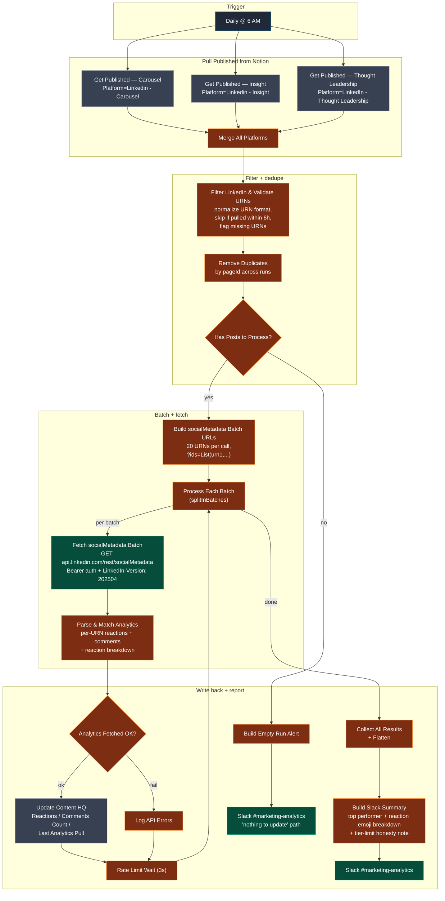

# Workflow 16 — LinkedIn Analytics Sync

> **What it does for you:** every morning at 6 AM, every LinkedIn post Transform Labs has shipped (carousels, long-form, thought-leadership) gets its current reaction count and comment count pulled from LinkedIn's API and written back into Notion next to the original draft. Closes the loop on every publishing workflow — one place to answer *"how is the content actually performing?"* without anyone manually copying numbers.

> **File:** `workflows/transform-labs-linkedin-analytics-sync.json` *(JSON to be added)*
> **Trigger:** Schedule — Daily at 6:00 AM (n8n host TZ)
> **Per-run cost:** ~$0 (no LLM in this pipeline; all work is Notion + LinkedIn REST + Slack)

## Purpose

This is **the feedback loop** for the Transform Labs LinkedIn publishing stack. W6 (carousels), W7 (thought leadership), and W8 (fractional CTO long-form) all write drafts to the Notion `Content HQ` database; humans review, post on LinkedIn, and paste the post URN back into Notion. W16 picks up from there: every morning it queries the three published-LinkedIn platform views, batches the URNs into LinkedIn's `socialMetadata` API, parses reactions + comments, and writes the numbers back into the same Notion entry the draft started in.

Result: marketing has a single source of truth for "which posts are working." No manual spreadsheet, no LinkedIn-app screenshots, no week-old numbers.

The defining engineering choice is the **batched + staleness-gated REST integration** with explicit tier-honesty in the Slack report. LinkedIn's `socialMetadata` endpoint supports BATCH_GET (`?ids=List(urn1,urn2,...)`) so 20 posts come back in one round-trip; the workflow only pulls posts that haven't been pulled in the last 6 hours so daily runs don't waste API quota; and the Slack summary explicitly notes that impressions / clicks / engagement-rate **require LinkedIn Standard Tier and aren't available on the developer tier**, so nobody downstream wonders why those columns are empty.

## Architecture



## Pipeline detail

### Stage 1 — Pull every published LinkedIn post

`Daily 6 AM EST` (Schedule trigger) fans out to three parallel Notion `databasePage.getAll` queries against the `Content HQ` database, each filtering on `Status = Published` and the matching platform value:

| Notion node | `Platform` filter | Source workflow |
|---|---|---|
| `Get Published - Carousel` | `Linkedin - Carousel` | W6 |
| `Get Published - Insight` | `Linkedin - Insight` | W8 |
| `Get Published - Thought Leadership` | `LinkedIn - Thought Leadership` | W7 |

Each Notion node has `continueOnFail` and `onError: continueErrorOutput` set so a single failing platform query doesn't kill the run. `Merge All Platforms` (3-input merge) concatenates the three result sets into one stream.

### Stage 2 — Filter, validate, and gate by staleness

`Filter LinkedIn & Validate URNs3` (JS) does four things to each Notion item:

1. **Drop non-LinkedIn entries.** Belt-and-suspenders against a stray Twitter or email entry being mislabeled — the per-platform query already filters, but the filter checks `property_platform.toLowerCase().includes('linkedin')` again.
2. **Validate the `Post URN` field.** Posts that don't have a URN pasted in yet (the human hasn't logged the published URL into Notion) get peeled off into a `missingUrns` list so the Slack report can call them out by name.
3. **Normalize the URN format.** The operator might paste any of these:
   ```
   urn:li:share:1234567890                                                       (clean)
   urn:li:activity:1234567890                                                    (clean activity)
   https://www.linkedin.com/feed/update/urn:li:share:1234567890/                 (full URL with share URN)
   https://www.linkedin.com/feed/update/urn:li:activity:1234567890/              (full URL with activity URN)
   activity-1234567890                                                           (legacy format)
   1234567890                                                                    (bare numeric ID)
   ```
   The regex chain handles all of them and outputs the canonical `urn:li:share:N` or `urn:li:activity:N` form.
4. **Apply the 6-hour staleness gate.** If `Last Analytics Pull` is set and the timestamp is less than 6 hours old, skip — the daily 6 AM run already covers each post once per day, so anything more recent than that came from a manual run or a rerun.

Output: a `readyForPull` array of items, each with `pageId / name / platform / postUrn / notionUrl / existingImpressions / linkedinLink`. The first item also carries a `_meta` object summarizing the run: total LinkedIn posts seen, ready count, missing-URN count + names + Notion links, stale-skipped count + names, non-LinkedIn skipped count, run timestamp. That `_meta` object travels through the workflow for the eventual Slack summary.

`Remove Duplicates` (n8n's `removeItemsSeenInPreviousExecutions` mode, key: `pageId`) layers a cross-execution dedupe on top — defends against double-pulls if the schedule misfires or someone runs the workflow manually right after the cron run.

`Has Posts to Process?3` (IF) routes:
- **True** → batch + fetch
- **False** → empty-run alert path (sends a "nothing to update" Slack message with the missing-URN list and stale-skipped count, so silence isn't ambiguous)

### Stage 3 — Batched LinkedIn `socialMetadata` requests

LinkedIn's REST API supports BATCH_GET on the `socialMetadata` endpoint with the syntax:

```
GET https://api.linkedin.com/rest/socialMetadata?ids=List(urn1,urn2,urn3,...)
LinkedIn-Version: 202504
X-Restli-Protocol-Version: 2.0.0
Authorization: Bearer <token>
```

`Build socialMetadata Batch URLs1` (JS) chunks the ready posts into groups of 20 and constructs one URL per batch with each URN URL-encoded inside the `List(...)` wrapper. 20 is conservative (LinkedIn allows up to 100 per call) — leaves headroom for retries and keeps individual response bodies small enough to parse quickly.

`Process Each Batch3` (`splitInBatches`) iterates each batch sequentially. `Fetch socialMetadata Batch` (HTTP Request, `httpBearerAuth` credential, `retryOnFail: true, maxTries: 3, waitBetweenTries: 5000`) sends the request with the LinkedIn version + Restli protocol headers. `onError: continueErrorOutput` so a 4xx/5xx on one batch doesn't stop the whole loop.

### Stage 4 — Parse the BATCH_GET response

LinkedIn's BATCH_GET responses come back as:

```json
{
  "results": {
    "urn:li:share:111": { "reactionSummaries": {...}, "commentSummary": {...} },
    "urn:li:share:222": { "reactionSummaries": {...}, "commentSummary": {...} }
  },
  "errors": {
    "urn:li:share:333": { "message": "Not found", ... }
  },
  "statuses": { ... }
}
```

`Parse & Match Analytics2` (JS) walks the `results` map per-URN and pulls:

- **Reactions:** sum across the `reactionSummaries` map. LinkedIn's reaction types are `LIKE` (👍), `PRAISE` (👏), `EMPATHY` (❤️), `INTEREST` (💡), `APPRECIATION` (🙏). The code captures both the total and the per-type breakdown for the Slack report.
- **Comments:** `commentSummary.count` (total) and `commentSummary.topLevelCount` (excludes replies).

Per-URN errors get tagged `_error: true` so the next IF can route them away from the Notion update. Posts that returned no error and no data (i.e. LinkedIn just didn't have `socialMetadata` for that URN, often because the post is too new) get tagged `_noData: true`.

### Stage 5 — Write back + per-batch rate-limit pause

`Analytics Fetched OK?2` (IF on `_error !== true`) routes:
- **True** → `Update Content HQ Analytics2` writes `Reactions`, `Comments Count`, and `Last Analytics Pull = $now` back to the Notion page via `databasePage.update`
- **False** → `Log API Errors2` (JS) logs the failed URN's error code + message to the n8n execution log

Both branches feed `Rate Limit Wait (3s)2` before looping back to `Process Each Batch3` for the next batch. 3 seconds between batches gives LinkedIn breathing room and keeps the workflow well under any per-minute caps.

### Stage 6 — Slack summary with tier-honesty note

After the batch loop completes, `Collect All Results2` aggregates every per-post result into one array, `Flatten Results2` re-emits them as items, and `Build Slack Summary2` (JS) computes the daily report:

- Header: `✅ LinkedIn Analytics Report` (or `⚠️` if some batches errored, or `❌` if everything failed)
- Subhead: date + time + `N updated, M errors` summary
- Three-column metrics row: Posts Updated / API Errors / Missing URNs / Stale-Skipped
- Engagement totals: Total Reactions / Total Comments / Total Engagement
- **Top Performer:** the post with the highest combined reactions + comments, with its reaction emoji breakdown (`👍 5 👏 2 ❤️ 1 💡 3`) + comment count + Notion link
- **Honest tier limit note:** *"📈 Impressions, clicks & engagement rate require Standard Tier upgrade."* — explicit so nobody wonders why those columns are empty
- Missing-URN callout: lists up to 5 posts that need URNs pasted in, with Notion links, so the marketing team knows exactly what to fix

`Send Analytics Report to Slack2` posts to `#marketing-analytics` using Block Kit blocks (mrkdwn enabled, link unfurling disabled).

### Stage 7 — Empty-run alert path

If the `Has Posts to Process?` IF returns false (no posts qualify), the workflow takes a separate path: `Build Empty Run Alert2` constructs a different Slack message — `ℹ️ LinkedIn Analytics — Nothing to Update` — with the missing-URN count, the already-current count (stale-skipped), and the non-LinkedIn count. This makes silence unambiguous: if the cron runs and nothing is in Slack, *something is wrong* (n8n didn't run, Slack credential expired, etc). If the cron runs and the empty-alert lands, the system worked but had nothing new.

## LinkedIn API constraints worth knowing

- **Tier limits.** The free / developer tier returns `socialMetadata` (reactions + comments) but NOT `socialActions`/`organicShareStatistics` (impressions, unique impressions, clicks, share count, engagement rate). Standard Tier upgrade required for those — this workflow gracefully tolerates the gap and the Slack note tells humans about it.
- **Versioning.** LinkedIn REST endpoints require an explicit `LinkedIn-Version` header (here, `202504`). Without it you get `400 PROTOCOL_VERSION_NOT_SPECIFIED`. The version string is YYYYMM and gets pinned per workflow — if LinkedIn deprecates a version you'll start seeing 400s and need to bump.
- **`X-Restli-Protocol-Version: 2.0.0` is required for BATCH_GET.** Without it the `?ids=List(...)` syntax doesn't work and you'll get a different error on the same URL.
- **Rate limits aren't documented per-app on the developer tier.** The 3-second between-batch wait and 5-second retry-backoff are conservative defaults that have held up over months of daily runs.

## Skills demonstrated

- **Closes the publishing loop without a separate analytics tool.** W6 / W7 / W8 write drafts to Notion → human posts to LinkedIn and pastes the URN back → W16 syncs reactions + comments back to the same Notion row daily. No spreadsheet, no Looker, no manual screenshot copy. The same database that holds the draft holds the performance.
- **Direct LinkedIn REST integration with explicit version + Restli protocol headers.** The n8n LinkedIn node doesn't expose `socialMetadata`. Raw HTTP with `Bearer` auth, `LinkedIn-Version: 202504`, and `X-Restli-Protocol-Version: 2.0.0`. Catches the two most common 400-error footguns (missing version header, missing Restli protocol header on BATCH_GET).
- **Batched BATCH_GET requests via `?ids=List(...)`.** 20 URNs per call instead of 1 round-trip per post. Drops API call count by 20× and stays well under any per-minute cap.
- **Multi-format URN normalization.** Operators paste URNs in six different shapes (full URN, full URL containing URN, legacy `activity-N`, bare numeric ID, etc). The JS normalizer handles all of them and outputs the canonical `urn:li:share:N` or `urn:li:activity:N` form so the API call always matches what the post actually is.
- **Staleness gate (6h) + cross-execution dedupe.** Saves API quota and prevents redundant Notion writes if the cron misfires or someone runs the workflow manually right after the daily run.
- **Honest reporting about API tier limits.** The Slack summary explicitly notes that impressions / clicks / engagement-rate require Standard Tier upgrade. Same lesson as W14's `[ESTIMATED]` markers — be loud about what you can't measure so nobody assumes empty fields mean zero.
- **Top-performer detection with reaction emoji breakdown.** Tracks the highest-engagement post per run and renders its reaction breakdown using LinkedIn's actual reaction type names (`LIKE / PRAISE / EMPATHY / INTEREST / APPRECIATION`) mapped to the corresponding emojis. Gives the marketing team a one-line "what worked yesterday" answer in Slack every morning.
- **Empty-run alert path with reason breakdown.** Makes silence unambiguous: if the cron runs and nothing arrives in Slack, the system is broken; if the empty-alert lands instead, the system worked but had nothing new (and tells you why — missing URNs, stale-skipped, non-LinkedIn).
