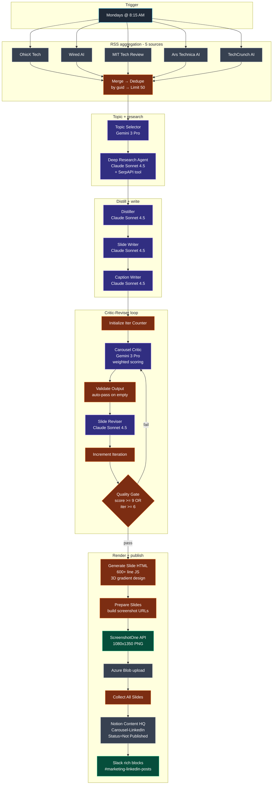

# Workflow 6 — Transform Labs LinkedIn Carousel Generator

> **File:** `workflows/transform-labs-linkedin-carousel.json` *(JSON to be added)*
> **Trigger:** Mondays at 8:15 AM weekly
> **Per-run cost:** ~$0.40–$0.80 (depends on iteration count through critic loop)

## Purpose

Weekly LinkedIn PDF carousel generator for Transform Labs. Aggregates AI news from five sources, picks the single best article for a multi-slide breakdown, deep-researches it via SerpAPI, distills into 6-8 slide-worthy insights, writes 8-10 slides + a caption in the founder's voice, then loops the result through a critic-reviser quality gate until it scores 9/10 or hits 6 iterations. Renders branded 3D-gradient HTML slides, screenshots each one to PNG via ScreenshotOne, hosts on Azure Blob, drops the assembled carousel into Notion Content HQ, and pings #marketing-linkedin-posts on Slack for human review.

This is the most ambitious AI-evaluation pipeline in the repo — the critic enforces ~50 explicit hard-fail rules (banned punctuation, banned words, headline word counts, CTA strength, caption structure) with a weighted six-category scoring formula and an iteration-aware publish threshold.

## Architecture



## Pipeline detail

### Stage 1 — RSS aggregation

Five parallel `rssFeedRead` nodes fetch the latest AI coverage:

| Source | Why |
|---|---|
| TechCrunch AI | Industry breaking news, funding, launches |
| Wired AI | Cultural / policy framing |
| MIT Tech Review | Research-backed depth |
| Ars Technica AI | Technical detail, skepticism |
| OhioX Tech | Local angle (Transform Labs is Columbus-based) |

`Merge All RSS Feeds` (5-input merge) → `De-Duplicate` (key: `guid`) → `Limit to 50 Articles` → `Aggregate` into a single `articles` array.

### Stage 2 — Topic selection

`Topic Selector Agent` (Google **Gemini 3 Pro**) reads the 50 articles and picks **one** for a carousel breakdown. The system prompt teaches it Transform Labs' sweet spot (AI agents in enterprise, automation ROI, digital transformation reality checks, Ohio/Midwest tech as bonus) and what makes a carousel-worthy topic (surprising data, breaks into 6-8 visual slides, creates winners/losers tension, has depth). Skips consumer gadgets, pure research papers, hype-without-substance.

Output: structured JSON with `selected_article`, `why_this_one`, `contrarian_angle`, `key_points`, `hook_idea`.

### Stage 3 — Deep research

`Deep Research Agent` (Anthropic **Claude Sonnet 4.5** + **SerpAPI tool** + Think tool) takes the selected topic and runs up to four targeted searches: statistics + dates, case studies, expert perspectives, business impact. Hard rate-limit guardrails in the system prompt ("no more than 5 anthropic API calls", "only 4 SerpAPI tool calls").

Output: `research_summary`, `key_stats`, `case_studies`, `expert_perspectives`, `business_impact`, `contrarian_insights`, `recommended_slide_angles`.

### Stage 4 — Distill

`Distiller Agent1` (Claude Sonnet 4.5) converts the research findings into 6-8 slide-worthy insights, each with `key_insight`, `evidence`, `why_it_matters`. The system prompt enforces "specific data, not generic", "frame from reader's perspective", "logical flow tells a coherent story slide-to-slide".

### Stage 5 — Slide writing

`Slide Writer Agent1` (Claude Sonnet 4.5) takes the distilled points and writes 8-10 slides under tight structural constraints:

- **Slide 1 (HOOK):** headline ≤8 words, subheadline ≤12 words, must reference a specific company/dollar/timeline
- **Slides 2-7 (INSIGHTS):** headline ≤8 words, body ≤25 words, specific numbers over vague claims
- **Slide 8 (CTA):** forward-looking, connects to Transform Labs by name
- **Slide 9 (BRAND_CLOSE):** "Transform Labs" / "AI Implementation. Digital Transformation. Fractional CTO."

Forbidden: em dashes, semicolons, colons in body, banned-words list (game-changer, leverage, synergy, etc.), questions as headlines, emojis on slides, more than 25 words in any body text.

### Stage 6 — Caption writing

`Caption Writer Agent` (Claude Sonnet 4.5) writes the 80-120 word LinkedIn caption that appears above the carousel. The prompt enforces a strict structure: hook (above the "See more" fold, under 100 chars combined), tension (2 sentences max, tease don't spoil), Transform Labs connection (1 sentence, must feel earned), engagement question (drives comments → algorithmic reach), 4-6 hashtags on their own line.

Hard fails enforced: never use the literal phrase "At Transform Labs, we...", never `". But"` (use comma), never em dashes, never `"Follow for more"`.

### Stage 7 — Critic-Reviser loop

The most production-engineered piece of the workflow.

**`Carousel Critic Agent1` (Google Gemini 3 Pro)** scores the carousel + caption against six weighted categories:

| Category | Weight |
|---|---|
| `hook_power` | 20% |
| `information_density` | 20% |
| `slide_flow` | 20% |
| `brand_voice` | 15% |
| `visual_readability` | 15% |
| `cta_strength` | 10% |

Plus an enumerated hard-fail checklist (~50 rules): punctuation violations, structural violations (word counts, slide counts), CTA failures, language violations, content failures, caption failures.

**Math is enforced in the prompt itself:**

```
overall = (hook×0.20) + (info_density×0.20) + (flow×0.20)
        + (voice×0.15) + (readability×0.15) + (cta×0.10)
IF any hard_fails: subtract 2.0 from overall
```

The critic must show its work in `verdict_reason`. Verdict: `PUBLISH` (≥8.0, no hard fails, no category below 7), `REVISE` (6.5–7.9), or `REJECT` (any hard fail, any category below 5, calculated overall below 6.5).

**`Slide Reviser Agent1` (Claude Sonnet 4.5)** takes the critic's flagged issues and applies surgical revisions: fix hard_fails first, fix specific issues second, improve slides relevant to low-category-score slides third. Untouched slides pass through verbatim. Returns a `fixes_applied` array logging every change.

**`Validate Critic Output1`** (JS Code) defends against empty critic responses — if the critic returns nothing, it auto-passes the carousel rather than infinite-looping. Also propagates the iteration counter through the loop.

**Iteration-aware threshold:** the prompt instructs the critic to relax the PUBLISH bar over time — full strictness on iterations 1-2, drops to 7.5 at iteration 3, drops to 7.0 at iteration 4+. Scores stay honest; only the verdict threshold relaxes.

**`Quality Gate1`** exits the loop when `overall >= 9` OR `iteration_count >= 6`. Without this, a stubborn critic could chew $20 of API credits in a runaway loop.

### Stage 8 — HTML slide generation

`Generate Slide HTML5` is a 600+ line JS Code node that builds a single HTML document containing one `1080×1350px` `.slide` div per slide, with custom-rendered CSS for a 3D blue-gradient design system:

- **Background:** four-stop linear gradient (deep navy → mid navy → rich blue → bright blue)
- **3D depth layers:** glass panels with `transform: perspective(800px) rotateY(...) rotateX(...)` for parallax depth
- **Radial glow orbs:** blurred rgba circles for atmospheric lighting
- **Per-role layouts:** distinct compositions for `hook`, `insight`, `cta`, `brand_close` slides
- **Typography:** Plus Jakarta Sans (headlines, weights 500-800) + DM Sans (body, weights 400-700)
- **Ghost numbers:** large semi-transparent slide numbers behind the content
- **Progress bars:** per-slide active-indicator dots in the footer
- **Logo:** Transform Labs logo with `mix-blend-mode: screen` to fuse the black logo background with the gradient

Six panel-config presets cycle across insight slides so no two consecutive slides have the same depth composition.

### Stage 9 — Screenshot + asset hosting

`Prepare Slides for Loop2` parses the HTML doc into individual slide URLs hosted at the Azure Blob template URL, with each slide's content URL-encoded as query params.

`Loop Over Slides2` (split-in-batches) iterates each slide:
1. `Screenshot Slide2` — POSTs to ScreenshotOne API (`viewport: 1080×1350`, `format: png`, `delay: 2s` for font loading)
2. `Upload PNG to Azure Blob2` — stores as `carousel-{ts}-slide-{n}.png` in `blogheaderimages` container
3. `Wait2` — small delay between iterations (rate-limit hygiene)

`Collect All Slides2` consolidates the slide-URL array, marks `passedQuality` based on the critic's overall score.

### Stage 10 — Notion + Slack

`Save to Content HQ6` creates a Notion entry under the `Carousel-LinkedIn` platform with `Status = Not Published`, `Date to Publish = now + 24h`, the slide URLs joined into the `Linkedin Image` field, and a `Details` block summarizing score / slide count / iteration count / exit reason / thesis.

`Prepare Notion Blocks3` + `Append Content to Notion3` then PATCH the Notion page with rich content blocks — the caption as a paragraph, a divider, then each slide as an inline image block.

`Build Slack Notification4` constructs a rich Slack Block Kit message — score badge, iteration count, slide count, hook-slide preview link, caption preview as blockquote, action buttons ("Review in Content HQ", "View Slides"). `Notify Slack5` posts to `#marketing-linkedin-posts`.

The whole publishing path stops at Notion. A human reviews the carousel and toggles `Status = Published` before it actually ships to LinkedIn — same approval gate philosophy as W5.

## Models used

| Model | Purpose | Why |
|---|---|---|
| **Google Gemini 3 Pro** | Topic Selector | Fast and cheap for selection across 50 articles |
| **Anthropic Claude Sonnet 4.5** | Research, Distill, Slide Write, Caption Write, Revise | Less generic copy, better instruction following on long structured prompts |
| **Google Gemini 3 Pro** | Critic | Different model than the writer = independent perspective; keeps the writer from grading its own homework |
| **Azure OpenAI gpt-5-mini** | Auxiliary | Available as an alternate language model for cost-sensitive subnodes |

The Gemini-as-critic / Claude-as-writer split is intentional. Two different model families judging each other catches mistakes that a single-vendor critic would miss.

## Skills demonstrated

- **Critic-reviser loop with bounded iteration.** Quality gate exits on score OR iteration count, so the worst case is bounded cost. The validator node defends against empty critic responses by auto-passing rather than infinite-looping.
- **Mathematical scoring formula enforced in the prompt.** Six weighted categories, explicit math, hard-fail penalty. The critic must show its work in `verdict_reason`. This is how you stop LLM judges from giving everything an 8.
- **Iteration-aware publish threshold.** Scores stay honest; only the verdict bar relaxes. Lets the system ship something good rather than loop forever chasing perfection.
- **Cross-vendor judge.** Gemini grades Claude's work. Independent perspective.
- **600+ line JS HTML slide generator with a real design system.** Per-role layouts, 3D glass panels, gradient backgrounds, brand typography, progress indicators, ghost numbers. Not a template engine — a custom render that produces consistently branded output.
- **Headless screenshot pipeline.** ScreenshotOne renders HTML → PNG; Azure Blob hosts the assets; Notion embeds them in the review entry.
- **Source-curated voice impersonation.** The writer prompts target the founder's specific voice patterns (declarative, pattern-recognition framing, "the problem is X" structure) and the critic enforces them.
- **Approval gate on outbound publishing.** Same philosophy as W5 — autonomous content for low-stakes channels, human review for branded outbound.
- **Voice-rule enforcement at three layers.** In the writer prompt, in the caption prompt, and in the critic's hard-fail list. The same rule appears three times because that's what it takes to make it stick.
