# Workflow 17 — LinkedIn Comment Auto-Reply

> **What it does for you:** every hour during business hours, every new comment on Transform Labs' LinkedIn org posts gets read, classified, and replied to in the founder's voice — automatically. Spam gets ignored. Simple "great post 👍" reactions get a like. Real questions, lead signals, and constructive challenges get a 300-character reply that sounds like a senior consultant wrote it, posted under the org page, plus a like on the original comment. Slack gets a full audit log of every reply with quality scores.

> **File:** `workflows/transform-labs-linkedin-comment-auto-reply.json` *(JSON to be added)*
> **Trigger:** Cron — every 60 minutes, Mon-Fri, 8am-7pm ET (gated by a business-hours JS check)
> **Per-run cost:** ~$0.05–$0.30 (depends on how many new comments arrive; capped at 5 replies per run)

## Purpose

This is the **inbound** side of Transform Labs' LinkedIn presence. W6 / W7 / W8 / W9 publish content. W16 pulls reaction + comment counts. **W17 actually replies** — under the org page, in Ryan Frederick's voice, on autopilot during business hours. The writeup is in three layers because that's what it takes to make it not sound like a bot:

1. **Hardcoded brand context** — Transform Labs identity, founder voice rules, and a long list of "things we never do in comments" baked into a JS node. No external Notion lookup; the prompt is the source of truth.
2. **Three-stage classification** — post-intent (Gemini Flash) → comment category (Gemini Flash) → routing decision (Switch). Each stage narrows what the writer needs to do.
3. **Ryan-voice critic-editor loop** — Claude Sonnet 4.5 drafts, Claude Sonnet 4.5 grades it on 5 dimensions with hard fails (`opens with "Great question!"` → cap at 4; emojis when commenter didn't use them → fail), Claude Sonnet 4.5 edits surgically. Loops until score ≥ 9 or 5 iterations. The critic prompt explicitly says *"Would I be comfortable if Ryan saw this reply go out under his name right now?"* as the bar.

The defining engineering choice is **classification-routing with three exit paths**: spam → do nothing, simple reaction → like only, everything else → full draft + critique + reply + like. The workflow does the *minimum useful action per comment*. Replying to a 👍 with a 300-character essay reads as botted; ignoring a real lead signal misses revenue. Routing fixes both.

## Architecture

```mermaid
flowchart TB
    subgraph trig["Trigger + business-hours gate"]
        T["Cron — every 60min<br/>Mon-Fri 8am-7pm ET"]:::trigger
        BH["Business Hours Check<br/>(JS)"]:::core
    end

    subgraph fetch["Fetch + filter posts"]
        FOP["Fetch Org Posts<br/>(last 10)"]:::out
        EPI["Extract Post Items"]:::core
        F5D["Filter to last 5 days<br/>(skip stale posts)"]:::core
        FCP["Fetch Comments Per Post<br/>(top-level, 50 each)"]:::out
        PRF["Prep Reply Fetches"]:::core
        SCF["Split Comments for Reply Fetch"]:::core
        FTR["Fetch Threaded Replies<br/>(per top-level comment)"]:::out
        MAC["Merge All Comments<br/>(top-level + threaded)"]:::core
    end

    subgraph dedupe["Cross-execution dedupe + self-skip"]
        FNC["Filter New Comments<br/>500-deep static-data ring buffer<br/>+ skip self-comments<br/>+ skip already-replied threads<br/>+ skip already-liked<br/>+ cap 5 per run"]:::core
    end

    subgraph enrich["Three-layer context enrichment"]
        LBC["Load Brand Context<br/>(hardcoded TL voice + comment rules)"]:::core
        PIC["Post Intent Classifier<br/>Gemini 3 Flash"]:::ai
        ATC["Analyze Thread Context<br/>(our prior replies + nesting)"]:::core
        CC["Comment Classifier<br/>Gemini 3 Flash<br/>10 categories + suggested tone"]:::ai
        MC["Merge Classification"]:::core
    end

    subgraph route["Classification routing"]
        ISP{"Is Spam?"}:::core
        ISR{"Is Simple Reaction?"}:::core
        NRE["No Response Exit<br/>(spam path)"]:::core
        LCO["Like Comment Only<br/>(reaction path)"]:::out
        LOE["Like Only Exit"]:::core
    end

    subgraph generate["Draft → critique → edit loop"]
        PDC["Prepare Draft Context"]:::core
        DRA["Draft Reply Agent<br/>Claude Sonnet 4.5<br/>+ SerpAPI tool"]:::ai
        ILS["Initialize Loop State"]:::core
        CA["Critic Agent<br/>Claude Sonnet 4.5<br/>5-dim score + hard fails"]:::ai
        VCO["Validate Critic Output"]:::core
        QG{"Score ≥ 9?"}:::core
        MIC{"Loop ≥ 5?"}:::core
        EA["Editor Agent<br/>Claude Sonnet 4.5<br/>surgical edits"]:::ai
        ULS["Update Loop State"]:::core
        PFR["Prepare Final Reply"]:::core
    end

    subgraph publish["Post + like + notify"]
        PRT["Post Reply<br/>POST /rest/socialActions/{post}/comments"]:::out
        WBP["Wait 30s"]:::core
        LOC["Like Original Comment<br/>POST /rest/reactions"]:::out
        BSN["Build Slack Notification"]:::core
        NTS["Slack #marketing-linkedin-posts<br/>(audit log + scores)"]:::out
    end

    T --> BH --> FOP --> EPI --> F5D --> FCP --> PRF --> SCF --> FTR --> MAC --> FNC
    FNC --> LBC --> PIC --> ATC --> CC --> MC --> ISP
    ISP -- yes --> NRE
    ISP -- no --> ISR
    ISR -- yes --> LCO --> LOE
    ISR -- no --> PDC --> DRA --> ILS --> CA --> VCO --> QG
    QG -- pass --> PFR
    QG -- fail --> MIC
    MIC -- yes --> PFR
    MIC -- no --> EA --> ULS --> CA
    PFR --> PRT --> WBP --> LOC --> BSN --> NTS

    classDef trigger fill:#1f2937,color:#fff,stroke:#0ea5e9
    classDef core fill:#7c2d12,color:#fff,stroke:#fb923c
    classDef ai fill:#312e81,color:#fff,stroke:#a78bfa
    classDef out fill:#064e3b,color:#fff,stroke:#34d399
```

## Pipeline detail

### Stage 1 — Cron + business-hours gate

The Schedule Trigger fires `*/60 8-19 * * 1-5` (every 60 min Mon-Fri 8am-7pm UTC by cron). A `Business Hours Check` JS node *also* runs and short-circuits if it's outside Mon-Fri 8am-7pm **ET** specifically (the cron is on the n8n host's TZ, so the JS gate translates and enforces ET). Replying at 3am would look botted; the gate keeps engagement looking human.

> **Known issue:** in the JSON, the `Every 60 Minutes` schedule trigger has empty connections (`"main": [[]]`). It doesn't fire automatically right now — has to be run manually. Wire `Schedule Trigger → Business Hours Check` to activate the cron.

### Stage 2 — Fetch posts + comments + threaded replies

`Fetch Org Posts` GETs `/rest/posts?q=author&author=urn:li:organization:281481&count=10` with the standard LinkedIn-Version + Restli-Protocol headers. `Extract Post Items` flattens the response into per-post items. `Filter new` (poorly named — it's actually a "last-5-days" filter) drops posts older than 5 days because old posts almost never get new comments and pulling their threads wastes API quota.

`Fetch Comments Per Post` GETs `/rest/socialActions/{postUrn}/comments?count=50` for each surviving post (batched 1-at-a-time with 15s spacing to stay polite to LinkedIn). That returns top-level comments only.

`Prep Reply Fetches` + `Split Comments for Reply Fetch` + `Fetch Threaded Replies` then expand to one fetch *per top-level comment*, getting any sub-thread replies (sub-thread replies are how we'd see if a commenter responded to our previous reply, and how we detect that we shouldn't double-reply). `Merge All Comments` flattens top-level + threaded into one comment list per post.

### Stage 3 — The dedupe-and-self-skip core

`Filter New Comments` is the heart of the workflow. It does five things:

1. **500-deep ring buffer dedupe.** `$getWorkflowStaticData('global').processedCommentIds` persists across executions in n8n's workflow-level static storage — no external DB. The list trims to 500 entries to keep the JSON manageable. Every comment ID we've ever processed gets remembered.
2. **Skip self-comments.** If `actor === urn:li:organization:281481`, that's us — never reply to ourselves.
3. **Skip already-replied threads.** Walk every comment under the post. If the org has a comment whose `parentComment` matches the candidate's URN, we already replied to it — mark seen and skip.
4. **Skip already-liked.** If `likesSummary.selectedLikes` includes the org URN, we already liked the comment — mark seen and skip.
5. **Cap 5 per run.** A viral post could surface 50 new comments at once; replying to all of them in one execution would (a) bust API rate limits and (b) look botted. Cap to 5; the rest get picked up next cron tick.

### Stage 4 — Three-layer context enrichment

`Load Brand Context` (JS) attaches a long hardcoded brand identity string to every item — Transform Labs' positioning, founder voice rules, and ~12 explicit *"things we never do in comments"* (no hard sells, no links unless asked, no emojis unless commenter used them, no `Great question!` openers, no hashtags, no pricing, no badmouthing competitors). The brand context is the *prompt input* for everything downstream — there's no Notion lookup, no DB. Trusting the prompt as source of truth is intentional.

`Post Intent Classifier` (Gemini 3 Flash) reads the parent post and tags it as `thought_leadership / case_study / event_promotion / industry_commentary / company_update / community_engagement`. Gemini Flash is the right model here — it's a cheap, mechanical classification.

`Analyze Thread Context` (JS) walks the comment thread and assembles per-comment context: a list of our previous replies on this post (so the drafter doesn't repeat itself), whether the candidate is nested in a reply chain, whether it's a direct reply to *our* prior comment.

`Comment Classifier` (Gemini 3 Flash again) tags the candidate comment as one of 10 categories — `genuine_question / agreement_amplification / constructive_challenge / personal_story / lead_signal / industry_insight / spam_irrelevant / simple_reaction / competitor_mention / event_related` — plus a suggested tone (helpful / appreciative / respectful / warm / etc).

### Stage 5 — Classification routing

Two IF nodes branch the workflow into three exit paths:

| Category | Action |
|---|---|
| `spam_irrelevant` | **No Response Exit** — do nothing. Don't waste API quota on a spam reply that LinkedIn will also flag. |
| `simple_reaction` (`Great post!`, `🔥`, `+1`) | **Like Comment Only** — POST to `/rest/reactions` with the unusual nested-tuple URN format `urn:li:comment:(postActivityUrn,commentId)`. A like is the right response to a reaction. |
| Everything else | Continue to draft + critique + reply + like |

The minimum-useful-action principle: replying to a 👍 with a 300-character essay reads as botted; ignoring a real `lead_signal` misses revenue. Routing fixes both.

### Stage 6 — Draft → critic → editor loop

For comments that survived routing, `Prepare Draft Context` flattens all four context layers (brand identity + post classification + thread context + comment classification) into one `draftContext` object the writer can consume cleanly.

`Draft Reply Agent` (Claude Sonnet 4.5 + SerpAPI tool + Think tool) writes the initial reply. The system prompt encodes the Ryan Frederick voice rules (bold declarative, builder's perspective, ≤300 characters, no em-dashes/semicolons/colons, no `Great question!` opener, no emojis unless commenter used them, no hashtags, end inviting continued conversation).

`Initialize Loop State` packages the draft + brand context + comment data and sets `loopCount = 1`.

`Critic Agent` (Claude Sonnet 4.5) is unusually opinionated. The system prompt:
- Scores 5 dimensions (Brand Voice / Relevance / Authenticity / Length / Tone Match) 1-10 each
- Caps Brand Voice at 5 if the reply could plausibly come from any other founder
- Caps Authenticity at 4 if any AI-tell phrasing (`absolutely`, hedge language, filler words)
- Lists ~10 hard fails that each automatically drop the overall score by 3 points (`Great question!` opener, emojis without precedent, hashtags, em-dashes, qualifying like `I think`/`I believe`, buzzwords like `leverage`/`ecosystem`)
- *"Default skepticism: Start every evaluation assuming the reply is a 5 and make it prove otherwise."*
- *"If you find yourself wanting to be generous, ask: 'Would I be comfortable if Ryan saw this reply go out under his name right now?' If the answer is not an immediate yes, score lower."*

`Validate Critic Output` (JS) auto-passes (score 9, empty issues) on a malformed critic response — defends against infinite loops if the critic returns garbage.

`Quality Gate` exits at score ≥ 9. `Max Iterations Check` exits at `loopCount ≥ 5` regardless of score. Otherwise `Editor Agent` (Claude Sonnet 4.5) does surgical edits — *"address the critic's specific issues, preserve what works, minimal changes for maximum impact"* — and `Update Loop State` increments the counter.

`Prepare Final Reply` strips wrapping quotes, picks editor output if it ran (else the original draft), and packages everything for posting.

### Stage 7 — Post reply + like the original + Slack audit

`Post Reply to LinkedIn` POSTs to `/rest/socialActions/{postActivityUrn}/comments` with the parent comment URN, message text, and `actor: urn:li:organization:281481`.

`Wait Before Post` adds a 30-second pause. Then `Like Original Comment` POSTs to `/rest/reactions?actor=urn:li:organization:281481` with the unusual nested-tuple URN format `urn:li:comment:(postActivityUrn,commentId)`. Posting a reply *and* liking the original is the human pattern — replies without likes look slightly cold.

`Build Slack Notification` (JS) constructs a rich Block Kit payload — category emoji, total iterations, all five sub-scores (Brand Voice / Relevance / Authenticity), 200-char post snippet, full comment text, the posted reply, strengths called out by the critic. `Notify Team on Slack` posts to `#marketing-linkedin-posts` for full audit-log visibility.

## LinkedIn API constraints worth knowing

- **The unusual comment URN format.** Top-level URNs are `urn:li:share:N` or `urn:li:ugcPost:N` or `urn:li:activity:N`. Comments use a nested tuple: `urn:li:comment:(postActivityUrn,commentId)`. The Reactions API needs the tuple form; the Comments API mostly takes the post URN + the comment URN separately. Easy to get wrong — costs you an hour the first time.
- **`socialActions/{post}/comments` returns top-level only.** To get sub-thread replies you have to fetch each top-level comment individually via the same endpoint pattern. That's why W17's fetch path looks heavier than you'd expect.
- **`likesSummary.selectedLikes`** is the field that tells you whether *your* org has already liked the comment — the heart of the "skip already-liked" branch. It's an array of actor URN strings.
- **100 API calls / day on the developer tier.** Capping to 5 comments per run + business-hours-only execution + 12 ticks/day stays well under the cap.

## Skills demonstrated

- **Closed-loop community management for a brand voice.** Most marketing automation publishes content and stops. W17 reads what people are saying about that content and replies in the brand voice without a human in the loop. The replies pass through a critic that explicitly asks *"would the founder be comfortable seeing this go out under his name?"* — you only get to that bar by enforcing voice as a quality gate, not as a system prompt afterthought.
- **Classification routing with three exit paths.** Spam → ignore. Simple reaction → like only. Real comment → full draft + critique + reply + like. Doing the *minimum useful action per comment* is what separates production-grade community management from the "auto-reply bot" archetype that gets blocked by every algorithm. *See [Stage 5](#stage-5--classification-routing).*
- **Three-layer self-skip logic.** Skip self-comments, skip threads we've already replied to, skip comments we've already liked. Three different signals all converging on "do nothing here." Without all three, the workflow either re-replies to itself in an embarrassing loop or floods one comment with multiple replies after a partial run. *See [Stage 3](#stage-3--the-dedupe-and-self-skip-core).*
- **`getWorkflowStaticData` ring buffer.** 500-deep dedupe of comment IDs across executions without an external database. Trimmed to 500 entries to keep the persisted JSON manageable. n8n trick worth knowing for any workflow that needs cross-execution memory but doesn't justify a Redis or Postgres dependency.
- **Hardcoded brand context as the prompt's source of truth.** The Transform Labs voice + comment rules live in a JS node — no Notion lookup, no DB read. Pure prompt engineering. Easier to version-control with the workflow; one fewer external thing to break.
- **Two-tier model strategy.** Gemini 3 Flash for the cheap mechanical classifications (post intent, comment category — pure tagging tasks). Claude Sonnet 4.5 for the writer + critic + editor loop where voice fidelity matters. Right model for the right task.
- **Ryan-voice critic prompt.** The critic prompt uses an unusually concrete bar (*"would the founder be comfortable seeing this go out under his name right now?"*) instead of an abstract scoring rubric. Combined with default-skepticism scoring (start at 5, make the reply earn higher), the critic actually catches AI-tells that a generic rubric misses. *See [Stage 6](#stage-6--draft--critic--editor-loop).*
- **Like + reply combo.** When a real reply gets posted, the workflow ALSO likes the original comment. Two engagement signals from the brand on the same thread looks human. Replies without likes look transactional.
- **Business-hours gate.** Replying at 3am looks botted regardless of how good the prose is. JS check enforces Mon-Fri 8am-7pm ET on top of the cron. Small detail, real production hygiene.
- **5-comments-per-run cap.** A viral post could surface 50 new comments at once; replying to all of them in one execution would bust API limits and look botted. Cap to 5; the rest get picked up next tick. Capacity discipline.
