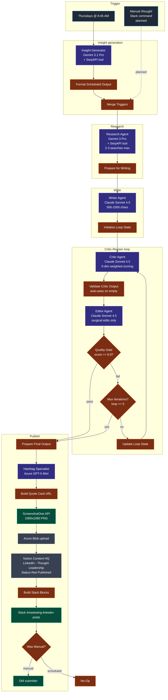

# Workflow 7 — Transform Labs LinkedIn Thought Leadership Engine

> **File:** [`workflows/transform-labs-linkedin-thought-leadership.json`](../../workflows/transform-labs-linkedin-thought-leadership.json) *(JSON to be added)*
> **Trigger:** Thursdays at 8:45 AM weekly (manual `/thought` Slack command planned but not yet wired)
> **Per-run cost:** ~$0.30–$0.60 (depends on iterations through critic loop)

## Purpose

Weekly LinkedIn thought-leadership post generator for Transform Labs. Picks (or accepts) a single quotable insight in the founder's voice, deep-researches the current context around it, writes a 500–1000 character post tuned for LinkedIn's "...more" fold, then loops through a critic-reviser quality gate until the post scores high enough or hits the iteration cap. The quotable insight is rendered onto a 1080×1080 PNG quote card via the same ScreenshotOne → Azure Blob pipeline that powers the carousel workflow, then the post + quote card land in Notion Content HQ behind a human approval gate with a Slack notification.

The defining engineering choice here is **voice impersonation as a first-class quality gate**. The critic prompt isn't scoring "is this a good LinkedIn post" — it's scoring "would Ryan Frederick's 584 Medium followers recognize this as his writing." Hard fails include opening with a question instead of a declarative statement, using setup phrases like `Here's the thing:`, and putting any `\n\n` in the first 250 characters of the post (because that triggers LinkedIn's premature truncation).

## Architecture

## Pipeline detail

### Stage 1 — Insight generation (scheduled path)

`Insight Generator Agent1` (Google **Gemini 3.1 Pro Preview** + **SerpAPI tool** + Think tool) runs up to 5 web searches to ground itself in current technology executive discourse, then generates **one** quotable insight under 150 characters. The system prompt teaches it Ryan Frederick's pattern-recognition voice with worked examples (`"AI is the most disruptive technology we've experienced."`, `"The best founders never intended to be founders."`) and explicit anti-patterns (no generic motivation, no obvious platitudes, no hype-driven slop).

Output: structured JSON with `quotableInsight`, `reasoning`, `currentContext`. `Format Scheduled Output1` reshapes it to match the manual-trigger contract (`source: 'scheduled'`, empty `userId`).

### Stage 2 — Manual `/thought` Slack command (planned)

The `Merge Triggers1` node has two inputs. Input 0 is wired to the scheduled path. Input 1 is reserved for a Slack slash-command trigger that lets a human submit a quotable insight directly via a modal — bypassing the AI generator and going straight to research. Not yet implemented; the scheduled path is the only live source today.

### Stage 3 — Research

`Research Agent1` (Google **Gemini 3 Pro Preview** + **SerpAPI tool** + Think tool) takes the chosen insight and does **2–3 web searches MAXIMUM** to gather:
- What's happening *now* that makes this insight relevant
- One specific data point, statistic, or example

The system prompt is hard-bounded: `Do NOT keep searching if results are thin - work with what you have. After 3 searches, immediately return your output.` `maxIterations: 7` on the agent caps the tool-call count regardless. This is a deliberate cost-control choice — research-class agents are the most likely to spiral.

Output: `relevantContext`, `dataPoints`, `executiveDiscourse`, `contraryViewpoints`, `transformLabsAngle`. `Prepare for Writing1` flattens the relevant fields into a single object for the writer.

### Stage 4 — Write

`Writer Agent1` (Anthropic **Claude Sonnet 4.5**) takes the insight + research bundle and produces a 500–1000 character LinkedIn post structured for LinkedIn's "...more" fold:

- **Hook** (first 2 lines, ≥250 chars *as one continuous paragraph with no `\n` breaks*) — the system prompt explicitly teaches that LinkedIn shows ~4-5 lines before truncation and that any double line-break in the first 250 chars eats vertical space and triggers early collapse
- **Body** — Ryan-voice declarative sentences mixing short punchy beats with longer explanatory ones
- **CTA** — a specific challenging question, not "What do you think?"

Forbidden punctuation: colons, semicolons, em dashes. Forbidden language: setup phrases (`Here's the thing:`, `Let me be clear:`), buzzwords (`game-changer`, `innovative`, `disruptive` as buzzword), question hooks, emojis, bullet points, exclamation marks, `In today's fast-paced world`.

Output: structured JSON with `hook`, `body`, `cta`, `fullPost`, `characterCount`. `Initialize Loop State1` initializes `loopCount = 1` and packages the post for the critic.

### Stage 5 — Critic-Reviser loop

The quality engine. Same architectural pattern as W6's carousel critic but tuned for a single-post format.

**`Critic Agent1` (Claude Sonnet 4.5)** scores five categories, each 1-10:

| Category | Weight |
|---|---|
| Voice Authenticity | 30% |
| Hook Power | 25% |
| Insight Depth | 20% |
| Structure & Flow | 15% |
| CTA Quality | 10% |

Plus a hard-fail checklist that automatically caps the score at 5.0 if any are present:
- Forbidden punctuation (`:`, `;`, `—`)
- Bullet points or numbered lists
- Opening with a question instead of a declarative
- Banned setup phrases or buzzwords
- Character count outside 500-1000
- *Any `\n\n` in the first 250 characters* (LinkedIn truncation hard-fail)
- "Sounds like it could come from any company" (voice-impersonation hard-fail)

**`Validate Critic Output1`** (JS Code) defends against empty critic responses by auto-passing the post (`overallScore: 8.5, readyToPublish: true`) rather than infinite-looping. Also propagates the loop counter through the loop with a fall-back read from `Initialize Loop State1` on the first iteration.

**`Editor Agent1` (Claude Sonnet 4.5)** applies *surgical* revisions only — its system prompt is adamant that voice preservation is paramount and that minor fixes shouldn't trigger full rewrites. Includes a formatting check that re-enforces the `\n\n` ≥250-character rule from the writer.

**`Quality Gate1`** passes when `overallScore >= 8.9`. **`Max Iterations Check1`** exits when `loopCount >= 5`. Worst-case the loop runs 5 critic + 5 editor calls, bounded.

> **Note:** the Quality Gate operator is `>= 8.9` while the README sticky note inside the workflow says `>= 8.5`. The sticky note is documentation drift; the live behavior is `>= 8.9`. Tighten the sticky or relax the gate, but pick one.

### Stage 6 — Hashtag generation

`Hashtag Specialist1` (Azure OpenAI **gpt-5-mini**) generates 4-5 hashtags for the post — 2 broad-reach, 2-3 niche, optionally 1 trending. The prompt steers away from too-generic (`#Business`, `#Success`) and too-obscure (`< 1000 posts`) options, scoped to Transform Labs' verticals (manufacturing, healthcare, financial services, nonprofit).

### Stage 7 — Quote card render

`Build Quote Card URL` URL-encodes the quotable insight as a query param onto a hosted HTML template (`tl_linkedin_quote_card.html` in Azure Blob) with a `Date.now()` cache-buster. `Screenshot Quote Card` POSTs to ScreenshotOne (1080×1080, `delay: 3s` for font/animation loading) and gets back a PNG. `Set Blob Name` constructs a timestamped filename (`linkedin-thought-yyyy-MM-dd-HHmmss.png`) and `Upload Quote Card to Azure` stores it in the `blogheaderimages` container.

The quote card carries the *insight verbatim* — it's the visual anchor that people screenshot and share, separate from the post copy that builds around it.

### Stage 8 — Notion + Slack

`Save to Content HQ1` creates a Notion entry under platform `LinkedIn - Thought Leadership` with `Status = Not Published`, `Date to Publish = now + 24h`, the post + hashtags as the title field, and a `Details` block summarizing score / iterations / exit reason / characters / hashtag-strategy reasoning / source. The quote card URL goes into the `Linkedin Image` URL field.

`Build Slack Blocks1` (JS Code) constructs a rich Block Kit message — score badge, iteration count, character-count percentage of LinkedIn's 3000 ceiling, exit reason, quote-card image link, post preview as blockquote, hashtags in a context block, the quotable insight, the research data points as bullets, and action buttons (`Review in Notion`, `View Quote Card`).

`Notify Marketing Channel2` posts to `#marketing-linkedin-posts`. `Was Manual Submission?1` then branches on `source === 'manual'`:
- **Manual:** `DM Submitter1` sends the original submitter a Slack DM confirming their thought is ready for review
- **Scheduled:** `No DM (Scheduled)1` no-ops

Same human-in-the-loop philosophy as W5 and W6 — autonomous generation, human approval before LinkedIn publish.

## Models used

| Model | Purpose | Why |
|---|---|---|
| **Google Gemini 3.1 Pro** | Insight Generator | Web-search-grounded ideation across current tech executive discourse |
| **Google Gemini 3 Pro** | Research Agent | Same family, slightly older snapshot for the bounded research pass |
| **Anthropic Claude Sonnet 4.5** | Writer / Critic / Editor | Long structured prompts, voice impersonation, surgical edits |
| **Azure OpenAI gpt-5-mini** | Hashtag Specialist | Cheap classifier-style task with structured output |

The Gemini-as-generator / Claude-as-writer/critic split mirrors W6's cross-vendor judging philosophy. Different model families judging each other catches mistakes that a single-vendor stack would miss.

## Skills demonstrated

- **Voice impersonation as a quality gate.** The critic prompt isn't scoring "good post" in the abstract — it's scoring "Ryan-voice fidelity" against worked examples from his actual writing. Hard-fail criteria include "sounds like it could come from any company." This is the contractor's discipline of judging output against a specific style target instead of a generic rubric.
- **Format-aware writing.** The writer and editor prompts both encode LinkedIn's truncation behavior (`\n\n` in the first 250 chars triggers early `...more` collapse) as a hard fail. The model is taught the platform-physics rule, then the critic enforces it.
- **Bounded research with explicit search caps.** The research agent prompt says "2-3 searches MAXIMUM" and the agent's `maxIterations: 7` caps tool-call count regardless. Prevents the most common runaway-cost failure mode for tool-using LLMs.
- **Critic-reviser loop with iteration cap.** Same architecture as W6 — score gate OR iteration ceiling, validator node defends against empty critic responses, worst-case API spend is bounded.
- **Two-input pipeline with shared downstream.** The `Merge Triggers1` node lets the same critic + render + publish path serve both AI-generated insights (scheduled) and human-submitted insights (manual `/thought` slash command, planned). Manual path lets a human bypass the AI ideation stage entirely while still benefiting from the research + writing + critic loop.
- **Quote card render via the shared screenshot pipeline.** Reuses the W6 ScreenshotOne → Azure Blob asset pipeline for a different output format (1080×1080 quote card vs 1080×1350 carousel slides). Same template-URL + cache-buster + delay pattern.
- **Approval gate on outbound publishing.** Notion `Status = Not Published` until a human reviews — same philosophy as W5 and W6.
