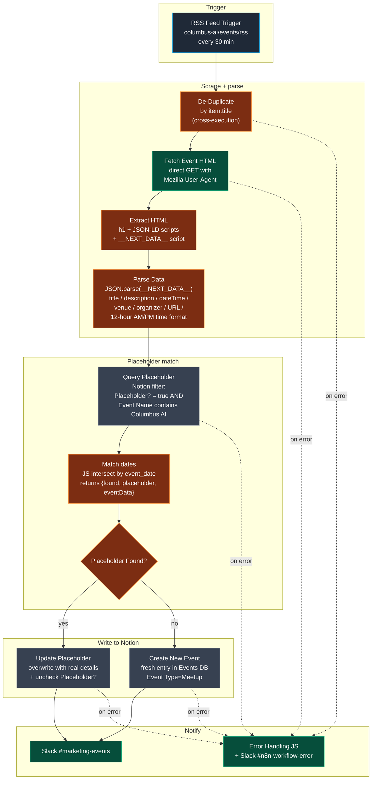

# Workflow 13 — Transform Labs Columbus AI Meetup Ingester

> **File:** `workflows/transform-labs-meetup-event-ingester.json` *(JSON to be added)*
> **Trigger:** RSS poll on `https://www.meetup.com/columbus-ai/events/rss/`, every 30 minutes
> **Per-run cost:** ~$0 (no LLM in this pipeline; just HTTP + Notion + Slack)

## Purpose

Polls the Columbus AI Meetup group's RSS feed every 30 minutes, fetches each new event's full HTML page directly from meetup.com, parses event details out of the embedded `__NEXT_DATA__` script tag, and writes the event into the Notion Events DB — but with a twist: if a human has already created a *placeholder* entry on the same date (`Placeholder?` checked, name contains `Columbus AI`), the workflow **updates the placeholder** instead of creating a duplicate. If no placeholder exists, it creates a fresh entry like a normal ingester would.

This is the **second writer into the Notion Events database** alongside W10 (the email-inbox ingester). Together they cover the two main inflow paths for Transform Labs' Columbus AI Meetup events:

| Source | Workflow | Trigger |
|---|---|---|
| Marketing inbox (forwards from team / external orgs) | W10 | Microsoft Graph poll, every 2h |
| Columbus AI Meetup RSS feed | **W13** (this) | RSS poll, every 30 min |

The defining engineering choice is the **placeholder-aware upsert pattern**. The Transform Labs marketing team often knows there's a Columbus AI Meetup coming on a specific date *before* the Meetup organizer publishes the actual event details. They create a Notion entry with the date filled in, the title set to `Columbus AI Meetup - [Month]`, and the `Placeholder?` checkbox ticked — then the marketing-promo flow (W5) and the follow-up flow (W11) can already start scheduling around that placeholder. When this workflow finally finds the published Meetup event on the matching date, it overwrites the placeholder with the real details (full title, description, venue, exact time, URL) and unchecks the `Placeholder?` flag. **No duplicate, no manual reconciliation, no broken downstream relations.**

## Architecture



## Pipeline detail

### Stage 1 — RSS poll + cross-execution dedupe

`RSS Feed - Columbus AI Meetup` (`rssFeedReadTrigger`) polls `https://www.meetup.com/columbus-ai/events/rss/` every 30 minutes. `retryOnFail` is on — Meetup occasionally serves transient 5xx.

`De-Duplicate1` (`removeItemsSeenInPreviousExecutions` mode, key: `$json.title`) tracks which event titles have been seen across previous runs. The Meetup RSS feed re-lists the same upcoming events on every poll until they're closed, so without this dedupe the workflow would re-process the same event every 30 minutes forever.

> **Note:** the workflow's overview sticky says *"Polls Meetup feed every 10 min"* but the actual `pollTimes.value` is `30` minutes. Doc drift — fix the sticky or change the cron.

### Stage 2 — Direct page scrape

`Fetch Event Data1` (HTTP Request) hits the event page URL from the RSS item with a Mozilla User-Agent header and `Accept: text/html`. Returns the raw HTML as a text response. The User-Agent matters — Meetup's edge rejects requests that look obviously bot-shaped.

`Extract Event HTML1` (HTML node, `extractHtmlContent` mode) pulls three things from the response:
- `event_title` from the `h1` element
- `json_ld_event` — array of `script[type='application/ld+json']` blocks (Meetup includes structured event data; not used downstream but kept for diagnostics)
- `next_data` — the `script#__NEXT_DATA__` tag content (Meetup is built on Next.js, so the page hydrates from a `__NEXT_DATA__` JSON blob containing every property the React tree needs)

### Stage 3 — Parse `__NEXT_DATA__`

`Parse Data1` (JS Code) does the actual data extraction:

1. Strip newlines from the raw script content (it's pretty-printed JSON which `JSON.parse` chokes on for some reason in this context)
2. `JSON.parse(...)` and walk to `props.pageProps.event`
3. Extract `title`, `description`, `dateTime` (ISO with timezone offset), `eventUrl`, `group.name` as the organizer
4. **Time formatting:** the `dateTime` field is `2026-01-20T18:00:00-05:00`. The code splits on `T`, takes the time portion, parses hours + minutes, and formats as `6:00 PM` — *without timezone conversion*, since Columbus AI Meetup events are always in the meetup's local time (Eastern) and we want to preserve that exact wall-clock time
5. Extract `venue.name` + `venue.address` + `venue.city` + `venue.state` and join them comma-separated
6. Strip Markdown bold (`**`) and escaped newlines (`\\n`) from the description for the Notion summary, truncate at 500 chars

Output: a flat object with `event_title`, `event_description`, `event_date` (ISO datetime), `event_date_formatted` (just the YYYY-MM-DD), `event_time` (12-hour AM/PM), `event_location_name`, `event_location_address`, `event_url`, `organizer_name`, `event_summary`.

### Stage 4 — Placeholder lookup

`Query Placeholder` (Notion `databasePage.getAll`) queries the Events DB with a two-filter conjunction:
- `Placeholder?` (checkbox) equals `true`
- `Event Name` (title) contains `Columbus AI`

Note this query *doesn't* filter by date directly — Notion's filter API can't easily compare `Event Date` against a value extracted from a different node's output without a workaround. So the workflow pulls all matching placeholders (typically 0-3 entries) and intersects in JS instead.

`Match dates` (JS Code) takes the placeholder query result + the parsed event data, normalizes both event-date strings to `YYYY-MM-DD`, and looks for a placeholder whose `property_event_date.start` (Notion's flattened date representation) matches the new event's date. Returns one of two shapes:

```js
// Match found
{ found: true, placeholder: <notion-page>, eventData: <parsed-event> }

// No match
{ found: false, placeholder: null, eventData: <parsed-event> }
```

`Placeholder Found?` (IF, single-value boolean check on `$json.found`) routes — true to update, false to create.

### Stage 5 — Update or create

**Update branch (`Update Placeholder`):** Notion `databasePage.update` against the matched placeholder's page ID. Overwrites every event-detail property with the parsed values, sets `Event Type = Meetup`, and **unchecks `Placeholder?`** (leaves the checkbox value blank, which Notion treats as `false`).

**Create branch (`Create New Event`):** Notion `databasePage` create with the same property set, `Event Type = Meetup`, `Date Added = $now`. No `Placeholder?` field set, defaults to false.

Both branches feed into `#marketing-events1` Slack notification with an event-details summary + Notion page link, with date formatted as `January 20th @ 6:00 PM` (the JS expression in the message text computes the ordinal suffix inline).

### Stage 6 — Error handling

Every Notion / HTTP node uses `onError: continueErrorOutput`. The error output of every node fans into a single `Error Handling1` JS code node that builds a structured Slack message (timestamp, error type, error message, pointer to n8n logs), then `Error Message1` posts it to `#n8n-workflow-error`. One alert path, multiple root causes, easy to wire in n8n's IF + onError-continue model — same pattern as W11.

## Models used

None. This is a pure scrape + parse + write pipeline — no LLM in the path.

The reason there's no LLM: Meetup's `__NEXT_DATA__` script is structured JSON with stable field names. Scrape, parse, write. Adding a Claude classifier would be theatre — same logic as why W10's classifier *does* exist (because email is unstructured text and most arrivals aren't events).

## Skills demonstrated

- **Placeholder-aware upsert pattern.** The marketing team can pre-create a Notion entry on a known event date with `Placeholder? = true` *before* the Meetup organizer publishes details. Downstream workflows (W5 promo, W11 follow-up) can already schedule around that placeholder. When this workflow finally finds the real event, it overwrites the placeholder rather than creating a duplicate. No manual reconciliation, no broken downstream relations. *See [Stage 5](#stage-5--update-or-create).*
- **Direct page scrape via `__NEXT_DATA__`.** Bypasses the Meetup API entirely. Meetup is a Next.js app — every page hydrates from a `__NEXT_DATA__` JSON blob with every prop the React tree needs. Reading that one tag gets us cleaner structured data than parsing the rendered HTML or hitting Meetup's rate-limited GraphQL.
- **Cross-execution dedupe by RSS title.** The Meetup feed re-lists the same upcoming events on every 30-min poll until they end. Without `removeItemsSeenInPreviousExecutions` keyed on `title`, every event would reprocess every 30 minutes. The dedupe only cares about new arrivals.
- **Timezone-preserving time formatting.** The Meetup `dateTime` is an ISO string like `2026-01-20T18:00:00-05:00`. The parser splits on `T` and reads the time portion *as-is* without doing a timezone conversion — preserving the wall-clock time the event organizer published. A `new Date(...).toLocaleTimeString(...)` would have converted to the n8n host's TZ, which is the wrong answer here. Small detail, real production hygiene.
- **Two-source ingestion into one Notion Events DB.** This workflow + W10 both write into the same Events DB from different inflow paths (RSS for known sources, email forwards for everything else). Decoupled triggers, decoupled code, shared write target. Modify either independently. The dedupe semantics across both sources are handled at the Notion level — by the placeholder pattern here and by Unicode-dash-aware name normalization in W10.
- **Conditional error fan-in to a single alert path.** Every Notion / HTTP node routes its `onError: continueErrorOutput` branch into one `Error Handling1` JS node, which builds a structured Slack message and posts it to `#n8n-workflow-error`. Six different upstream failure modes, one alert path. Same pattern as W11.
