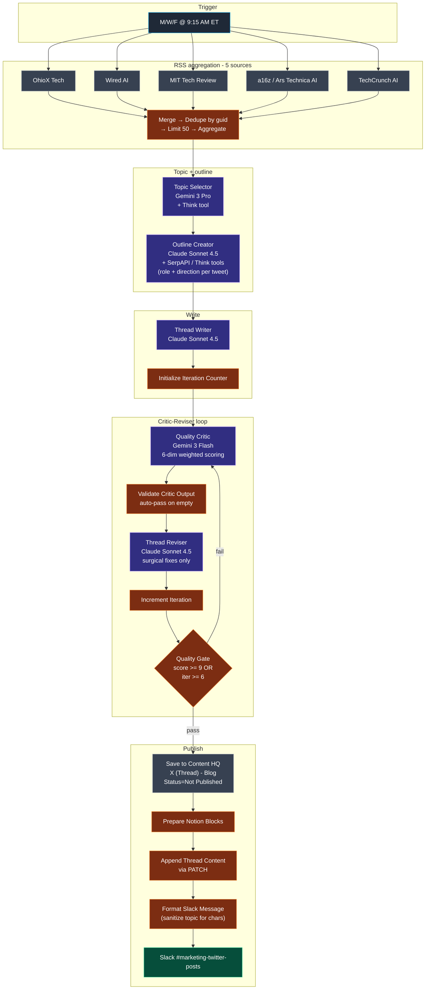

# Workflow 12 — Transform Labs X Thread Generator

> **File:** `workflows/transform-labs-x-thread-generator.json` *(JSON to be added)*
> **Trigger:** Cron — Mondays, Wednesdays, Fridays at 9:15 AM ET
> **Per-run cost:** ~$0.20–$0.50 (depends on critic-reviser iterations)

## Purpose

Tri-weekly X (Twitter) thread generator. Aggregates the same five AI-news RSS feeds W6 uses, picks one article worth a multi-tweet breakdown, drafts a 5-7 tweet thread in Transform Labs voice, runs it through a critic-reviser quality loop, and parks the approved thread in Notion Content HQ behind a human approval gate. A Slack notification to `#marketing-twitter-posts` includes the rendered thread inline so the human reviewer can scan-approve from the channel.

This is the **X-thread sibling of W6** (LinkedIn carousel) — same RSS aggregation, same critic-reviser pattern, same approval-gate philosophy, but tuned for Twitter's 280-char-per-tweet ceiling and thread-numbering conventions (`1/` is the hook ending in `🧵`, `2/` through `6/` are the body tweets, hashtags only on the final tweet).

The defining engineering choice is the **flexible-not-formulaic outline**. The Outline Creator gives the Writer a *role + direction* per tweet (`"Establish the stakes — why should a CTO care about this?"`) rather than a literal script. Some stories need more context up front, some need evidence first; letting the topic dictate the structure prevents every weekly thread from reading like the same Mad Lib.

## Architecture

## Pipeline detail

### Stage 1 — RSS aggregation

Five `rssFeedRead` nodes pull from the same AI-news sources W6 uses:

| Source | Why |
|---|---|
| TechCrunch AI | Industry breaking news, funding, launches |
| Wired AI | Cultural / policy framing |
| MIT Tech Review | Research-backed depth |
| a16z (via Ars Technica feed) | Technical detail, skepticism |
| OhioX Tech | Local angle (Transform Labs is Columbus-based) |

`Merge All RSS Feeds1` (5-input merge) → `De-Duplicate` (key: `guid`, cross-execution) → `Limit to 50 Articles1` → `Aggregate` into one `articles` array. Same shape as W6 — the two workflows can share article-curation upgrades without much rework.

> **Note on the cosmetic side:** the workflow's overview sticky says *"Every Friday at 9 AM EST"* but the cron is `triggerAtDay: [1,3,5]` at 9:15 AM — Mondays, Wednesdays, Fridays at 9:15. The sticky also says *"Quality Gate score ≥ 8 OR 5+ iterations"* but the IF node thresholds are `>= 9` and `>= 6`. Doc drift in two places — fix the stickies or relax the gate.

### Stage 2 — Topic selection

`Topic Selector Agent1` (Google **Gemini 3 Pro Preview** + Think tool) reads the 50 articles and picks **one** with the strongest thread potential. The system prompt steers toward Transform Labs' sweet spot (AI agents in enterprise, automation ROI and failures, digital transformation reality checks, Ohio/Midwest tech as bonus) and explicitly skips consumer gadgets, pure research papers, and hype-without-substance.

Output: structured JSON with `selected_article {title, url, source}`, `why_this_one`, `thread_angle`, `hook_idea`.

### Stage 3 — Flexible outline

`Outline Creator Agent1` (Anthropic **Claude Sonnet 4.5** + **SerpAPI tool** + Think tool) takes the selected article and produces a 5-7 tweet thread *outline* — explicitly **not** a script. Each tweet entry carries:

- `number` (1-7)
- `role` (Hook / Context / Evidence / Insight / CTA / etc.)
- `direction` — what this tweet should accomplish, in plain English (`"Establish the stakes — why should a CTO care about this?"`)

The system prompt is explicit about **not** forcing every thread into the same structure: *"Some stories need more context upfront. Some need evidence first. Let the topic dictate the structure."* That looseness is the whole point — it's what keeps the weekly thread from reading like the same Mad Lib every time.

Output also includes the `hashtags` list (which the Writer is told to pack into the *final* tweet, not as a separate tweet).

### Stage 4 — Write

`Thread Writer Agent1` (Claude Sonnet 4.5) takes the outline + the article context + the hashtag list and writes the actual 5-7 tweets. The Writer system prompt encodes the X-specific structural and stylistic rules:

- **Per-tweet:** under 280 characters, high-school reading level, sentences under 15 words, active voice
- **Tweet 1:** the hook, ends with `🧵` to signal a thread, **no** number prefix
- **Tweets 2-6:** start with their number prefix (`2/`, `3/`, `4/`, etc.)
- **Final tweet:** include the hashtags inline, no separate hashtag tweet
- **Banned punctuation:** em dashes, semicolons, mid-sentence colons
- **Banned phrases:** AI cliches (`In today's...`, `Let's dive in`, `Here's the thing`), buzzwords (`Game-changer`, `Revolutionize`, `Cutting-edge`), banned openers (`So,`, `Now,`)
- **Date hygiene:** prompt explicitly notes the current year is 2026, never reference 2025 as current/future
- **Conversational flow:** worked good/bad examples showing what choppy fragment-list prose looks like vs. flowing connected sentences (`"Chatbots know things. Facts. Patterns."` → `"Chatbots needed to know things — facts, patterns, syntax. Agents need to know how to DO things, and that changes everything."`)

Output: structured JSON with `thread: [{number, text, characters}]`.

### Stage 5 — Critic-Reviser loop

Same architectural pattern as W6 / W7 / W8 / W9 / W11 but tuned for X.

`Initialize Iteration Counter1` sets `iteration_count = 1`.

**`Quality Critic Agent1` (Google Gemini 3 Flash)** scores the thread across six weighted dimensions:

| Dimension | Weight |
|---|---|
| Hook | 20% |
| Value | 20% |
| Flow | 20% |
| Voice | 15% |
| Engagement | 15% |
| Conversational Flow | 15% |

Plus a hard-fail checklist (auto-fails the thread if any present): any tweet over 280 chars, em dashes, semicolons, colons anywhere, AI cliches, banned openers, generic CTA (`Follow for more`), incorrect year references (2025 as future), tweet 1 missing the `🧵` signal or having a number prefix, tweets 2-6 missing their number prefix, `". But"` (should be a comma + lowercase). Plus *flow* hard fails: more than 3 consecutive sentences under 8 words, every sentence with the same opening structure, no compound sentences in the entire thread.

The critic uses **Gemini 3 Flash** rather than Pro — Flash is faster + cheaper for the score-and-list-issues classification task, and the writer-side Claude Sonnet 4.5 is doing the heavy lifting on the actual text. This is intentional cross-vendor judging at the cheap end of the model spectrum.

**`Validate Critic Output`** (JS) defends against empty critic responses by auto-passing the thread (`overall: 8, verdict: PUBLISH, _autoPassedDueToError: true`) and propagating the loop counter.

**`Thread Reviser Agent1` (Claude Sonnet 4.5)** applies surgical edits — fix every issue the critic flagged, don't touch tweets that weren't, preserve the strengths the critic listed. The reviser system prompt restates the same banned-punctuation and banned-phrases list as the writer (third layer of enforcement) plus emphasizes character-count math: *"280 characters is a HARD LIMIT. Count carefully. URLs count toward the limit."*

`Increment Iteration1` bumps the counter. **`Quality Gate1`** exits the loop on `overall >= 9` OR `iteration_count >= 6`. Worst case bounded at 6 critic + 6 reviser calls.

### Stage 6 — Notion + Slack

`Save to Content HQ1` creates a Notion entry under platform `X (Thread) - Blog` with `Status = Not Published`, `Date to Publish = now + 1d`, the thread JSON serialized into the `Thread Json` rich-text field for downstream programmatic consumption, and a `Details` block summarizing the verdict reason / score / fixes applied / topic-selection reasoning / thread angle.

`Prepare Notion Blocks1` (JS) splits the rendered thread (each tweet's `text`, `\n\n`-separated) into per-paragraph Notion blocks. `Append Thread Content1` (HTTP PATCH to `/v1/blocks/{page_id}/children`) writes them into the page body so a reviewer can read the rendered thread inline in Notion.

`Format Slack Message` (JS) builds a `🧵 *New X Thread Ready for Review*` message with the topic + score + tweet count + iteration count + the full rendered thread inline. Notably it **sanitizes the topic title** by stripping em dashes, en dashes, colons, semicolons, and replacing regular dashes with spaces — Slack mrkdwn vs. the topic's source-publication formatting tends to fight, so the workflow normalizes the title before posting.

`Notify Slack` posts to `#marketing-twitter-posts`. Same approval gate as the rest of the Notion-publishing chain — autonomous draft, human reviews and posts.

## Models used

| Model | Purpose | Why |
|---|---|---|
| **Google Gemini 3 Pro Preview** | Topic Selector | Fast and cheap for selection across 50 articles |
| **Anthropic Claude Sonnet 4.5** | Outline / Write / Revise | Long structured prompts, voice fidelity, surgical revision discipline |
| **Google Gemini 3 Flash Preview** | Critic | Cheaper Flash variant for the score-and-list-issues classification task; cross-vendor judge against Claude's writer |

The Gemini-as-judge / Claude-as-writer split mirrors W6 — but where W6 uses Gemini 3 Pro for the critic, W12 uses **Gemini 3 Flash**. Flash is the right call for X threads because the per-tweet constraints make critique a more mechanical pass-or-fail check than the W6 carousel critic's semantic-quality assessment.

## Skills demonstrated

- **Flexible-not-formulaic outline as a creative-output technique.** The Outline Creator gives the Writer a *role + direction* per tweet (`"Establish the stakes — why should a CTO care about this?"`) rather than a literal script. The system prompt explicitly says *"Some stories need more context upfront. Some need evidence first. Let the topic dictate the structure."* This is the difference between every weekly thread reading like the same Mad Lib and the threads actually feeling differently shaped week to week.
- **Cross-vendor judging at the cheap end of the model spectrum.** Most of the Transform Labs critic/reviser loops use Gemini Pro to grade Claude Sonnet 4.5. W12 uses **Gemini 3 Flash** instead — the X thread quality check is more mechanical (per-tweet character limits, banned-phrase scans, hard-fail checklists) than the carousel/long-form critics, so Flash's lower cost outweighs its slightly worse semantic judgment. Right model for the right task.
- **Format-aware critic.** The critic enforces X-specific structure rules: tweet 1 ends with `🧵` and has no number prefix, tweets 2-6 start with their number prefix (`2/`, `3/`), hashtags only on the final tweet, every tweet under 280 chars including URLs. Each rule is a hard-fail in the critic prompt and a self-check in the reviser. *See [the critic prompt's hard-fail checklist](#stage-5--critic-reviser-loop).*
- **Slack-mrkdwn-aware topic sanitization.** `Format Slack Message` strips em dashes, en dashes, colons, semicolons, and replaces regular dashes with spaces in the article title before posting to Slack. Source publications like to use these characters in headlines; Slack mrkdwn fights with some of them. Sanitize once, post cleanly.
- **Three-layer style-rule enforcement.** Same banned-punctuation + banned-phrases list appears in (1) the Writer system prompt, (2) the Critic hard-fail checklist, (3) the Reviser self-check. Three layers because that's what it takes to make it stick — same lesson as W6 / W8.
- **Sibling workflows feeding the same critic loop architecture.** W6 (carousels) and W12 (X threads) use the same RSS aggregation, the same Notion approval pattern, the same critic-reviser-bounded-iteration loop, but produce wildly different outputs. The architecture is reusable; the prompts and structural constraints diverge per channel.
- **Approval gate on outbound publishing.** Same philosophy as W5 / W6 / W7 / W8 / W9 / W11 — autonomous draft, human reviews in Notion or Slack before X publish.
